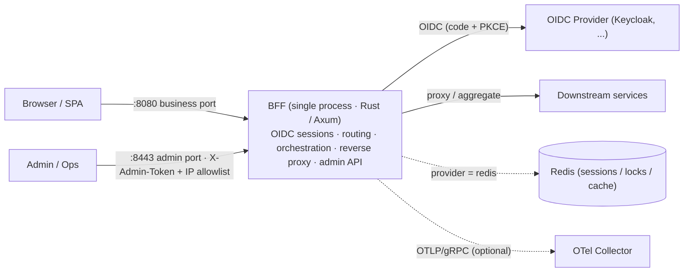

# BFF — A General-Purpose Backend-For-Frontend Middleware

[](https://github.com/byteforce-cn/bff/actions/workflows/ci.yml)
[](https://github.com/byteforce-cn/bff/releases)
[](LICENSE)
[](https://www.rust-lang.org/)

A general-purpose Backend-For-Frontend middleware built on **Axum**: it bundles **OIDC login / session management / declarative service orchestration / reverse proxy / scripting / admin console** into a single-binary service — one configurable layer between your frontends and downstream services.

> 中文版: [README.md](README.md)

> **Status: beta** (v0.1.x). Suitable for evaluation and pilot use. Before using in production, read [SECURITY.md](SECURITY.md) and [Security Hardening](docs/security-hardening.md), and complete your own checklist: replace default secrets, enable TLS, run a penetration test, etc.

## 🎯 Use Cases

- Centralize login / session / authorization handling instead of re-implementing it in every frontend;
- Aggregate and orchestrate calls to multiple downstream services into page-oriented APIs;
- Onboard new backend routes with YAML + small scripts rather than a bespoke gateway per flow.

## ✨ Features

- 🔐 **OIDC login**: Authorization Code + PKCE, token refresh (distributed-lock thundering-herd protection), RP-Initiated Logout; validated end-to-end against Keycloak 26 (cross-site IdP)
- 🔀 **Declarative orchestration**: YAML-defined DAGs with layered parallel execution, hard timeouts, `fail_fast`, HTTP caching
- 📜 **QuickJS scripting**: JavaScript sandbox (memory / stack / time limits, `spawn_blocking` isolation)
- 🔁 **Reverse proxy**: route mapping with input/output transforms, Bearer injection, circuit breaker (rolling window + single half-open probe), rate limiting, SSE / WebSocket passthrough (with auth and heartbeats)
- 🛠️ **Admin port (`:8443`)**: config import / export (auto-redacted), hot reload with on-disk persistence, provider / pipeline / script management, session management, Prometheus metrics, embedded admin console
- 🧩 **Pluggable providers**: `memory | redis` — Redis enables shared sessions / locks / cache across instances
- 📈 **Observability**: request & upstream latency histograms, W3C `traceparent` propagation, OTel (OTLP/gRPC) trace export; Grafana dashboards and alert rules included
- 📄 **Static asset hosting**: built-in SPA serving with frontend-route fallback on the business port
- 📦 **Deliverables**: multi-stage Dockerfile, docker-compose (with local HTTPS e2e), Kubernetes manifests (Deployment / Service / Ingress / PDB / HPA / NetworkPolicy / PVC)

## 🏗️ Architecture



Requests enter via the business port, pass through session / rate-limit middlewares, and are dispatched by the unified router to one of four handler kinds — **proxy / pipeline / script / static** — depending on configuration. The admin port is a separate listener carrying the admin API, metrics and the embedded admin console.

### Project Layout

| Path | Description |
| --- | --- |
| `src/` | BFF core (Rust / Axum): OIDC, orchestration, proxy, middleware, admin API |
| `tests/` | Integration tests (in-memory providers by default — no external dependencies) |
| `admin-ui/` | Admin console (React 19 + Vite + Tailwind 4 + shadcn/ui), embedded into the binary at compile time |
| `frontend/` | Demo SPA (for local integration and contract verification) |
| `iam/` | **Dev/test component**: local OIDC provider (Spring Authorization Server) |
| `fakesvc/` | **Dev/test component**: local downstream service (Spring Boot) |
| `config/` | Declarative configuration (entry point: `base.yaml`) |
| `deploy/` | Deployment assets (HTTPS, Keycloak e2e, K8s / Grafana / Prometheus) |
| `benchmark/` | k6 load-test scripts and scenarios |

## 🚀 Quick Start

### Prerequisites

| Component | Version | Needed for |
| --- | --- | --- |
| Rust | 1.93.0 | Running the BFF (required) |
| Node.js | 22.x + pnpm 9 | Building the admin console / demo SPA |
| Java | 17 + Maven | Running the `iam/` and `fakesvc/` local dev components |
| Redis | 7 | Optional — Redis provider / multi-instance setups |

```bash
git clone https://github.com/byteforce-cn/bff.git
cd bff
cargo run
```

- Business port: <http://localhost:8080> (`/login`, `/auth/callback`, `/logout`, `/pipeline/:name`, `/health`, SPA)
- Admin port: <http://localhost:8443> (`/admin/api/*` requires the `X-Admin-Token` header, default `changeme`; IP allowlist in `config/base.yaml`)

> The admin console is a compile-time embedded asset. On a fresh clone, `build.rs` generates a placeholder page so the project always compiles out of the box.
> To get the full admin console, build it first and rebuild:

```bash
cd admin-ui && pnpm install && pnpm build && cd ..
cargo run          # or: make build  (= admin UI build + release build)
```

> The demo SPA is served from `spa.dir` (`frontend/dist` by default) at runtime. Without it, SPA routes return 404 — the API is unaffected:

```bash
cd frontend && pnpm install && pnpm build
```

### Full Local Stack (optional)

```bash
docker run -d --name bff-redis -p 127.0.0.1:6379:6379 redis:7-alpine   # Redis (optional)
make iam-run                    # local OIDC provider (:9090)
cd fakesvc && mvn spring-boot:run   # local downstream service (:9091)
cargo run
```

`iam/` and `fakesvc/` are dev/test fixtures, not production components — see their READMEs for details.

## ⚙️ Configuration

- Entry point: `config/base.yaml`. Merge order: `base.yaml` → `oidc/providers.yaml` → `pipelines/*.yaml` → `routes/routes.yaml` → `env/${BFF_ENV}.yaml` → `BFF_*` environment variables (highest priority; `__` encodes nesting, e.g. `BFF_PROVIDER__SESSION_STORE=redis`)
- Sensitive values (`bff_secret`, OIDC `client_secret`, admin token, ...) must be injected via environment variables or a secret manager — the defaults in the repo are **placeholders for local development only**
- `BFF_ENV=prod` enables startup guardrails: weak tokens, in-memory providers, skipped ID-token verification and other unsafe settings are rejected

Full field reference: [docs/configuration.md](docs/configuration.md).

## 🧪 Testing

```bash
cargo test                                   # unit + integration tests (in-memory providers, no external deps)
make check                                   # fmt + clippy + test
cargo audit                                  # supply-chain audit (exceptions & rationale in .cargo/audit.toml)
BFF_TEST_REDIS_URL=redis://127.0.0.1:6379 cargo test --all-features   # includes Redis provider tests
make coverage                                # coverage (cargo-llvm-cov; CI gate: ≥75% lines)
```

End-to-end and performance assets:

- Keycloak contract e2e (login / callback / RS256 verification / refresh / logout / Bearer / Redis sessions): [deploy/keycloak/README.md](deploy/keycloak/README.md)
- HTTPS + LB full-stack e2e: [deploy/https/](deploy/https/)
- k6 load testing (SLO / capacity baseline methodology): [benchmark/README.md](benchmark/README.md)

## 📚 Documentation

| Document | Description |
| --- | --- |
| [docs/architecture.md](docs/architecture.md) | Architecture, module boundaries, request flows |
| [docs/configuration.md](docs/configuration.md) | Configuration reference |
| [docs/security-hardening.md](docs/security-hardening.md) | Security hardening checklist and verification |
| [docs/deployment.md](docs/deployment.md) | Production deployment (TLS / K8s / SLO) |
| [docs/runbook.md](docs/runbook.md) | Alert handling runbook |
| [docs/token-exchange-rfc8693.md](docs/token-exchange-rfc8693.md) | RFC 8693 Token Exchange design & operations |
| [deploy/keycloak/README.md](deploy/keycloak/README.md) | Keycloak IdP contract e2e (one command) |
| [benchmark/README.md](benchmark/README.md) | k6 load-test guide |

## 🤝 Contributing

Issues and PRs are welcome. Please read [CONTRIBUTING.md](CONTRIBUTING.md) and [CODE_OF_CONDUCT.md](CODE_OF_CONDUCT.md) first.

## 🔒 Security

Please do not report vulnerabilities via public issues — see [SECURITY.md](SECURITY.md) for reporting channels and supported versions.

## 📄 License

[MIT](LICENSE) © 2026 [byteforce](https://github.com/byteforce-cn)
