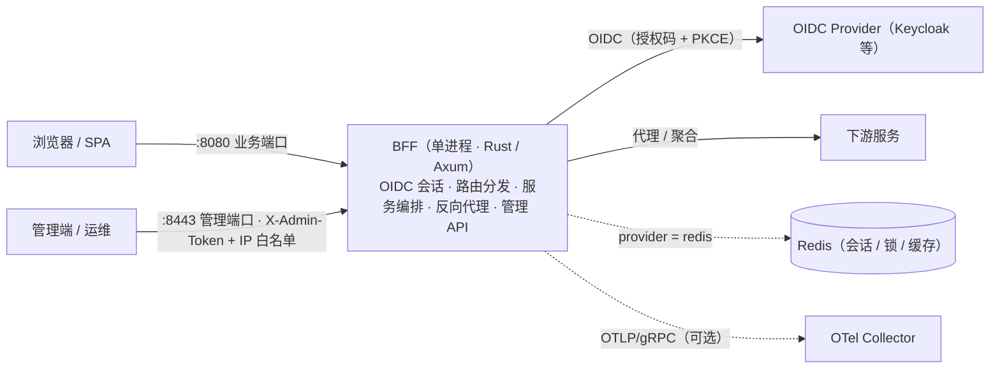

# BFF — 通用型 Backend-For-Frontend 中间件

[](https://github.com/byteforce-cn/bff/actions/workflows/ci.yml)
[](https://github.com/byteforce-cn/bff/releases)
[](LICENSE)
[](https://www.rust-lang.org/)

基于 **Axum** 的通用型 Backend-For-Frontend 中间件：把 **OIDC 登录 / 会话管理 / 声明式服务编排 / 反向代理 / 脚本扩展 / 管理台** 收拢进一个单二进制服务，让前端与下游服务之间只隔一层可配置的 BFF。

> English version: [README.en.md](README.en.md)

> **状态：beta**（v0.1.x）。可用于评估与试点；生产使用前请阅读 [SECURITY.md](SECURITY.md) 与[安全加固](docs/security-hardening.md)，并完成默认密钥替换、TLS 与渗透测试等自评项。

## 🎯 适用场景

- 前端需要统一的登录 / 会话 / 鉴权收口，而不是在每个前端项目里重复实现；
- 需要把多个下游服务的调用聚合、编排成面向页面的接口；
- 希望通过 YAML + 少量脚本完成接入，而不是为每条业务链路写一个定制网关。

## ✨ 功能特性

- 🔐 **OIDC 登录**：授权码 + PKCE、令牌刷新（分布式锁防惊群）、RP-Initiated 登出；跨站点 IdP 场景已用 Keycloak 26 实测
- 🔀 **声明式服务编排**：YAML 定义 DAG，分层并行执行、硬超时、`fail_fast`、HTTP 缓存
- 📜 **QuickJS 脚本扩展**：JavaScript 沙箱（内存 / 栈 / 时长上限，`spawn_blocking` 隔离）
- 🔁 **反向代理**：路由映射与输入输出变换、Bearer 注入、熔断（滚动窗口 + 半开单探针）、限流、SSE / WebSocket 透传（含鉴权与心跳）
- 🛠️ **管理端口（`:8443`）**：配置导入 / 导出（自动脱敏）、热重载与落盘持久化、Provider / Pipeline / 脚本管理、会话管理、Prometheus 指标、内嵌管理台
- 🧩 **Provider 可插拔**：`memory | redis`，Redis 提供多实例共享的会话 / 锁 / 缓存
- 📈 **可观测性**：请求与上游延迟直方图、W3C `traceparent` 传播、OTel（OTLP/gRPC）追踪导出；附 Grafana 面板与告警规则
- 📄 **静态资源发布**：业务端口内置 SPA 托管与前端路由 fallback
- 📦 **交付物**：多阶段 Dockerfile、docker-compose（含本地 HTTPS E2E）、K8s 清单（Deployment / Service / Ingress / PDB / HPA / NetworkPolicy / PVC）

## 🏗️ 架构



请求从业务端口进入后，经会话与限流等中间件，由统一路由分发器按配置决定走 **代理（proxy）/ 编排（pipeline）/ 脚本（script）/ 静态资源（static）** 四类处理；管理端口独立监听，承载管理 API、指标与嵌入式管理台。

### 项目结构

| 目录 | 说明 |
| --- | --- |
| `src/` | BFF 核心（Rust / Axum）：OIDC、编排、代理、中间件、管理 API |
| `tests/` | 集成测试（默认内存 provider，无外部依赖） |
| `admin-ui/` | 管理台（React 19 + Vite + Tailwind 4 + shadcn/ui），编译期内嵌进二进制 |
| `frontend/` | 演示 SPA（本地联调与契约验证用） |
| `iam/` | **开发/测试组件**：本地 OIDC Provider（Spring Authorization Server） |
| `fakesvc/` | **开发/测试组件**：本地下游服务（Spring Boot） |
| `config/` | 声明式配置（`base.yaml` 为入口） |
| `deploy/` | 部署资产（HTTPS、Keycloak E2E、K8s / Grafana / Prometheus） |
| `benchmark/` | k6 压测脚本与场景说明 |

## 🚀 快速开始

### 环境要求

| 组件 | 版本 | 需要的场景 |
| --- | --- | --- |
| Rust | 1.93.0 | 运行 BFF（必需） |
| Node.js | 22.x + pnpm 9 | 构建管理台 / 演示 SPA |
| Java | 17 + Maven | 运行 `iam/`、`fakesvc/` 本地联调组件 |
| Redis | 7 | 可选，Redis provider / 多实例场景 |

```bash
git clone https://github.com/byteforce-cn/bff.git
cd bff
cargo run
```

- 业务端口：<http://localhost:8080>（`/login`、`/auth/callback`、`/logout`、`/pipeline/:name`、`/health` 与 SPA）
- 管理端口：<http://localhost:8443>（`/admin/api/*` 需 `X-Admin-Token` 请求头，默认 `changeme`；IP 白名单见 `config/base.yaml`）

> 管理台 UI 是编译期内嵌资源。未构建管理端时 `build.rs` 会生成占位提示页，保证干净克隆可以直接编译运行；
> 需要完整管理台时，先构建再重新编译：

```bash
cd admin-ui && pnpm install && pnpm build && cd ..
cargo run          # 或 make build（= 管理台构建 + release 构建）
```

> 演示 SPA 由业务端口按 `config/base.yaml` 的 `spa.dir`（默认 `frontend/dist`）发布，属运行时资源；未构建时 SPA 路径返回 404，不影响 API：

```bash
cd frontend && pnpm install && pnpm build
```

### 完整本地链路（可选）

```bash
docker run -d --name bff-redis -p 127.0.0.1:6379:6379 redis:7-alpine   # Redis（可选）
make iam-run                    # 本地 OIDC Provider（:9090）
cd fakesvc && mvn spring-boot:run   # 本地下游服务（:9091）
cargo run
```

`iam/` 与 `fakesvc/` 仅用于本地开发与契约验证，不是生产组件；各自目录的 README 有详细说明。

## ⚙️ 配置

- 入口为 `config/base.yaml`，合并顺序：`base.yaml` → `oidc/providers.yaml` → `pipelines/*.yaml` → `routes/routes.yaml` → `env/${BFF_ENV}.yaml` → `BFF_*` 环境变量（最高优先级，`__` 表示层级，如 `BFF_PROVIDER__SESSION_STORE=redis`）
- 敏感值（`bff_secret`、OIDC `client_secret`、管理 token 等）通过环境变量 / 密钥管理注入；仓库内默认值是 **POC 占位值，生产必须替换**
- `BFF_ENV=prod` 启用启动防呆：拒绝弱口令、内存 provider、跳过验签等不安全配置

配置字段的完整说明见 [docs/configuration.md](docs/configuration.md)。

## 🧪 测试

```bash
cargo test                                   # 单元 + 集成测试（默认内存 provider，无外部依赖）
make check                                   # fmt + clippy + test 全量检查
cargo audit                                  # 供应链审计（例外清单与风险界定见 .cargo/audit.toml）
BFF_TEST_REDIS_URL=redis://127.0.0.1:6379 cargo test --all-features   # 含 Redis provider 用例
make coverage                                # 覆盖率（cargo-llvm-cov；CI 门禁 ≥75% lines）
```

端到端与性能验证资产：

- Keycloak 真实 IdP 契约（登录 / 回调 / RS256 验签 / 刷新 / 登出 / Bearer / Redis 会话）：[deploy/keycloak/README.md](deploy/keycloak/README.md)
- HTTPS + LB 全链路 E2E：[deploy/https/](deploy/https/)
- k6 压测（含 SLO / 容量基线方法）：[benchmark/README.md](benchmark/README.md)

## 📚 文档

| 文档 | 说明 |
| --- | --- |
| [docs/architecture.md](docs/architecture.md) | 架构、模块边界与请求流 |
| [docs/configuration.md](docs/configuration.md) | 配置参考 |
| [docs/security-hardening.md](docs/security-hardening.md) | 安全加固清单与验证方式 |
| [docs/deployment.md](docs/deployment.md) | 生产部署（TLS / K8s / SLO） |
| [docs/runbook.md](docs/runbook.md) | 告警处置手册 |
| [docs/token-exchange-rfc8693.md](docs/token-exchange-rfc8693.md) | RFC 8693 Token Exchange 设计与运维 |
| [deploy/keycloak/README.md](deploy/keycloak/README.md) | Keycloak 真实 IdP 契约验证（一键 E2E） |
| [benchmark/README.md](benchmark/README.md) | k6 压测说明 |

## 🤝 贡献

欢迎提交 Issue 与 PR。开始前请阅读 [CONTRIBUTING.md](CONTRIBUTING.md) 与 [CODE_OF_CONDUCT.md](CODE_OF_CONDUCT.md)。

## 🔒 安全

请勿通过公开 Issue 报告安全漏洞，报告渠道与支持范围见 [SECURITY.md](SECURITY.md)。

## 📄 许可证

[MIT](LICENSE) © 2026 [byteforce](https://github.com/byteforce-cn)
