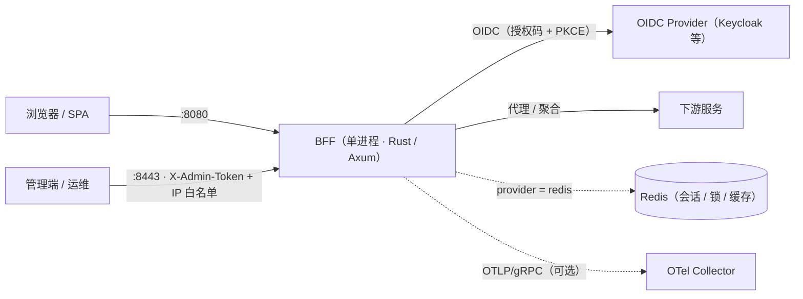

# BFF 架构说明

BFF（Backend-For-Frontend）是前端与下游服务之间的可配置中间层：把登录 / 会话 / 鉴权收口、
把多个下游服务聚合编排成面向页面的接口，并以声明式配置接入新路由，而不是为每条链路写定制网关。

实现为**单二进制进程**（Rust / Axum），同时监听两个端口：

| 端口 | 面 | 内容 |
| --- | --- | --- |
| `:8080` | 业务面 | OIDC 端点、统一路由分发（proxy / pipeline / script / static）、SPA 托管、SSE / WebSocket |
| `:8443` | 管理面 | 管理 API（配置 / Provider / Pipeline / 脚本 / 会话）、Prometheus 指标、内嵌管理台 |

## 总览



## 业务请求处理链

进入业务端口的请求按实现层序处理（由外到内；层序在 `src/server/business.rs` 中定义并有注释锁定）：

1. **安全响应头**：CSP / X-Frame-Options / nosniff / Referrer-Policy / HSTS（CSP 支持按路径前缀覆盖，最长前缀优先）；
2. **认证端点限流**（可选）：按来源 IP + 路径前缀独立令牌桶，超出返回 429 + `Retry-After`；
3. **全局限流**：按真实客户端 IP 建桶；SPA 静态资源前缀（`/assets/` 等）不消耗令牌；
4. **CORS 与 gzip**：默认拒绝跨域（显式白名单才放行）；gzip 对 `text/event-stream` 例外；
5. **追踪**：OTel 语义的 `http.request` span、`x-request-id` 生成与传播、W3C `traceparent` 注入；
6. **会话层**：Cookie ↔ 会话存储（memory / redis）解析；
7. **令牌刷新**：跳过登录 / 回调等前缀；SWR 方式后台刷新，分布式锁防止惊群；
8. **指标采集**：请求计数与延迟直方图（`path` 标签归一化，防基数爆炸）；
9. **路由**：
   - OIDC 端点：`/login`、按 provider 配置动态注册的回调路径、`/logout`；
   - 探针：`/live`（进程存活）、`/ready`（上游探测，结果缓存、输出裁剪）；
   - WebSocket 升级：`/ws`、`/ws/*`（仅 `proxy` + `websocket|auto` 路由可升级，强制会话鉴权）；
   - 兼容入口：`/pipeline/:name`（内部转为统一分发，鉴权规则与路由一致）；
   - fallback → **统一路由分发**（static / proxy / pipeline / script）；未命中静态资源时走 SPA fallback（`spa.dir`）。

## 统一路由分发

路由定义在 `config/routes/routes.yaml`，分发器实现见 `src/server/route_dispatcher.rs`。

- **匹配**：路径前缀按**段边界**匹配（`/api` 不会命中 `/api-secret`）、方法过滤、最长前缀优先；
- **鉴权**：`auth_required: true` 的路由要求有效会话（401），匿名请求不进入下游；
- **输入映射**（优先级）：`defaults < env < session < header < path < body < query`；
  `env` / `header` 只注入被**显式引用**的键，敏感请求头（cookie / authorization / x-admin-token）默认过滤；
- **输出映射**：`pick` / `rename` / `wrap` / `status_map`（带 `default` 兜底）；
- **proxy**：上游超时（默认 30s，可路由级覆盖；SSE 走独立无总超时客户端）、请求 / 响应体上限、
  熔断（滚动窗口失败计数 + 半开单探针）、Bearer 注入、响应头过滤（默认剥离 `set-cookie`，可显式放开）、
  SSE / WebSocket 透传（心跳、空闲超时、消息大小上限）；
- **pipeline**：YAML 定义的 DAG，分层并行执行、硬超时、`fail_fast`、HTTP 缓存
  （缓存键包含调用参数指纹，避免跨用户串数据）；
- **script**：QuickJS 沙箱执行（时长上限默认 2s，内存 / 栈限制，`spawn_blocking` 隔离）。

## OIDC 与会话

- 授权码流程 + **PKCE（S256）** + `state` / `nonce`；ID Token 走真实 JWKS 验签（RS256），
  覆盖伪造密钥 / `alg:none` / nonce 不一致等攻击拒绝（`tests/test_oidc_signature.rs`）；
- **回调地址恒定**：`redirect_uri` 一律由 `server.public_base_url` 推导，**绝不信任 Host 头**；
  未配置时回退 `trusted_hosts` 白名单（`BFF_ENV=prod` 强制二者至少其一）；
  OIDC 客户端缓存的键包含 `(provider, base_url)`，避免首个调用者固化回调地址；
- 回调路径按 provider 配置在启动时动态注册（`callback_path`，默认 `/auth/callback`）；
- 令牌加密存储于会话（AES-256-GCM）；刷新为 SWR + 分布式锁；登出优先使用 discovery 的
  `end_session_endpoint`，失败回退本地清会话；
- 会话 Cookie：`HttpOnly` + `Secure` + `SameSite=Lax`（跨站点 IdP 场景；同站 IdP 可显式改回 `Strict`）；
  登录成功后轮换会话 ID；服务端维护会话索引并后台 GC。

## 管理面（`:8443`）

- 独立端口 + **IP 白名单**（每请求实时读取）+ `X-Admin-Token` / `Bearer` 认证
  （常量时间比较；失败按来源 IP 计数限流）；
- API 分组：配置导入 / 导出（自动脱敏 + `***` 哨兵回填）、热重载与**落盘持久化**、
  Provider（含连通性验证与删除）、Pipeline / 脚本 / 路由管理、会话列表与撤销、Prometheus 指标、健康检查；
- 管理写操作统一**结构化审计**（操作者、来源 IP、方法与状态；配置变更输出变更摘要）；
- 变更路径：**先原子落盘（临时文件 + rename）再应用内存**，失败即拒绝，避免内存 / 磁盘分裂；
- 内嵌管理台：编译期由 RustEmbed 打包进二进制；未构建管理端时 `build.rs` 生成占位提示页，
  保证干净克隆可直接编译运行。

## 状态模型

| 组件 | 说明 |
| --- | --- |
| 配置快照 | `ArcSwap<AppConfig>`；热生效 / 需重启边界见 [deployment.md](deployment.md) §3 |
| Provider | `memory | redis` 三件套：缓存 / 锁 / 会话；Redis 支持多实例共享 |
| OIDC 客户端管理器 | 按 `(provider, base_url)` 缓存；配置变更自动失效 |
| 出网 HTTP 客户端 | IdP 专用（15s 总超时、禁重定向）；SSE 独立客户端（connect 5s + keepalive，无总超时）；共享连接池 |
| 持久化 | `runtime.yaml`（脱敏快照）；写入原子化；多副本 watcher 轮询收敛 |
| 后台任务 | 会话 GC、配置 watcher |

## 可观测性

- **指标**（Prometheus）：`bff_http_requests_total{path}`（标签归一化）、
  `bff_http_request_duration_seconds`、`bff_upstream_request_duration_seconds{upstream,status_class}`、
  限流 / 熔断 / Token Exchange 等业务指标；
- **追踪**：W3C `traceparent` 逐跳传播（响应 / 出站与导出 span 严格一致）；
  可选 OTel（OTLP/gRPC）导出，`ParentBased` 采样，关停时 flush；
- **资产**：Grafana 面板与 Prometheus 告警规则（`deploy/grafana/`、`deploy/prometheus/`）、
  处置手册 [runbook.md](runbook.md)。

## 代码结构

```text
src/
├── oidc/          # OIDC 客户端、登录 / 回调 / 登出处理器、令牌处理
├── orchestration/ # YAML 服务编排（DAG 执行器、步骤、缓存）
├── provider/      # cache / lock / session；memory 与 redis 实现
├── server/        # 业务路由、统一分发器、代理、SSE、WS 隧道、SPA
├── middleware/    # 会话、限流、熔断、traceparent、客户端 IP 解析
├── admin/         # 管理 API（配置 / 运行时）与内嵌管理台
├── scripting/     # QuickJS 沙箱
├── telemetry.rs   # OTel 导出与关停
├── state.rs       # AppState：配置快照 / provider / HTTP 客户端 / 后台任务
└── config.rs      # 配置模型、合并与校验
```

## 延伸阅读

- 配置参考：[configuration.md](configuration.md)
- 安全加固与验证：[security-hardening.md](security-hardening.md)
- 生产部署（TLS / K8s / SLO / 热生效对照表）：[deployment.md](deployment.md)
- 告警处置：[runbook.md](runbook.md)
