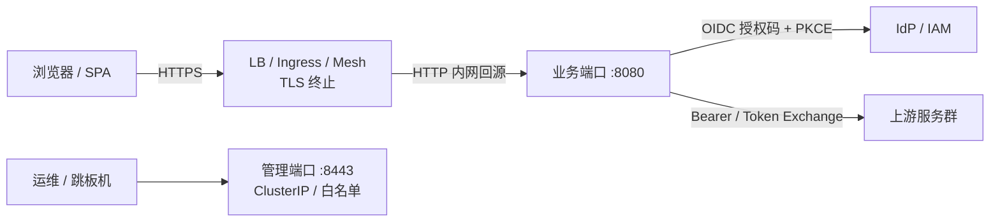

# BFF 生产部署与运维指南

> 配套文档：[architecture.md](architecture.md)（架构）、[security-hardening.md](security-hardening.md)（安全加固）、
> [runbook.md](runbook.md)（告警处置手册）、
> [../deploy/keycloak/README.md](../deploy/keycloak/README.md)（Keycloak 真实 IdP 契约验证）。

---

## 1. 目标拓扑与 TLS 方案

推荐拓扑：



**三种 TLS 终止方案（三选一）**

| 方案 | 说明 | BFF 侧配置 |
| --- | --- | --- |
| LB（nginx/ALB 等）直连 Pod | 最常用；`deploy/https/` 提供 nginx 示例与本地 E2E | `server.public_base_url: https://bff.example.com` |
| K8s Ingress | `deploy/k8s/ingress.yaml`（nginx-ingress + cert-manager） | 同上 |
| Service Mesh（Istio 等） | Sidecar 终止 mTLS/边缘 TLS | 同上 |

要点：

- **BFF 自身不提供 TLS**（仅明文监听）：必须由上述方案之一终止 TLS；
- **`server.public_base_url` 是硬约束**：设置后 `redirect_uri` / `post_logout_redirect_uri`
  一律由它推导，**完全不信任 Host 头**（防匿名 Host 污染）。未设置时回退
  `trusted_hosts` 白名单（生产 `BFF_ENV=prod` 强制二者至少其一）；
- 上游出网：默认 rustls 校验；内网自签可用 `http_client.ca_cert_path`，
  双向 TLS 用 `client_cert_path` / `client_key_path`（PEM）；
- 经 LB 的 XFF 语义按 **nginx `proxy_add_x_forwarded_for`**（每跳追加其对端地址）
  标定 `auth_rate_limit.trusted_proxies` 与 `admin.trusted_proxies`：
  `浏览器 → LB → BFF` 单层 LB 填 `1`；直连填 `0`（不信任 XFF）。
- **会话 Cookie 默认 `SameSite=Lax`**：跨站点 IdP（不同注册域，如 Okta/Entra/独立域 Keycloak）
  的回调与登出回跳是跨站顶层导航，`Strict` 会丢 Cookie 导致登录失败（Keycloak 契约验证实测）；
  同站 IdP（同一注册域子域）部署可显式改 `session.same_site: Strict`（CSRF 主防护为 state+PKCE）。

---

## 2. 部署形态

### 2.1 Docker / Compose（单机或验证）

```bash
export BFF_ADMIN_TOKEN=$(openssl rand -hex 32)
export BFF_SECRET=$(openssl rand -hex 32)
export BFF_SECRET_SALT=$(openssl rand -hex 16)
docker compose up --build          # Redis + BFF（BFF_ENV=prod 全量防呆）
```

- 配置持久化落在 compose 卷 `bff-state`（`/data/bff/runtime.yaml`）；
- 管理面默认白名单放宽到 Docker 网段，**生产须按实际入口收紧**。

### 2.2 本地 HTTPS 全链路 E2E（LB 拓扑验证）

```bash
# 终端 A：Mock IdP（仅验收演示）
MOCK_IDP_ISSUER=http://host.docker.internal:9090 cargo run --release --example mock_idp

# 终端 B：nginx TLS 终止 + BFF
bash deploy/https/gen-certs.sh
docker compose -f docker-compose.yml -f deploy/https/docker-compose.https.yml up --build

# 终端 C：一键验收（登录 → 回调 → 会话 → 登出）
bash deploy/https/e2e.sh
```

验证点：`redirect_uri` 恒为 `https://localhost:9443/auth/callback`（不随 Host 变化）、
登出走 discovery 的 `end_session_endpoint`。

### 2.3 Kubernetes

> 配置注入方式：**标量**配置可走 `BFF_*` 环境变量（`__` 分级）；
> **数组/对象**（`oidc.providers`、`routes`、`pipelines` 等）必须来自配置文件/
> ConfigMap 挂载（figment 的环境变量层仅解析标量，直接塞 JSON 数组会启动报类型错误）。

```bash
kubectl create ns bff
kubectl -n bff create secret generic bff-secrets \
  --from-literal=BFF_ADMIN__AUTH_TOKEN="$(openssl rand -hex 32)" \
  --from-literal=BFF_SECRET="$(openssl rand -hex 32)" \
  --from-literal=BFF_SECRET_SALT="$(openssl rand -hex 16)" \
  --from-literal=BFF_PROVIDER__REDIS_URL="redis://bff-redis:6379"
kubectl -n bff apply -k deploy/k8s/
```

清单要点（`deploy/k8s/`）：

| 文件 | 内容 |
| --- | --- |
| `deployment.yaml` | 2 副本、多站点容器端口（`app1:8081` / `app2:8082` / `admin:8443`）、startup/liveness/readiness 探针打 **app1** 站点端口、`terminationGracePeriodSeconds: 45`（对齐 30s 排空窗口）、nonroot + seccomp、资源配额；迁移发布策略见注释（`strategy: Recreate`） |
| `service.yaml` | 每站点一个业务 ClusterIP 端口；**管理端口独立 ClusterIP**（不要挂 Ingress） |
| `ingress.yaml` | 每子域一条 host 规则 → 对应 Service 端口；TLS 终止、SSE 反缓冲、`proxy-read-timeout` |
| `pdb-hpa.yaml` | PDB minAvailable=1；HPA CPU 70%（2–6 副本） |
| `networkpolicy.yaml` | 业务入网放行 **8080 + 8081 + 8082**（8080 为两步迁移第 1 步预留）；8443 仅运维命名空间；出网按实际拓扑收窄 |
| `pvc.yaml` | 配置持久化卷（多副本需 RWX 共享存储） |
| `secret.example.yaml` | 密钥模板（真实值走 SealedSecrets/Vault） |

**迁移预警（有损变更，灰度前必须评估）**

| 变更 | 影响 | 前置要求 |
| --- | --- | --- |
| `memory → redis` provider | 全部在线会话即时失效（全员重登） | 低峰切换 + 公告；预发验证 |
| `bff_secret` 轮换 | 旧密钥加密的会话令牌不可解密（等价全员重登）；**不支持热更新**，必须重启 | 双密钥过渡或与上一条合并为一次切换窗口 |
| `public_base_url` / 回调地址切换 | 与 IdP 注册值必须严格一致 | 先在 IdP 同时注册新旧 `redirect_uri` 再切换 |

---

## 3. 配置热生效 / 需重启对照表

> 依据当前实现与代码路径核对（读取 `state.cfg()` 的即热生效；启动时构建的层/客户端反之）。
> 管理端变更已支持**落盘 + 多副本收敛**（见 §4）。

### ✅ 热生效（无需重启）

| 配置 | 说明 |
| --- | --- |
| `routes`（含 upsert 后新增路径前缀） | 每请求从快照匹配 |
| `pipelines` / `scripts` | 每请求读取；脚本持久化时同步写 `config/scripts/<name>` |
| `oidc.providers[].*`（client_id/secret/scopes/issuer） | 更新即 invalidate 客户端缓存 |
| `oidc.providers[].callback_path` — **仅当该路径已在启动时注册** | 见下方“需重启”补注 |
| `admin.auth_token` / `auth_mode` / `ip_whitelist` / `trusted_proxies` | 认证与白名单中间件每请求读配置 |
| `admin.auth_fail_limit_per_minute` | 每请求读配置 |
| `server.public_base_url` / `trusted_hosts` | OIDC 处理器每请求读配置 |
| `sites[].server_names` / `public_base_url` / `spa.dir` / `oidc` 绑定 / `security_headers` / `logout_scope` | 每请求从配置快照按站点名解析（`SiteView`）；`security_headers` 在配置替换时预构建为 `HeaderMap` |
| `sites[].oidc.allowed_providers` / `default_provider` | 站点鉴权与 provider 选择每请求解析（防越站） |
| `auth_rate_limit.*`（enabled/paths/per_ip/trusted_proxies） | 中间件每请求读配置 |
| `websocket.*`（超时/心跳/消息上限） | 每个升级请求读取 |
| `health.*`（探针缓存 TTL/超时/路径） | `/ready` 每请求读取 |
| `token_refresh.skip_prefixes` | 中间件每请求读取 |
| `persistence.path` / `watch_interval` | watcher 每轮读取（文件覆盖仅在启动生效） |
| `route.config.timeout` / `circuit_breaker_threshold` | 代理调用时读取（阈值对**已建**熔断 key 固化，新路由立即生效） |

### 🔁 需重启（启动时构建/快照）

| 配置 | 原因 |
| --- | --- |
| `server.business_port` / `admin_port` | 监听地址启动绑定 |
| `sites[]` 增删 / `name` / `port` / `bind` / `session_profile` | listener 与 router 结构启动构建 |
| profile 解析后 cookie 策略：`(cookie_name, cookie_domain, secure, http_only, same_site, ttl)` | `SessionManagerLayer` 启动构建 |
| `provider.*`（memory/redis 选型、redis_url） | Provider 实例与 Session 层启动构建 |
| `session.*`（cookie 名/secure/same_site/ttl） | SessionManagerLayer 启动构建 |
| `bff_secret.*` | **显式拒绝热更新**（密钥派生进程级一次性完成），必须重启 |
| `http_client.*`（超时/池/mTLS/CA） | 共享 HTTP 客户端启动构建 |
| `rate_limit.*`（全局限流参数与跳过前缀） | Governor 启动构建 |
| `cors.*` / `security_headers.*` / `body_limit.max_bytes`（业务路由层） | 中间件层启动快照 |
| `circuit_breaker.*`（全局阈值/窗口/冷却） | 注册表启动构建 |
| `oidc.providers[].callback_path` 的**新增值** | 回调路由在启动时按当时的路径集合注册；新增路径须重启后生效 |
| `persistence.enabled` 及启动时对 runtime.yaml 的覆盖 | 加载期行为 |
| `spa.dir` | ServeDir 每次构建（目录变更需部署新内容） |
| `telemetry.*`（OTLP 导出开关/端点/采样率） | exporter 与 tracing 导出层在启动时构建 |
| 日志级别 `RUST_LOG` | 订阅器启动初始化 |

> 运维口径：管理端改完配置后，**热生效项立即验证**（curl 探针/目标路由）；
> 涉及“需重启”项时走滚动发布，并在变更单注明。
>
> **导入/热重载响应（多站点）**：`config import`（`POST /admin/api/config/import`，版本化路径为 `POST /admin/api/v1/config/import`）对含启动物化字段变更的
> 配置返回 `{"status": "requires_restart", "hot_applied": [...], "requires_restart": [...]}`（按字段路径列出，
> 如 `sites[app1].port`、`session_profiles[default].cookie_name`），**不替换运行配置、不落盘**；无结构变更时
> 返回 `{"status": "applied", "hot_applied": [...]}`。配置 watcher 检测到结构差异时同样只告警、不应用，
> 保持旧配置（设计 §5.6）。

---

## 4. 配置持久化与多副本一致性

- 单一事实源：`persistence.path`（默认 `config/state/runtime.yaml`；prod 模板为
  `/data/bff/runtime.yaml`）保存**脱敏后的完整配置**（密钥以 `***` 哨兵写入）；
- **卷属主**：容器以数值 UID **10001** 运行——K8s PVC 需 `fsGroup: 10001`（清单已配），
  compose 具名卷由镜像中 `/data/bff` 目录属主初始化；手工挂载宿主机目录时需
  `chown 10001:10001`。启动自检会对持久化路径做**可写性探针**，不可写时直接拒绝启动；
- 写入路径：任一管理写操作（import/providers/pipelines/routes/scripts）→
  **先原子落盘（临时文件 + rename）→ 再应用内存**；落盘失败则拒绝变更（避免内存/磁盘分裂）；
- 启动加载优先级：`base/分文件 < runtime.yaml < BFF_* 环境变量`；
  runtime 中 `***` 按环境变量/基础配置回填真实值；
- 多副本收敛：各副本 watcher 轮询（`watch_interval`，默认 5s）文件内容哈希；
  与我方最近写入一致则跳过，否则校验后热重载（校验失败仅告警、不影响运行态）；
- **共享存储要求**：多副本须挂同一 RWX 卷（NFS/EFS/CephFS 等）；单副本可用 RWO；
- `bff_secret` 不允许通过文件变更（watcher 校验拒绝）。

---

## 5. 探针、优雅停机与容量

| 项 | 行为 |
| --- | --- |
| `/live` | 进程存活；无外部依赖 |
| `/ready` | 并行探测 `health.upstreams`（缺省从 routes 推导）；结果缓存 `health.cache_ttl`（默认 1s）；响应仅含 `{status, upstreams_total, upstreams_unreachable}`（不暴露内部拓扑）；`allow_degraded=false` 时任一不可达 → 503 |
| 停机 | 单信号源（SIGTERM/SIGINT）→ 停止接受新连接 → 排空至多 **30s** → 退出；K8s `terminationGracePeriodSeconds: 45` + preStop `sleep 5` |
| 超时 | 代理默认总超时 **30s**（可按路由覆盖）；SSE 走独立无总超时客户端（connect 5s + TCP keepalive 60s）；WS 握手 5s、空闲 300s、心跳 30s、消息 ≤1MiB |
| 体量 | 请求体默认 10MiB（代理/编排/脚本统一读 `body_limit.max_bytes`）；代理响应 ≤64MiB（`max_response_bytes`）；管理 API ≤8MiB |

### SLO 基线与容量标定（2026-09-27 本地实测；详见 benchmark/README.md）

| SLI | 目标 | 数据来源 | 实测（单实例，与 k6/Redis 共享 8 vCPU） |
| --- | --- | --- | --- |
| 登录成功率（/auth/callback 2xx/3xx 占比） | ≥ 99.5% | `bff_http_requests_total{path="/auth/callback"}` | Mock/Keycloak E2E 全链路通过 |
| API 可用性（非 5xx 占比） | ≥ 99.9% | `bff_http_requests_total` | 157 万请求 **0 错误**（10,464 QPS 峰值） |
| P95 延迟（业务路由） | ≤ 500ms | `bff_http_request_duration_seconds` | **p95 39ms**（10.4k QPS）/ 2.9ms（2k QPS） |
| 上游错误率 | ≤ 1% | `bff_upstream_request_duration_seconds` + `bff_proxy_error_total` | 0%（含代理/脚本/Pipeline 全路径） |
| 就绪抖动 | /ready 非 200 总时长 < 5min/月 | K8s 探针/告警 `BffReadyNotReady` | 压测期间 /ready 稳定 200 |

容量结论与参数反推（原始数据 `benchmark/results/`）：

- 单实例 **≥ 10,464 QPS**（800 VU 峰值，0 错误、0 丢弃；测试机同时跑 k6/Redis/nginx，数值偏保守）；
- 最重的代理路径（含 Redis 会话 + Bearer 注入）峰值 p95 ≈ 53–56ms，**对 500ms SLO 有 ~9× 余量**；
- `rate_limit.per_second: 50 / burst_size: 500`（按真实客户端 IP）：防单客户端滥用的阈值，
  与实测引擎能力相差两个数量级，无需按容量放大；
- HPA 建议以 **50–60% 水位**设置扩容触发（如单副本 5k QPS 触发），并按副本数 ×10k QPS 估算集群上限；
- ⚠️ 限流语义修复（压测实测发现）：tower-governor 0.4.x 的 `per_second` 为周期语义，
  旧实现会把 50/s 退化为每 50s 1 个；已在 `rate_limit_skip.rs` 显式换算并加回归测试，升级依赖时勿回退。

---

### 分布式追踪（OTel / OTLP）

- **启用**：配置 `telemetry.otlp_endpoint`（OTLP/**gRPC**，如 `http://otel-collector.observability.svc:4317`；
  `https` 走 rustls，读系统证书库）。未配置时**完全禁用**（无出站、无额外开销，仅为 traceparent 传播保留极小开销）。
- **采样**：`telemetry.sample_ratio`（0–1，默认 1.0）为**根请求**采样率；带 `traceparent` 的请求按
  W3C ParentBased 语义**跟随上游采样位**（上游已决定不采样时不额外采样）。
- **span 语义**：每请求一个 `http.request`（`http.method` / `http.target` / `http.status_code` /
  `otel.kind=server`）；入站 `traceparent` 作为**远程父上下文**，响应/出站 `traceparent` 的 span-id
  与导出 span **严格一致** → collector/Jaeger/Tempo 中 BFF → 上游可串成同一 trace（已由契约测试锁定）。
- **资源属性**：`service.name`（可配，默认 `bff`）、`service.version`、`deployment.environment`（取 `BFF_ENV`）。
- **关停**：SIGTERM 排空后 flush 导出队列再退出；异常退出最多丢失批量窗口（默认 5s）内的 span。
- **出网方向**：BFF 自身出网统一 **HTTP/1.1**（`.http1_only()`，连接池/超时行为确定性优先；
  已随 openidconnect 4.0 / reqwest 0.12 迁移，与供应链例外界定无关）；OTLP 走独立 tonic 栈（HTTP/2）。
- collector 最小接收示例（验证用）：

  ```yaml
  receivers: { otlp: { protocols: { grpc: { endpoint: 0.0.0.0:4317 } } } }
  exporters: { debug: {} }
  service: { pipelines: { traces: { receivers: [otlp], exporters: [debug] } } }
  ```

---

## 6. 安全清单（上线前逐项核对）

- [ ] `server.public_base_url` 已配置为 https 对外域名（IdP 注册的 redirect_uri 一致）；
- [ ] `BFF_SECRET`/`BFF_SECRET_SALT`/`BFF_ADMIN__AUTH_TOKEN` 从密钥管理注入（≥32 字节随机）；
- [ ] `admin.ip_whitelist` 收紧到跳板机/运维网段；管理端口不挂公网 Ingress；
- [ ] `admin.trusted_proxies` / `auth_rate_limit.trusted_proxies` 与入口拓扑一致；
- [ ] `admin.enable_test_endpoints: false`（prod 强制）；
- [ ] CORS：仅按需填写 `allowed_origins`（空 = 不允许跨域；`permissive` 仅限本地）；
- [ ] `security_headers.hsts_max_age` 在 LB 未代发时配置（如 `31536000`）；
- [ ] OIDC `insecure_skip_id_token_verification` 保持 false（prod 强制）；
- [ ] 依赖审计（CI `audit` job + `.cargo/audit.toml` 例外清单）无新增未处置项；
- [ ] **生产上游一律 https**（`routes[].config.upstream`、OIDC issuer/token endpoint）：
  内网自签配 `http_client.ca_cert_path`；双向 TLS 配 `client_cert_path/key_path`；
  示例配置中的 `http://localhost` 仅为本地联调，照抄上线属不安全默认值。
- [ ] `telemetry.otlp_endpoint` 指向内网 collector（勿暴露公网；跨网段用 https 端点）。

---

## 7. 多站点（Multi-site）部署与迁移

> 设计规格：§5（配置模型）/ §8.4（IdP 注册）/ §11（部署与迁移）。本节汇总部署与运维侧落地。

### 7.1 端口与清单

显式多站点下 BFF 逐 `sites[].port` 监听，管理端口保持全局单实例：

| 端口 | 归属 | 说明 |
| --- | --- | --- |
| `8081` / `8082` | 业务站点 app1 / app2 | 每个站点一个容器端口 + Service 端口 |
| `8080` | legacy 迁移预留 | 两步发布第 1 步（无 `sites` 时 `server.business_port`）；NetworkPolicy 放行 |
| `8443` | 管理面（全局） | 独立 ClusterIP，不挂 Ingress |

`deploy/k8s/` 已按 `app1:8081` / `app2:8082` / `admin:8443` 配置（清单要点见 §2.3）；探针打
**app1（8081）**——`/live`、`/ready` 站点无关且豁免 Host 校验。

> ⚠️ 站点端口属基础设施契约：`sites[].port` 变更属**结构变更**（§5.6 `requires_restart`），
> 须同步 Deployment / Service / Ingress。

**本地双子域验收**：`deploy/multi-site/` 提供 nginx 反向代理示例，把 `app1.localhost` /
`app2.localhost` 代理到 `127.0.0.1:8081` / `8082`，并固定 `proxy_set_header Host $host;`（剥端口，
模拟生产 Host 透传）：

| 文件 | 说明 |
| --- | --- |
| [`deploy/multi-site/nginx.conf`](../deploy/multi-site/nginx.conf) | 两个 `server` 块 + `default_server` 透传伪造 Host（预期 421） |
| [`deploy/multi-site/config.example.yaml`](../deploy/multi-site/config.example.yaml) | 两站点 dev 配置示例（`sites` + `session.cookie_domain` + `allow_unmanaged_subdomains`） |
| [`deploy/multi-site/README.md`](../deploy/multi-site/README.md) | 启动步骤与 curl 手工验收 |

> 为什么用子域：host-only Cookie 按**主机**（而非端口）共享，纯 `localhost:8081/8082` 无法验证
> Domain cookie 语义与跨站 SSO（设计 §11.2）。

### 7.2 两步发布与 Cookie 名轮换

默认迁移路径（设计 §11.3）：

1. **行为中立发布**：先部署多站点能力二进制，配置保持**无 `sites`**（legacy 模式）→ 行为与升级前
   完全一致，验证回归。该步必须沿用**迁移前**的探针/Service 布局：探针与 Service 指向
   `server.business_port`（8080）；`deploy/k8s/` 中的 `app1:8081` / `app2:8082` 站点端口布局
   自第 2 步（切换 `sites`）起才生效（NetworkPolicy 已放行 8080 供第 1 步使用）。
2. **切换配置**：新增 `sites`（原站点建议沿用名 `default` 与原业务端口）、把 `session.cookie_name`
   轮换为 `BFF_SESSION_V2`、设置 `session.cookie_domain: .example.com`、每站点 `public_base_url` /
   `server_names`，并按 §5.4 第 5 条显式 `session.allow_unmanaged_subdomains: true`。

切换是一次性的，**推荐步骤 2 使用 `strategy: Recreate`**（`deploy/k8s/deployment.yaml` 默认
`RollingUpdate`，迁移时改 `Recreate`）：短暂停机换取确定性，避免新旧 Pod 各自读写不同 cookie 名
（`BFF_SESSION` / `BFF_SESSION_V2`）导致同一用户反复重认证。任一策略下 Ingress/Service 保持不变。

### 7.3 混版窗口（若必须滚动）

若必须滚动发布，需明确接受：滚动期间部分用户可能经历**多次**重认证（不是一次），因新旧 Pod 各自
持有不同 cookie 名。建议低峰执行并在变更单注明该代价。

### 7.4 回滚与 Cookie 清理

- **回滚配置**：删除 `sites` / `session_profiles` 并还原 `session.cookie_name`；
- **Domain cookie（V2）**：回滚后旧代码忽略 `BFF_SESSION_V2`，其随 `Max-Age` 自然过期；需要立即
  清理可由运维下发同名 `Max-Age=0` 删除；
- **旧 host-only cookie（V1）**：轮换后仍被浏览器发送但被新代码忽略；若未过期且 Redis 旧记录仍在，
  回滚后可恢复为已登录状态——变更窗口内需核对两种 cookie 的清理约定。

### 7.5 IdP 注册清单（交付模板，设计 §8.4）

每个站点在 IdP 注册**独立 client**（令牌受众隔离）：

| 项 | 值 |
| --- | --- |
| `client_id` / `client_secret` | 每站点独立 |
| `redirect_uri` | `https://appN.example.com/auth/callback`（与 `sites[N].public_base_url` + provider `callback_path` 推导一致） |
| `post_logout_redirect_uri` | `https://appN.example.com/` |
| IdP 侧 SSO 会话 | 必须保留（跨站点静默认证的前提） |

`redirect_uri` 一律由站点 `public_base_url` 推导、**不信任 Host**（设计 §8.2）；同一站点绑定的多个
provider 其 `callback_path` 必须唯一（§5.4 第 8 条），否则回调无法区分 provider。

### 7.6 SameSite 交叉验证

- `SameSite=Lax`（默认）兼容 IdP 的**顶层导航**回调与登出回跳；
- 若企业 IdP 的登录流程涉及**跨站 POST 回调**（如 SAML 场景），`Lax` 会阻止 Cookie 发送，此时需
  `session.same_site: "None"`（YAML 必须带引号）且 `secure: true`（校验强制）；
- 部署前逐站点确认 IdP 实际的回调方式，并据此在其 profile 上交叉核对 `SameSite` 策略。

### 7.7 421 与 nginx `proxy_next_upstream`

Host 不命中站点白名单（`server_names ∪ {public_base_url 主机}`）时 BFF 返回 **421 Misdirected
Request**。nginx/nginx-ingress 的 `proxy_next_upstream` **默认值为 `error timeout`，不含
`http_421`**，421 会原样透传给客户端，不影响默认重试行为。仅当运维自定义了该列表并**包含
`http_421`** 时，需将其移除，避免 421 被当作可重试错误在下游反复重试。