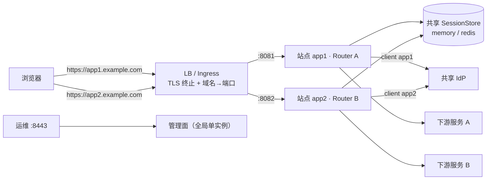

# BFF 多站点（Multi-site）设计

> 状态：v0.4 定稿 · 2026-10-09（已通过评审，待 writing-plans 拆解）
> 前置决策：TLS 终止与域名→端口映射由前置 LB/Ingress 承担，BFF 纯 HTTP（见 `deploy/k8s/ingress.yaml`、`deploy/https/`）。
> 本文是设计规格；实施计划（writing-plans）据此拆解为可执行任务。评审决策的完整过程记录（三轮 22 项 + 复核）见 `docs/multi-site-design-v0.4.md`。
> **v0.4 修订摘要**：在三轮评审收敛的决策基础上定稿——legacy 行为冻结与 Host 校验边界、`session_profiles` 卫生规则、两步发布 + cookie 名轮换迁移、`logout_scope` 语义修正、结构指纹与 `requires_restart`、路由站点特化优先级、指标 `site` 标签来源、响应头按请求读与预构建、探针不进业务指标等。关键技术假设均已核验（附录 A）。

---

## 1. 背景与目标

BFF 当前是“单站点”模型：一个业务端口、一份全局 `spa.dir`、一个全局 `session.cookie_name`、一份全局 `routes`，OIDC 的 `public_base_url` 也是全局值。它无法在同一进程里同时托管多个相互独立的 SPA 项目。

**典型场景**：企业内部信息系统（如 HR、财务、工单、Wiki 等）由不同团队开发，但面向同一批员工。统一认证（SSO）是企业内信息系统的刚性需求，需要“一处登录、处处免登录”，同时各系统的令牌受众必须隔离。

目标是把 BFF 演进为**组织内统一的 SPA Web Server**：

- **单进程、多监听端口**：每个项目（站点）一个独立端口，可绑定到同一顶级域下的独立子域名；
- **共享 IdP、跨站点 SSO**：各站点在 IdP 注册独立 client（令牌受众隔离），但共享顶层域会话 Cookie，实现“一处登录、处处免登录”；
- **站点隔离**：令牌、业务会话属性、SPA 资源、路由、安全响应头按站点命名空间隔离；
- **生产合理化**：现有单站点配置零行为变更升级；启动期严格校验；明确热重载边界；可观测、可迁移、可回滚（两步发布路径见 §11.3）。

非目标（明确不做）：

- BFF 自身终止 TLS / SNI 证书管理（由前置 LB/Ingress 承担）；
- 跨注册域（`app1.com` / `app2.io`）的 SSO；
- 按站点拆分进程/二进制；
- 站点端口的自动分配（端口是 BFF 与基础设施之间的显式契约）；
- 面向浏览器的登出广播通道（WS/SSE push）。

## 2. 需求与已确认决策

| # | 决策 | 结论 |
|---|---|---|
| D1 | 项目形态 | 多个独立 SPA 项目，由同一个 BFF 托管 |
| D2 | 端口 | 每个项目独立监听端口 |
| D3 | 域名 | 站点 = 同一顶级域下的子域名（`app1.example.com`、`app2.example.com` …） |
| D4 | OIDC | 共享 IdP；**每个站点在 IdP 注册独立 client**（client_id/secret/redirect_uri 独立） |
| D5 | SSO | **跨站点 SSO**：任一站点点过登录后，其他站点静默完成认证，无登录页 |
| D6 | 会话 | 共享顶层域会话（`Domain=.example.com` + 共享 SessionStore），令牌/业务属性按站点命名空间隔离 |
| D7 | TLS/域名映射 | 前置 LB/Ingress 终止 TLS 并做域名→端口映射；BFF 纯 HTTP + Host 白名单纵深防御 |
| D8 | 登出 | 默认 `global`（清共享会话 + RP-Initiated Logout），可按站点配置为 `site`（详见 §7.4） |
| D9 | 路由归属 | 路由集中定义，`RouteDef.sites` 注解站点（缺省 = 全部站点） |
| D10 | session 配置 | 引入 `session_profiles`，站点通过 `session_profile` 引用；同 profile 天然共享会话 |
| D11 | per-site CSP | P1 提供 `sites[].security_headers` 覆盖（路径前缀机制无法区分同服务在 `/` 的站点） |
| D12 | current_provider 迁移 | 仅 legacy 合成 default 模式允许回退读取旧键并迁移；显式多站点模式永不读取旧键。该迁移仅在“未引入 Domain cookie、cookie 名未轮换”的同类升级中生效；默认迁移路径见 D13 |
| D13 | 迁移发布 | **两步发布**：①部署多站点能力二进制、保持无 `sites` 配置（behavior-neutral）；②切换 `sites` 配置并轮换 cookie 名引入 Domain cookie，接受一次性重认证（IdP 会话在时无登录页）。详见 §11.3 |
| D14 | 登出语义 | `global` = 全站本地清理 + RP-Initiated Logout；`site` = 仅本地清理、**不触发 IdP 登出**。验收标准 7 相应修订 |
| D15 | Host 白名单 | 多站点有效白名单 = `server_names ∪ {public_base_url 主机}`；`server_names` 可省。legacy 不启用全局 421，可选 `server.enforce_host: true` |
| D16 | 共享 provider | 同 profile 内站点 `allowed_providers` 交集对应的 provider 必须显式 `shared_across_sites: true` 才放行 |

## 3. 术语

| 术语 | 含义 |
|---|---|
| 站点 / site | 一个被托管的 SPA 项目：独立端口、（可）独立子域名、SPA 目录、路由子集、Provider 绑定 |
| SSO 组 | 引用同一 `session_profile` 的站点集合；组内共享会话 Cookie 与服务端会话记录。跨子域共享要求 profile 的 `cookie_domain` 非空；被多主机引用的 profile 缺 Domain 时 prod 启动失败、dev 告警 |
| Session profile | 一组 Cookie 与会话策略（名字/域/Secure/SameSite/TTL）；启动时为每个 profile 构建**一个** `SessionManagerLayer` 供组内站点复用 |
| SiteHandle | 站点运行时句柄（静态，启动时构建）：`name` / `port` / `bind` / `session_profile` 引用与已构建的 `SessionManagerLayer`；注入该站点 router |
| SiteView | 站点配置视图（动态，每请求从配置快照按站点名解析）：`server_names` / `public_base_url` / `spa.dir` / provider 绑定 / `security_headers`（预构建 HeaderMap）/ `logout_scope` |
| SiteCtx | 显式站点上下文的传参载体（`SiteHandle` + 解析后的 `SiteView`），沿 `dispatch → proxy / token_exchange / pipeline / ws` 传递 |
| 结构指纹 | 启动期物化字段的规范化集合（§5.6），`requires_restart` 判定的唯一依据 |
| legacy 模式 | 配置中无 `sites`，由现有 `server.business_port` / `spa` / `session` / `routes` 合成名为 `default` 的站点；保留 v0.3 前行为语义（多 provider 无 `?provider=` → 400；Host 校验仅 OIDC 路径，或显式 `server.enforce_host`） |

## 4. 总体架构



共享（进程级单例）：`AppState`（HTTP 连接池、`OidcClientManager`、`SessionStore`、pipelines/scripts 注册表、指标、熔断/舱壁、token exchange 缓存）。

按站点独立：listener 端口、SPA 目录与 fallback、路由子集、Provider 绑定、`public_base_url`、Host 白名单、安全响应头（P1 起支持覆盖）、Session profile 引用。

**参考实现**：Duende BFF v4 在单 host 内逻辑托管多个前端（每个前端独立 OIDC client、Cookie 策略），并支持动态增删前端。本方案在设计思路上与其多前端能力对齐，但基于 byteforce-cn/bff 的现有架构自研实现，并扩展了共享会话 SSO 与 legacy 兼容路径。

## 5. 配置模型

### 5.1 `sites[]`

```yaml
server:
  admin_port: 8443
  business_port: 8080          # legacy 字段：无 sites 时用于合成 default 站点；显式多站点下被忽略

sites:
  - name: app1                 # 唯一；[a-z0-9-]，用作指标/日志/会话命名空间；保留名 admin 禁止
    port: 8081                 # 必填、唯一、≠ admin_port、禁用 0
    bind: "0.0.0.0"            # 可选，默认 0.0.0.0
    server_names: ["app1.example.com"]        # 可选；有效白名单 = server_names ∪ {public_base_url 主机}
    public_base_url: "https://app1.example.com"  # prod 必填；redirect_uri 一律由此推导
    session_profile: default   # 引用 session_profiles / 顶层 session（默认 default）
    spa: { dir: "apps/app1/dist" }
    oidc:
      default_provider: app1   # 引用 oidc.providers
      allowed_providers: [app1]  # 可选；缺省 = [default_provider]
    logout_scope: global       # global（默认）| site
    security_headers:          # 可选 Partial 覆盖（未指定字段继承全局，CSP 一旦指定即整体替换）
      content_security_policy: "default-src 'self'; script-src 'self'; style-src 'self' 'unsafe-inline'"
```

全局 `oidc.providers[]` 新增可选布尔 `shared_across_sites`（默认 `false`，见 §5.4 第 10 条）。

### 5.2 `session_profiles`

顶层现有 `session` 即 profile `default` 的定义（零改动兼容）；额外 profile 通过 `session_profiles` 声明，**未指定字段继承顶层 `session` 后覆盖**：

```yaml
session:                          # = profile "default"
  cookie_name: "BFF_SESSION_V2"   # 全局唯一（跨全部 profile）
  cookie_domain: ".example.com"   # 新增：非空 = Domain cookie；缺省/空串 = host-only
  secure: true
  http_only: true
  same_site: "Lax"                # "None" 必须带引号（见下）
  ttl: "336h"                     # 可选（humantime），Cookie Max-Age / 服务端 TTL 对齐；默认 14 天
  gc_interval: "10m"              # 进程级（仅顶层生效）
  allow_unmanaged_subdomains: false  # 共享域信任边界显式确认（prod 必选，见 §5.4 第 5 条）

session_profiles:
  isolated:                       # 继承顶层未指定字段；cookie_name 必须显式且全局唯一
    cookie_name: "BFF_SESSION_ISOLATED"
    cookie_domain: ""             # 显式空串 = 强制 host-only
```

- **继承**：profile 未指定字段继承顶层 `session`；`cookie_domain` 的显式空串 `""` 表示强制 host-only（用于隔离组），缺省才继承。配置接受 `.example.com` 与 `example.com` 两种写法，内部归一为无前导点小写。
- **唯一性**：`cookie_name` 跨全部 profile（含 default）全局唯一；`session_profiles` 不得定义 `default` 键；profile 名匹配 `[a-z0-9-]+`。`cookie_name + cookie_domain` 组合判定不再使用（全局唯一已覆盖）。
- **共享 SSO 前提**：被 ≥2 个不同主机站点引用的 profile，`cookie_domain` 必须非空（prod 启动失败 / dev 告警）——“同 profile 天然共享会话”只在 Domain cookie 成立时成立。
- **`same_site` 写法**：取值 `"Strict"`/`"Lax"`/`"None"`（YAML 字符串）。`"None"` 必须带引号，且校验强制 `secure: true`；`null` 或未知值在反序列化/校验阶段拒绝。
- **信任边界确认**：每 profile 提供 `allow_unmanaged_subdomains`（默认 false）。prod 下 `cookie_domain` 非空且未显式置 true → 启动失败；dev → warn。语义：确认“该域内未托管的子域也会收到会话 Cookie”这一信任边界。
- **层与 TTL**：启动时每 profile 构建一个 `SessionManagerLayer`（复用 `build_layer`，新增 `with_domain`）；`ttl` 为 profile 级，`gc_interval` 为进程级（仅顶层生效）。

### 5.3 路由归属

`RouteDef` 增加可选字段：

```yaml
routes:
  - path: "/api/users"
    sites: ["app1"]            # 可选；缺省/空 = 全部站点（兼容旧配置）
    methods: ["GET", "POST"]
    type: proxy
    config: { upstream: "http://svc-a:9091" }
  - path: "/api/orders"
    sites: ["app2"]
    ...
```

匹配语义：`match_route(routes, site, method, path)`，顺序为：

1. 站点过滤（`sites` 缺省/空 = 全部站点）；
2. 现有“段边界最长前缀 + 方法过滤”；
3. 同长度时**显式带 `sites` 的路由优先于全局路由**；
4. 再相同则保持现行配置顺序 last-wins。

启动时对“同一站点可同时命中的完全同规格路由（相同 path/methods/sites）”给出 **warn**（不 fail，保持 legacy 兼容）。`pipelines` / `scripts` 注册表保持全局共享，不按站点复制。

### 5.4 启动期校验（fail-fast）

1. `sites[].name` 非空、唯一、匹配 `[a-z0-9-]+`；**保留名 `admin` 禁止（error）**，避免指标/日志/未来管理面命名空间与“管理端口请求”混淆；`default` 允许（legacy 过渡名）。
2. `port` 唯一、非 0、≠ `admin_port`。
3. `session_profile` 引用存在；profile 名合法且不得为 `default`；profile 未指定字段继承顶层 `session`；**`cookie_name` 全局唯一**；`same_site ∈ {Strict, Lax, None}` 且 **`None ⇒ secure: true`**；**prod 逐 profile** 校验 `secure`（不能只查顶层 `session`）。
4. **`cookie_domain` 正向校验**：非空时必须 domain-match 所有引用该 profile 站点的有效主机（`server_names ∪ {public_base_url 主机}`），否则 error；被 ≥2 个不同主机站点引用且 `cookie_domain` 为空 → prod 启动失败、dev warn。
5. **共享域确认**：prod 下 profile `cookie_domain` 非空且 `allow_unmanaged_subdomains != true` → 启动失败；dev warn。
6. **显式多站点 + prod**：每站点必须配置 `public_base_url`（http/https、无 path/query）；`server_names` 可选，若配置必须包含 public 主机；站点间 `public_base_url` 归一化后必须唯一（error）。显式多站点下 `server.public_base_url` / `server.trusted_hosts` 非空 → **error**（dead config）；`server.business_port` 忽略（文档注明；≠ 8080 时 warn）。
7. `server_names` 条目仅主机名：拒绝 `://`、`/`、端口、**通配符 `*`**；大小写不敏感、去尾点；站点内唯一。
8. 站点绑定 provider 必须存在于 `oidc.providers`；`default_provider ∈ allowed_providers`；**同一站点绑定的 provider `callback_path` 必须唯一**（error，否则回调无法区分 provider）。
9. `routes[].sites` 中的名字必须是已定义站点。
10. **同 profile 内 provider 隔离**：不同站点的 `allowed_providers` 集合不应有交集。若确实需要共享 provider，必须显式配置 `oidc.providers[].shared_across_sites: true`，否则启动失败。这是保证“站点间令牌互不可见”的结构性约束。
11. 多站点 prod 下多个站点解析到同一 `spa.dir` → warn（可能误配，也可能有意复用）。
12. `sites` 为空 ⇔ legacy 模式：保持现有全局校验、多 provider 选择语义（无 `?provider=` → 400）与 Host 校验路径（仅 OIDC + 可选 `server.enforce_host`）完全不变。

### 5.5 向后兼容合成

无 `sites` 时合成单站点（名字 `default`）：`port = server.business_port`，`spa = 顶层 spa`，`session_profile = default`，`allowed_providers = 全部 oidc.providers`，`default_provider = 第一个 provider`，`routes = 现有全局 routes`，`logout_scope = global`。现有部署升级为零配置变更。

**legacy 登录选择语义冻结**：`select_provider(None)` 仅在恰好一个 provider 时取默认，多 provider 仍 400；合成的 `default_provider` 只用于 `current_tokens` 回退与 token 刷新，不改变登录选择。legacy 不启用全局 Host 421。

### 5.6 热重载边界

`AppState.config` 为 `ArcSwap<AppConfig>`（管理端 import / 配置 watcher 整体替换）。判定依据统一为 **`structural_diff(old, new)`（结构指纹）**。

**热生效**：

| 变更 | 生效方式 |
|---|---|
| `routes`（含新增/修改 `sites` 注解）、`pipelines`、`scripts` | 热生效（每请求读配置快照） |
| `oidc.providers` 的 client_id/secret/issuer/scopes/refresh_skew 等 | 热生效（**`callback_path` 集合变化除外**，见下）；生效时必须使 `OidcClientManager` 缓存失效（见下） |
| `sites[].server_names`、`public_base_url`、`spa.dir`、`oidc` 绑定、`security_headers`、`logout_scope` | 热生效（每请求从配置快照按站点名解析） |
| `persistence.path` / `watch_interval`、`health.*`、`websocket.*`、`token_refresh.skip_prefixes`、`admin.*`（除端口） | 维持现状（每请求/每轮读取） |

**需重启（结构指纹覆盖）**：

| 变更 | 原因 |
|---|---|
| `sites[]` 增删 / `name` / `port` / `bind` / `session_profile` 引用 | listener 与 router 结构启动构建 |
| profile 的解析后 cookie 策略：`(cookie_name, cookie_domain, secure, http_only, same_site, ttl)` | `SessionManagerLayer` 启动构建 |
| `oidc.providers[].callback_path` **集合的新增/删除/修改** | 回调路由启动注册（集合内路径互换因路由与 provider 无绑定而可热生效，见下） |
| `server.admin_port` | 监听绑定 |
| `provider.*`（memory/redis、redis_url） | Provider 实例启动构建 |
| `http_client.*` | 共享 HTTP 客户端启动构建 |
| `rate_limit.*`、`cors.*`、`body_limit.max_bytes` | 中间件层启动快照 |
| `circuit_breaker.*`、`scripting.max_duration` | 注册表 / 引擎启动构建 |
| `telemetry.*`、`persistence.enabled`、`session.gc_interval` | 启动初始化 |
| `bff_secret.*` | **直接拒绝**（不属于 `requires_restart` 清单，保持现有语义） |

**结构指纹定义**（规范化、顺序不敏感；profile 取继承+覆盖后的解析值）：

```
( admin_port,
  provider.*, http_client.*, rate_limit.*, cors.*, body_limit.max_bytes,
  circuit_breaker.*, scripting.max_duration, telemetry.*, persistence.enabled,
  session.gc_interval,
  sorted[ profiles: (name, cookie_name, cookie_domain, secure, http_only, same_site, ttl) ],
  sorted[ sites: (name, port, bind, session_profile) ],
  sorted[ providers: callback_path ] )
```

实现注意（评审复核补充）：

- 归一化必须与 §5.4 校验共用同一函数（`public_base_url`、`cookie_domain`、`server_names`），否则会出现“校验通过但指纹认为变了”；
- profile 必须取**解析后**值（含继承），内层集合同样排序；
- `allow_unmanaged_subdomains` 属校验开关，不在指纹内（每次配置替换重新执行 §5.4 校验）；
- 新增启动物化字段时同步更新指纹（集中构造指纹，禁止散落比较）。

**`callback_path` 语义**：回调路由按“路径集合”注册且与 provider 无绑定（handler 按 `?provider=`/站点默认选择 provider）；集合内的路径互换可热生效，但任何新增/删除/修改都改变指纹 → 需重启。删除路径后旧路由随重启消失，不存在“注册但无效”的中间态。

**Provider 缓存失效**：provider 内容（含 `issuer_url`/`client_id`）热更新后必须使 `OidcClientManager` 缓存失效——集中到配置替换的单一钩子（`replace_config` / `apply_watched_config`）统一对受影响 provider 调用 `invalidate`，不依赖各 handler 记得调用；否则会出现“配置改了但行为不变”的隐性故障。

**行为**：

- `import`：`structural_diff` 非空 → **不替换 `ArcSwap`、不落盘**，返回 `{"status": "requires_restart", "hot_applied": [...], "requires_restart": [...]}`（按字段路径列出）；为空 → 正常应用并返回 `hot_applied` 清单。
- watcher：检测到结构差异 → error 日志 + 告警，保持旧配置不应用。
- `settings` 交互：任何路径的结构性变更都不得产生“listener 仍在、但 `SiteView` 按名解析不到”的中间态。

## 6. 运行时架构

### 6.1 多监听器与站点运行时（SiteHandle / SiteView / SiteCtx）

- `src/main.rs`：由 `sites[]`（或 legacy 合成）循环 bind；每个站点一个 router；优雅关闭沿用现有 `JoinSet` 模型扩展到 N 个 server；失败语义为“任一 listener bind 失败 → 启动失败”。
- **运行期 listener 异常退出**：任一 listener 的 accept 循环意外退出时，**触发全局优雅关闭并退出进程**，由 K8s 重启。不允许“部分站点静默不可用而 Pod 仍 Ready”。
- 运行时分为两层，并以显式参数 `SiteCtx` 传递：
  - `SiteHandle`（**静态**，启动时构建）：`name` / `port` / `bind` / `session_profile` 引用与已构建的 `SessionManagerLayer`。站点 router 挂 `Extension<Arc<SiteHandle>>`（或等价 per-router state）。
  - `SiteView`（**动态**，每请求从 `state.cfg()` 按 `SiteHandle.name` 解析）：`server_names` / `public_base_url` / `spa.dir` / provider 绑定 / `security_headers` / `logout_scope`。站点数很小，按名解析成本可忽略。
  - `SiteCtx = { handle: &SiteHandle, view: SiteView }`，沿 `dispatch(SiteCtx) → proxy / token_exchange / pipeline / ws` **显式传参**；不使用隐式 Extension 作为唯一来源。
- 路由构建入口：
  - `build_site_router(state, handle) -> anyhow::Result<Router>`：多站点主路径；
  - `build_business_router(state) -> anyhow::Result<Router>`：legacy 模式便利入口（内部合成 default 站点），现有测试与嵌入方零改动。
- **改造顺序（评审复核建议）**：先定义 `SiteCtx` 并让 legacy 路径填充 `default` 站点 → 逐个 handler 迁移（每步保持测试绿色）→ 最后切换到多站点 router 入口；不要一次性改完再跑测试。

### 6.2 中间件与处理器改造清单

| 位置 | 改造 |
|---|---|
| `src/server/route_dispatcher.rs` | `match_route(routes, site, ...)`（§5.3 优先级）；`dispatch` 接受 `SiteCtx`；`session_json` 取站点 token；`auth_required` 判定 = 本站点当前 provider 有 token |
| `src/server/proxy.rs` | 上游鉴权注入站点 token；401 重试 `force_refresh` 用站点 provider |
| `src/server/token_exchange.rs` | `subject_token` 取站点 token；端点解析/刷新站点感知；缓存键不变，清理沿用会话前缀 |
| `src/server/sse_proxy.rs` | 如涉及 token 注入，同 `proxy.rs` |
| `src/middleware/token_refresh.rs` | 按站点刷新“站点当前 provider”的 token；`canonical_base_url` 改为站点感知 |
| `src/server/business.rs` | `fallback_handler` / `serve_spa` 使用站点 `spa.dir`；`session_info` 按站点返回；`/pipeline/:name`、`/ws` 站点鉴权；metrics `site` 由 `SiteHandle` 取 |
| `src/oidc/handlers.rs` | `login/callback/logout`、`select_provider`、`current_tokens`、`base_url_from` 全部站点感知；`select_provider` 限定站点 provider 白名单；logout 按 scope（`site` 不调 end_session） |
| `src/provider/session.rs` | `build_layer` 支持 `cookie_domain`；每 profile 构建一次 |
| `src/state.rs` | profile → layer 映射；`SessionInfo` 新增 `sites`/`providers` |

### 6.3 Host 校验

- **有效白名单**（多站点）：`server_names ∪ {public_base_url 主机}`（归一化比较）；未配置 `server_names` 时即为 public 主机。
- 比较规则：**仅比较主机名**——大小写不敏感、剥离端口、IPv6 方括号归一化；`server_names` 不参与网络绑定，只做白名单。
- 非豁免路径 Host 不命中（含 Host 缺失）→ **421 Misdirected Request**。
- **豁免**：`/live`、`/ready` 无条件跳过（探针来源是节点 IP、Host 是 Pod IP，且这两个端点不返回敏感信息、不参与 redirect_uri 推导）。
- **loopback 语义**：未配置 `public_base_url`（dev 语义）时 loopback 主机名（`localhost`、`127.0.0.1`、`[::1]`）作为开发兜底放行；配置了 `public_base_url` 后（prod 语义），非豁免路径 Host 必须命中白名单，loopback 也拒绝。
- **legacy 语义**：不启用全局 421，OIDC 路径沿用现有 `base_url_from` 规则；`server.enforce_host: true` 时对全部路径启用同规则（有效白名单 = `trusted_hosts ∪ {public_base_url 主机}`，为空则仅 loopback）。
- **中间件顺序**：Host 校验应在 session layer **之前**执行，避免为伪造 Host 建立会话。
- 文档备注：nginx `proxy_next_upstream` 默认值为 `error timeout`，不含 `http_421`，421 会透传给客户端；仅当运维自定义列表包含 `http_421` 时需要移除，避免被当作可重试错误。

## 7. 会话与跨子域 SSO

### 7.1 Cookie 与共享会话

共享 SSO 组的站点使用同一 profile：`cookie_name = BFF_SESSION`、`cookie_domain = .example.com`、`Secure`、`HttpOnly`、`SameSite=Lax`（与现状一致，兼容 IdP 顶层导航回调）。服务端为同一份 `SessionStore`（memory 单实例 / redis 多副本共享，key `bff:sess:{id}` 保持不变）。**同 profile 跨子域共享要求 `cookie_domain` 非空**（§5.2）；缺省 host-only 时“共享 store”不构成跨站 SSO。

**SameSite 与 IdP 回调**：`Lax` 兼容顶层导航回调。若企业 IdP 的登录流程涉及跨站 POST 回调（如 SAML 场景），`Lax` 会阻止 Cookie 发送，此时需要 `SameSite=None`（YAML 写 `"None"`）且 `secure: true`。部署文档需明确列出 IdP 的回调方式，并与 `SameSite` 策略做交叉验证。

### 7.2 会话数据命名空间

| 键 | 归属 | 说明 |
|---|---|---|
| `oidc:{provider}:tokens` | 现有关键，天然按 client/provider 隔离 | 每站点独立 client ⇒ 令牌互不可见 |
| `oidc:{provider}:flow` | 现有，同上 | login/callback 的 state/nonce/PKCE 暂存 |
| `oidc:current_provider` | **legacy 兼容键** | 仅 legacy 合成 default 模式读取并迁移 |
| `oidc:{site}:current_provider` | 新增，站点维度 | 值为该站点最近一次登录使用的 provider，必须 ∈ 站点白名单 |

- `current_tokens(session, ctx)` 站点感知，统一处理逻辑：
  1. 读 `oidc:{site}:current_provider`；
  2. 若值有效且 ∈ 站点白名单，检查该 provider 的 token 是否存在；
  3. 若值无效/缺失/不在白名单，或对应 provider 无 token，则尝试站点 `default_provider` 的 token；
  4. 若 `default_provider` 有 token，写回 `oidc:{site}:current_provider` 并继续；
  5. 若仍无 token，视为该站点未登录。
- `auth_required` 路由的 401 语义不变；`/api/session` 按站点返回 `{ logged_in, provider? }`。
- **迁移规则**：仅 legacy 合成 default 站点允许回退读取旧键 `oidc:current_provider`；命中其绑定的 provider 时，迁移为 `oidc:default:current_provider` 并删除旧键。显式多站点模式永不读取旧键。该迁移仅在“cookie 名未轮换、未引入 Domain cookie”的同类升级中可能命中；默认迁移路径（两步发布 + cookie 轮换）不依赖旧键迁移——旧会话直接视为未登录并重认证。

### 7.3 SSO 时序（静默续登）

```mermaid
sequenceDiagram
    participant B as 浏览器
    participant A as "BFF app1 · 8081"
    participant C as "BFF app2 · 8082"
    participant I as IdP
    B->>A: GET /login（app1）
    A->>B: 302 IdP（client_app1，redirect_uri=app1）
    B->>I: 授权请求
    I->>B: 302 回 app1/auth/callback?code
    B->>A: 回调
    A->>I: code 换 token（client_app1）
    A->>B: Set-Cookie BFF_SESSION; Domain=.example.com
    Note over B,C: 共享会话建立（含 oidc:app1:tokens）
    B->>C: 访问 app2 受保护接口
    C->>B: 401（会话存在，但无 oidc:app2:tokens）
    B->>C: GET /login（app2）
    C->>B: 302 IdP（client_app2）
    B->>I: 授权请求（IdP 会话仍在，无登录页）
    I->>B: 302 回 app2/auth/callback?code
    B->>C: 回调
    C->>I: code 换 token（client_app2）
    C->>B: 200（oidc:app2:tokens 写入同一会话）
```

每站点首次访问有一次静默重定向往返（用户无感）。零往返 SSO（RFC 8693 token exchange）列入 P2 可选增强，不进 P1。

### 7.4 登出

`sites[].logout_scope`：

- **`global`（默认）**：移除**全部站点** token（`session.flush()`）→ 清除该会话的 token exchange 缓存 → RP-Initiated Logout（用触发站点的 client 与 `id_token_hint`）。IdP 是否真正终止其 SSO 会话取决于 IdP：若终止，其他站点重新访问会出现 IdP 登录页（属预期）；若未终止，才可能静默恢复。
- **`site`**：仅移除**本站点绑定的全部 provider** tokens 与 `oidc:{site}:current_provider`，保留会话与其他站点；**不触发 IdP 登出**；同样清理该会话的 exchange 缓存。provider 定位优先 `oidc:{site}:current_provider`，缺失/无效回退站点 `default_provider`。

预期行为（写入文档，不作为缺陷）：`global` 登出后其他站点在途请求可能以 401 失败，SPA 按既有“401 → `/login`”处理；是否静默恢复取决于 IdP SSO 会话是否被终止。管理端 `DELETE /admin/api/sessions/:id` 在共享会话下等于**全局踢出**（清掉所有站点 token），运维文档需标注，admin UI 也应明确提示（如“此操作将终止该用户在所有站点的会话”）。

### 7.5 残余风险与缓解

| 风险 | 说明 | 缓解 |
|---|---|---|
| 共享域 Cookie 暴露面 | `Domain=.example.com` 的 Cookie 会发送给该域下**所有**子域（含非 BFF 管理的服务）；域内任一子域被攻破即可窃取会话（会话记录含全部站点 token） | 正向 domain-match 校验（§5.4 第 4 条）+ 每 profile `allow_unmanaged_subdomains` 显式确认（§5.4 第 5 条）+ `docs/security-hardening.md` 运维规范；`__Host-` 前缀与 Domain 互斥，无法使用 |
| Cookie 投毒/固定 | 兄弟子域服务可向父域写同名 Cookie | 登录成功后 `cycle_id()` 轮换会话 ID（现有）；P2 可选签名 Cookie（仅防篡改，不防暴露） |
| 多 provider 站点 | `oidc:{site}:current_provider` 选错 provider 导致 401 | 值必须 ∈ 站点白名单，否则尝试 `default_provider`；无 token 则视为未登录 |
| 同 profile 内 provider 共享 | 两个站点引用同一 provider 导致令牌可见 | 启动校验强制隔离（§5.4 第 10 条），需 provider 级 `shared_across_sites: true` 才能放行 |
| session record 规模 | 单 record 承载全站 token，请求加载与整条重写随站点数增长 | 文档给出每 profile ≤10 站点预期与大小估算；超出考虑 P2 token 分片存储 |
| 跨站点并发写 | tower-sessions 整条 record 保存，跨站并发请求为 last-write-wins（低概率） | 接受并在运维文档注明 |

## 8. OIDC 每站点 client

### 8.1 绑定与防越站

- `oidc.providers` 保持全局列表；**每站点在 IdP 注册一个独立 client**，其 `callback_path` 可相同（`/auth/callback`，不同端口/域名天然区分）。
- 站点通过 `oidc.default_provider` / `allowed_providers` 绑定；`select_provider` 增加站点上下文：
  - `?provider=` 请求的 provider 不在站点白名单 → 拒绝（**400**），**不得回退默认 provider**；
  - 无 `?provider=` → 站点 `default_provider`；
  - legacy 下未知 provider 保持现状 **404**（不统一改码）。
- **同一站点绑定的 provider `callback_path` 必须唯一**（§5.4 第 8 条）；不唯一时回调无法区分 provider。
- 跨站点共享 provider 需 `shared_across_sites: true`（§5.4 第 10 条）。
- 防越站的实现位置是 handler 层（`login/callback/logout`），不是 `OidcClientManager`；后者缓存键已是 `(provider, base_url)`（`src/oidc/client.rs::cache_key`），无需改动。

### 8.2 base_url 推导

- `base_url_from`：配置了站点 `public_base_url`（prod 多站点必配）时一律使用它、不信任 Host；未配置时回退 Host——多站点模式必须命中 `server_names ∪ {public host}`，legacy 模式沿用现有 `trusted_hosts` 规则，loopback 作开发兜底（仅在未配置 `public_base_url` 时）。
- `canonical_base_url`：站点感知（后台刷新等非请求路径使用站点 `public_base_url`，dev 回退 loopback + 站点端口）。
- redirect_uri = `{base_url}{provider.callback_path}`，per `(provider, base_url)` 缓存，天然支持多站点。

### 8.3 token 刷新

`token_refresh` 中间件按站点运行：只刷新“站点当前 provider”的 token（其他站点各自按需刷新），不再争用全局 `current_provider`。刷新失败沿用既有语义（标记会话过期 / 走重新登录）。

### 8.4 IdP 注册清单（交付模板）

每个站点一条 client 注册：`client_id`/`secret` 独立；`redirect_uri = https://appN.example.com/auth/callback`；`post_logout_redirect_uri = https://appN.example.com/`；IdP 侧须保留自身 SSO 会话（跨站点静默认证的前提）。模板落入 `docs/configuration.md` / 部署文档。

## 9. 路由、SPA 与安全响应头

- 每站点独立 `spa.dir` + `index.html` fallback；`/api/` 与 `/admin/api/` 前缀 404 行为保持；每站点各自注册保留路径（`/login`、`/logout`、回调路径、`/live`、`/ready`、`/api/session`、`/pipeline/:name`、`/ws`）。
- 路由按 §5.3 过滤与优先级匹配；未命中路由时按站点 SPA fallback；`/api` 404 语义不变。
- **P1 提供 per-site `security_headers` 覆盖**：`sites[].security_headers` 为 **Partial 类型**（所有字段 `Option`）：未指定字段继承全局；`content_security_policy` 一旦指定即**整体替换**（含全局 path-prefix `csp_overrides`）。
- **性能**：安全响应头在配置替换时**预构建为 `HeaderMap`（`HeaderValue` 已解析）**，`SiteView` 只持有 `Arc<HeaderMap>`；请求路径零解析成本。中间件改为按请求读 `SiteView` 的预构建值（兑现热生效），不得在热路径解析字符串/构造 `HeaderValue`。
- CORS、body limit、rate limit 的 per-site 覆盖放 **P2**（本拓扑无跨源 XHR；限流按每个 listener 一个 governor 实例天然分桶）。
- 指标路径标签继续低基数归一化（现有 `metrics_path_label`），`site` 维度按 §10 规则。

## 10. 管理面与可观测性

- **管理端口保持全局单实例**（`:8443`），不随站点复制；配置导出/导入包含 `sites` / `session_profiles`；导入响应区分 `hot_applied` / `requires_restart`（§5.6）。
- **会话管理**：`SessionInfo` 形状为 `{ id, provider, sites[], providers[], sub, created_at, last_seen }`：
  - `provider` 保持非空 `String`，语义为“最近一次登录使用的 provider”。前提：索引仅在站点登录成功（`register_session`）后创建；访问 SPA 不会产生无 provider 的索引项。
  - `sites` / `providers` 为当前会话实际持有 token 的站点/provider 集合（additive）；`list_sessions` 对当前页条目以有界并发（≤16）加载 session record 推导，缺失条目跳过（交由 GC）；Redis 后端的批量加载（MGET/管道）列为 P2 优化。
  - callback 在 `cycle_id()` 前捕获旧 session id，轮换后移除旧索引项，消除 GC 窗口内的幽灵会话。
- **指标**：
  - 请求计数与延迟直方图新增 `site` 标签，由 `SiteHandle` 决定（数值 = 站点数，可控）；业务端口的所有非探针请求都记站点名。
  - **`/live`、`/ready` 不进入业务请求指标**（K8s 探针会污染低频站点的 P95/P99 且占比可观）；如需监控探针可达性，使用独立的 `bff_health_probe_total{path,status}`（可选）。
  - 不再定义 `health` / `unknown` 取值；admin 端口当前无请求指标中间件，故不定义 `admin`。
  - provider 不进指标标签（基数 = 站点 × provider，只在管理 API 返回）。
- **日志/追踪**：日志字段与 trace span 属性增加 `bff.site`；错误日志带站点名。
- 现有 `/api/session` 的响应结构保持向后兼容（按站点返回 `{ logged_in, provider? }`，不删字段）。
- **管理台**：Sessions 页增加站点只读列；模拟登录增加站点下拉（按所选站点端口构造 `/login?provider=...`）；删除会话按钮提示“将终止该用户在所有站点的会话”。

## 11. 部署

### 11.1 Kubernetes

- 单 Deployment / 容器暴露多个 `containerPort`（如 `app1: 8081`、`app2: 8082`）；
- `deploy/k8s/service.yaml` 增加按站点的端口映射；`deploy/k8s/ingress.yaml` 为每个子域写 host → service port 规则（TLS 在 Ingress 终止）；
- 探针打**任一业务端口**（`/live`、`/ready` 站点无关且豁免 Host 校验）；示例取 `default` 站点端口；站点端口变更属结构变更（§5.6），需同步 Deployment/Service/Ingress；
- PDB / HPA / NetworkPolicy 不变。

### 11.2 本地与 compose

- 提供 nginx 示例：`app1.localhost` / `app2.localhost` → `127.0.0.1:8081/8082`，并配置 `proxy_set_header Host $host;`（剥离端口，模拟生产行为）；
- 纯本地也可直接用 `localhost:8081/8082`（dev 语义放行 loopback Host，仅未配置 `public_base_url` 时）。注意：host-only cookie 按**主机**（而非端口）共享，Domain cookie 语义无法在纯 localhost 场景验证；验证 SSO/隔离请使用 `app1.localhost`/`app2.localhost` + nginx 示例。

### 11.3 迁移与回滚

- **默认迁移路径（两步发布）**：
  1. 部署 v0.4 二进制，配置保持**无 `sites`**（legacy 路径）→ 行为与升级前一致，验证回归；
  2. 切换配置：新增 `sites`（原站点建议沿用名 `default` 与原业务端口）、`session.cookie_name` 轮换为 `BFF_SESSION_V2`、`cookie_domain: .example.com`、每站点 `public_base_url`/`server_names`，并按 §5.4 第 5 条显式 `allow_unmanaged_subdomains: true`。重启后用户首次访问完成一次登录（IdP 会话在时无登录页）。
- **混版窗口策略（必须显式选择）**：
  - **推荐：步骤 2 使用 `strategy: Recreate`**（或先 drain/缩容旧 Pod 再启动新 Pod）——配置切换是一次性的，短暂停机换取确定性，避免新旧 Pod 各自读写不同 cookie 名导致同一用户多次重认证；
  - 若必须滚动：文档明确声明“滚动期间部分用户可能经历**多次**重认证”（不是一次），建议低峰执行并接受该代价；
  - 任一策略下，Ingress/Service 在切换期间保持不变。
- **旧 host-only cookie**：轮换后仍会被浏览器发送但被新代码忽略，随 Max-Age 自然过期；需要立即清理可由运维下发同名 Max-Age=0 删除。
- **legacy 键迁移（窄路径）**：仅在“cookie 名不变、未引入 Domain”的升级中出现；先以 legacy 配置运行一次使 `oidc:current_provider` 迁移为 `oidc:default:current_provider`，再启用 sites。默认路径不需要它。
- **回滚**：删除 `sites` / `session_profiles` 并还原 `cookie_name`。V2 Domain cookie 被旧代码忽略并自然过期；旧 host-only cookie 若未过期且 Redis 旧记录仍在，可恢复为已登录状态。文档注明两种 cookie 的清理约定。

## 12. 测试策略

**单元测试**

- 配置解析：legacy 合成 default、`sites` / `session_profiles` 校验规则（重复端口、provider 越界引用、prod 缺 `public_base_url`、`server_names` 非法格式、`routes[].sites` 未定义站点、profile cookie 名冲突、同 profile 内 provider 交集、`cookie_domain` 正向 domain-match 与 ack、`same_site="None"` 且 `secure=false`、prod 逐 profile `secure`、dead config、`public_base_url` 重复、同站点 `callback_path` 重复、站点名 `admin`、同 `spa.dir` warn）；
- `match_route` 站点过滤、最长前缀优先级（站点特化 > 全局）、同规格重复告警；
- Host 校验：剥端口、大小写、IPv6、豁免路径、prod 下 loopback 拒绝、dev 下 loopback 放行、有效白名单并集、legacy `server.enforce_host`；
- `base_url_from` / `canonical_base_url` 站点感知；
- `current_tokens` 的统一处理逻辑（无效值回退 default_provider）；
- 结构指纹：站点端口变更 → `requires_restart`；provider 内容变更 → 热生效；顺序不敏感；解析后继承值比较。

**集成测试**（复用 `tests/common`，扩展为多 router 夹具）

- 站点 A 登录 → 共享会话建立 → 站点 B 受保护接口 401 → 模拟 IdP 会话静默换码成功；
- **跨站点 provider 越权反向用例**：站点 A 端口请求 `/login?provider=<站点B的provider>` 必须被拒（400），且不回退默认；
- 令牌隔离：站点 A 的 `oidc:{providerA}:tokens` 不参与站点 B 的鉴权；
- 多站点模式下两个站点引用同一 provider → 启动校验拒绝（除非显式 `shared_across_sites: true`）；
- 热重载配置删除站点 → import 返回 `requires_restart` 且旧配置保持；
- `site` / `global` 登出行为差异 + exchange 缓存清理；
- `SessionInfo.sites`/`providers` 推导 + `cycle_id` 旧索引清理；
- 每站点 SPA fallback 与 `/api` 404；探针请求不进入业务请求指标（或只进独立探针指标）；
- 管理台模拟登录站点选择；
- legacy 模式：现有单站点测试经 `build_business_router(state)` 零改动通过。

**listener 异常退出测试（可注入性要求）**：

- 抽出可测试的 serve 编排：签名从 `JoinSet` 抽象出可注入的 `shutdown_rx`/`shutdown_tx`；
- 单个 listener 失败映射为全局 `shutdown_tx`；测试构造“一个 server 任务先退出”，断言整体关闭被触发；
- 该测试是 P1 集成测试中挑战最高的一项，实施计划中提前做技术验证。

**E2E**

- mock IdP + nginx 双子域全链路：登录、跨站点静默 SSO、global/site 登出、Host 伪造返回 421、prod 下 loopback 非豁免路径 421；
- 迁移演练：模拟“旧 host-only + 新 Domain”双 cookie 并存，断言轮换 cookie 名后新会话不受影响（脚本可重复执行）。

## 13. 分期与范围

### P1（核心，本文范围）

配置 schema + 校验 + legacy 合成；`SiteHandle`/`SiteView`/`SiteCtx` + 多监听器；`session_profiles` 与共享 SSO；`current_provider` 站点化与迁移；`logout_scope`；站点 provider 绑定与防越站；per-site SPA/路由/`security_headers`（预构建 + 按请求读）；结构指纹与 import `requires_restart` 响应；管理配置 API + 管理台站点/会话只读展示 + 会话 schema additive + 管理台模拟登录站点选择 + 指标 `site` 标签（探针排除）；单测/集成/E2E（含 listener 异常退出 harness）；迁移/回滚文档与文档更新（`configuration.md`、`deployment.md`、`security-hardening.md`、`runbook.md`、`architecture.md`）。

### P2

管理台站点编辑；per-site CORS / rate limit / body limit 覆盖；签名 Cookie；动态增删 listener（免重启）；token exchange 零往返 SSO（可选增强）；SSO 安全区模式（按安全等级分段 profile）；token 分片存储（session record 规模超预期时）；`global_local` 登出 scope（仅本地全站清理、不登出 IdP）；cookie_domain 的公共后缀（PSL）校验。

### 明确不做

见第 1 节“非目标”。

## 14. 验收标准

1. 现有单站点配置原样启动，行为与升级前一致（legacy 合成路径测试覆盖；含多 provider 无 `?provider=` → 400 的冻结语义）；
2. 两个子域站点共享 SSO：站点 A 登录后，站点 B 首次访问无需登录页即可完成认证；
3. 任一站点无法使用他站点的 provider（`/login?provider=` 越权返回 400 且不静默回退）；
4. 站点间令牌互不可见（站点 B 鉴权不使用站点 A 的 token）；
5. 错误 Host 返回 **421**，且不影响 LB 默认重试行为（文档注明自定义 `proxy_next_upstream` 的注意事项）；
6. 结构性变更在 config import 响应中被明确标注 `requires_restart`，不静默忽略；
7. global 登出后所有站点 token 失效；重复访问各站点将重新走 IdP 认证——若 IdP SSO 会话被终止则出现 IdP 登录页（属预期），未终止才可能静默恢复；
8. `/live`、`/ready` 在 K8s 探针场景（节点 IP 来源、Pod IP Host）下正常，且**不进入业务请求指标**（或仅进入独立探针指标）；
9. 指标包含 `site` 标签且基数 = 站点数；日志/追踪可区分站点；
10. 上述每条均有自动化测试或明确的手工验收步骤；
11. 含启动物化变更的配置 import 返回 `requires_restart` 明细且旧配置保持；watcher 同样不应用；
12. 同长前缀下带 `sites` 的路由优先于全局路由；同站点完全同规格重复路由启动告警；
13. 多站点 prod 多主机引用同一 profile 且 `cookie_domain` 为空 → 启动失败；`allow_unmanaged_subdomains` 未确认同样失败；
14. `site` 登出不影响其他站点会话与 token（与 `global` 行为可区分）；
15. 旧 host-only cookie 存在时，轮换 cookie 名后新会话不受影响（迁移演练覆盖）。

## 15. 兼容性与回滚

- **配置**：仅新增字段，无破坏性改名；legacy 模式行为完全保留（含多 provider 400、Host 校验路径）。
- **管理 API**：会话列表为 additive 扩展；`GET /admin/api/routes` 返回的 `RouteDef` 新增可选 `sites` 字段（旧消费方忽略未知字段）；import/export 兼容无 `sites` 的旧配置。
- **import 语义变化**：含启动物化字段变更的导入从“静默生效但无效”改为“拒绝并返回 `requires_restart` 清单”，需写入 `docs/deployment.md`。
- **回滚**：删除 `sites` / `session_profiles` 并还原 `cookie_name`；已下发的 Domain cookie 在回滚后仍可能被浏览器发送，需等待其过期或运维清除（文档注明）；旧 host-only cookie 若未过期可恢复旧会话。

## 16. 设计评审处置记录

### v0.2 处置

| 评审意见 | 处置 | 理由摘要 |
|---|---|---|
| `port` 可自动分配（base+index） | **不采纳** | 端口是基础设施契约；自动分配把配置顺序变成隐式语义，不消除 LB/Service 联动 |
| AppState 级共享 `SessionManagerLayer` | **采纳并升级** | 以 `session_profiles` 把“一致性校验”变成结构保证（已核验 layer 可 Clone） |
| Host 校验放行“loopback 来源 + 健康路径” | **修订** | K8s 探针来源是节点 IP 非 loopback；改为“健康路径无条件豁免 + dev 按 Host 放行” |
| 421 会被 nginx 默认重试 | **修正说明** | `proxy_next_upstream` 默认 `error timeout`，不含 `http_421`；文档按自定义列表场景备注 |
| `current_provider` 回退需“最后登录站点” | **收紧方案** | 旧键只可能属于 legacy 唯一站点；仅 legacy 模式回退并迁移，多站点模式永不读取 |
| global 登出向其他站点推送通知 | **不采纳（YAGNI）** | 无面向浏览器的推送通道；采用 401 → `/login` 标准语义并写入文档 |
| per-site CSP 提前到 P1 | **采纳** | 路径前缀覆盖无法区分同服务在 `/` 的站点，属 P1 可用性问题 |
| per-site CORS 提前到 P1 | **不采纳** | 本拓扑无跨源 XHR，无 P1 必需场景 |
| provider 进 Prometheus 标签 | **不采纳** | 基数膨胀；只在管理 API 返回 |
| 保留 `build_business_router(state)` 兼容入口 | **采纳** | 现有测试零改动；新增 `build_site_router` 承载多站点 |
| 跨站点 provider 越权反向测试 | **采纳** | 纳入 P1 必测（验收标准第 3 条） |
| Host 比较忽略端口 / compose `Host $host` | **采纳** | 避免 Ingress 转发带端口 Host 被误拒 |

### v0.3 补充处置

| 评审意见 | 处置 | 理由摘要 |
|---|---|---|
| loopback Host 在 prod 下也放行 | **修订** | 配置了 `public_base_url` 后 loopback 也拒绝（健康路径除外） |
| 同 profile 内不同站点 provider 交集 | **新增启动校验** | 保证令牌隔离，需显式 `shared_across_sites: true` 才放行 |
| `current_provider` 无效时处理不一致 | **统一逻辑** | 无效/缺失时尝试 `default_provider` token，有则写回，无则未登录 |
| 热重载时站点从配置中消失 | **新增运行时约束** | 结构性变更不得替换 `ArcSwap`，保持旧配置并返回 `requires_restart` |
| listener 异常退出语义 | **明确全局关闭** | 任一 listener 异常退出触发进程退出，由 K8s 重启 |
| legacy → 多站点升级路径 | **写入迁移文档** | 见 v0.4 D13 两步发布 |
| 非站点请求的 `site` 指标取值 | **统一定义** | v0.4 修订为：由 `SiteHandle` 决定，探针不进业务指标 |
| 共享域 Cookie 信任边界 | **新增启动校验开关** | v0.4 修订为每 profile `allow_unmanaged_subdomains` 必选确认 |
| `SessionInfo.provider` 语义 | **明确** | 保持非空，语义为“最近一次登录”，索引仅在登录后创建 |
| global 登出 RP-Initiated Logout | **补充文档说明** | 见 v0.4 D14：是否静默恢复取决于 IdP |
| 回滚后的 Cookie 清理 | **补充文档说明** | 旧 `Domain` Cookie 可能仍被发送，需等待过期或运维清除 |
| 测试补充 | **采纳** | 见 §12 |
| Duende BFF v4 参考 | **写入设计参考** | 多前端能力思路对齐，自研实现并扩展共享 SSO 与 legacy 兼容 |

### v0.4 处置（三轮 22 项决策）

完整决策表与逐节修订过程见 `docs/multi-site-design-v0.4.md` §1。要点：

| 组 | 决策 |
|---|---|
| 行为冻结 | legacy 多 provider 400 与 Host 校验范围冻结；全局 421 仅多站点默认启用；`server.enforce_host` opt-in |
| profile 卫生 | `cookie_name` 全局唯一；未指定字段继承顶层；禁止重定义 `default`；`cookie_domain` 正向 domain-match；每 profile `allow_unmanaged_subdomains` |
| 迁移 | 两步发布 + cookie 名轮换；legacy 键迁移收窄；Recreate/滚动的混版策略显式化 |
| 登出 | global 含 RP-Initiated Logout；site 不触发 IdP 登出；两者均清理 exchange 缓存 |
| 运行时 | 显式 `SiteCtx` 传参；路由“站点特化 > 全局”；结构指纹 + `requires_restart`；provider 缓存失效集中化 |
| 配置 | dead config error/warn；`public_base_url` 唯一；同站点 `callback_path` 唯一；站点名保留 `admin`；`"None"` 引号写法 |
| 观测/管理 | `site` 由 `SiteHandle` 决定；探针不进业务指标；`SessionInfo` additive；`list_sessions` 分页 + 有界并发；管理台模拟登录站点选择 |
| 规模 | 单 session record（文档给出 ≤10 站点/ profile 预期）；token 分片列 P2 |

### v0.4 复核补充（评审意见 → 处置）

| 复核意见 | 处置 |
|---|---|
| `/live`、`/ready` 污染业务指标（拉低 P95/P99） | 采纳：探针不进入业务请求指标，可选独立探针指标（§10、§14 第 8 条） |
| `SessionInfo.provider` 非空前提 | 采纳：明确索引仅在站点登录成功后创建（§10） |
| provider `issuer` 热更新缓存不失效 | 采纳：失效动作集中到配置替换钩子，不依赖各 handler（§5.6） |
| 混版窗口可能多次重认证 | 采纳：步骤 2 推荐 `strategy: Recreate`；若滚动则文档声明可能多次重认证（§11.3） |
| `list_sessions` N+1 加载 | 采纳：分页 + 有界并发（≤16），Redis 批量加载列 P2（§10） |
| `same_site=None` 配置写法 | 采纳：必须 `"None"`（引号）且强制 `secure: true`（§5.2、§5.4） |
| 站点名保留 `admin` 的动机 | 采纳：补说明（§5.4 第 1 条） |
| `callback_path` 删除语义 | 采纳：指纹按路径集合判定，新增/删除/修改需重启；集合内互换可热生效（§5.6） |
| `SiteCtx` 改造面大 | 采纳：分步迁移顺序写入 §6.1 |
| `security_headers` 热路径解析成本 | 采纳：配置替换时预构建 `HeaderMap`（§9） |
| 结构指纹实现陷阱 | 采纳：归一化共用、解析后比较、集中构造（§5.6） |
| listener 异常退出测试 harness | 采纳：可注入 `shutdown` 通道 + 提前技术验证（§12） |
| 文档应产出完整版 + 前置产物加验收点 | 采纳：本文即完整版；§18 每项带完成判据 |

## 17. 后续事项

- 本文为 v0.4 定稿：由 writing-plans 拆解实施计划（任务、顺序、验证点）；前置产物与完成判据见 §18；
- P2 项在实施计划中单列 backlog，不进入 P1 范围；
- 若未来部署形态变为“每站点一个进程”，第 5 节配置模型可直接复用（`sites` 拆分为独立配置目录）；
- 关注 Duende BFF v4 的后续演进，作为多前端能力的参考实现。

## 18. 实施计划前置产物与完成判据

| # | 产物 | 完成判据 |
|---|---|---|
| 1 | `structural_fingerprint` / `structural_diff` 与字段路径命名；import 响应 schema；watcher 拒绝路径 | 单测覆盖 §5.6 指纹的每个字段，顺序不敏感测试通过；import/watcher 行为与 §5.6 一致 |
| 2 | §5.4 全部校验（含 legacy 分支、归一化、domain-match、逐 profile prod 检查） | 每条规则至少一个正向 + 一个反向测试；错误信息含字段路径 |
| 3 | `SiteCtx` 类型与调用链改造（`dispatch → proxy / token_exchange / pipeline / ws`） | 按 §6.1 分步迁移，每步全量测试绿色；legacy 路径填充 `default` 后行为不变 |
| 4 | 回调路由策略：启动注册 + `callback_path` 指纹 | 集合变化触发 `requires_restart`；默认 `/auth/callback` 兼容；集合内互换热生效测试 |
| 5 | `security_headers` 预构建 + 按请求读 | 热更新后新响应头生效；请求路径无字符串解析（基准或单测证明） |
| 6 | 管理台：Sessions 站点列 + 模拟登录站点下拉 | 多站点下可完成模拟登录与会话查看；删除会话提示全站影响 |
| 7 | 测试 harness：多 router 夹具 + 可注入 `shutdown` 的 serve 编排 | listener 异常退出测试稳定（无 flaky）；多站点集成用例可复用 |
| 8 | 迁移演练脚本/步骤（§11.3）与文档更新：`configuration.md`、`deployment.md`、`security-hardening.md`、`runbook.md`、`architecture.md` | 演练脚本可重复执行并断言“新会话不受旧 cookie 影响”；各文档与 §5–§11 一致 |
| 9 | 文档索引 | `docs/README.md` 指向完整版与评审记录 |

---

## 附录 A：已核验事实（评审依据）

| 事实 | 位置 |
|---|---|
| `SessionManagerLayer` `derive(Clone)`，支持 `with_domain` | tower-sessions 0.12.3 `src/service.rs:132,405` |
| `cycle_id` 保留 record 数据、删旧 id、save 时 create 新 id | tower-sessions-core 0.12.3 `src/session.rs:843` |
| 同名 Cookie 解析 last-wins（`IndexMap::replace`） | `cookie-0.18.1/src/jar.rs:120-153` |
| Redis session key 保持 `bff:sess:{id}` | `src/provider/redis.rs:294` |
| OIDC client 缓存键含 base_url | `src/oidc/client.rs:83` |
| `select_provider` 多 provider 无入参 → 400 | `src/oidc/handlers.rs:47-64` |
| 现状 Host 校验仅 OIDC 路径；无全局 421 | `src/oidc/handlers.rs:105-145` |
| 安全响应头当前为启动快照 | `src/server/business.rs`（`build_business_router` 闭包） |
| proxy/token_exchange/route_dispatcher/pipeline/ws 直接调用全局 token helper | `proxy.rs:38,172`、`token_exchange.rs:256,352,395`、`route_dispatcher.rs:47,94`、`business.rs:352,442`、`token_refresh.rs:30` |
| nginx `proxy_next_upstream` 默认 `error timeout`（不含 `http_421`） | nginx 文档 |
| K8s 探针打 business 端口 | `deploy/k8s/deployment.yaml:71,75,80` |
| 管理台模拟登录硬编码 business 端口 8080 | `admin-ui/src/pages/Sessions.tsx:93-99` |
| `SessionInfo` 现为 `provider: String`；`StoredTokens` 无 last_used | `src/state.rs:19`、`src/oidc/tokens.rs` |
| 现状配置无 `cookie_domain`、无 `sites`、无 `security` 段 | 全仓 grep |

## 附录 B：显式多站点配置示例

```yaml
server:
  admin_port: 8443
  # 显式多站点模式下 business_port 被忽略；public_base_url / trusted_hosts 不得配置（§5.4 第 6 条）

sites:
  - name: app1
    port: 8081
    bind: "0.0.0.0"
    server_names: ["app1.example.com"]        # 可选；有效白名单 = server_names ∪ {public 主机}
    public_base_url: "https://app1.example.com"
    session_profile: default
    spa: { dir: "apps/app1/dist" }
    oidc:
      default_provider: app1
      allowed_providers: [app1]
    logout_scope: global
  - name: app2
    port: 8082
    server_names: ["app2.example.com"]
    public_base_url: "https://app2.example.com"
    session_profile: default
    spa: { dir: "apps/app2/dist" }
    oidc:
      default_provider: app2
      allowed_providers: [app2]
    logout_scope: global

session:                                       # = profile "default"
  cookie_name: "BFF_SESSION_V2"                # 迁移期轮换（D13）
  cookie_domain: ".example.com"
  secure: true
  http_only: true
  same_site: "Lax"                             # "None" 场景必须带引号且 secure: true
  ttl: "336h"
  allow_unmanaged_subdomains: true             # prod 共享域 SSO 的显式确认

oidc:
  providers:
    - id: app1
      display_name: "App1"
      issuer_url: "https://idp.example.com"
      client_id: "app1-client"
      client_secret: "${APP1_SECRET}"
      callback_path: "/auth/callback"
      shared_across_sites: false
    - id: app2
      display_name: "App2"
      issuer_url: "https://idp.example.com"
      client_id: "app2-client"
      client_secret: "${APP2_SECRET}"
      callback_path: "/auth/callback"
      shared_across_sites: false
```
