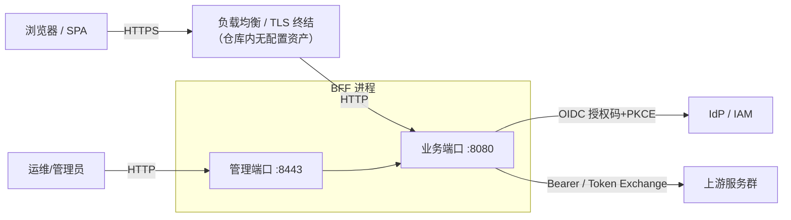

# BFF 生产落地评估与实施规划（Production Readiness Assessment）

| 项目 | 内容 |
| ---- | ---- |
| 文档类型 | 生产就绪审计报告（含落地路线图与 Go/No-Go 检查单） |
| 审计对象 | `byteforce-cn/bff`（Rust BFF 核心 + admin-ui + frontend + 测试组件） |
| 审计基线 | commit `223fd3c`（main 分支） |
| 审计日期 | 2026-09-26 |
| 文档版本 | **v2**（v1 的修订与补遗版，见 §0.2） |
| 审计方式 | 源码静态审计（逐模块）+ 构建/测试/门禁实证 + **真实二进制对照实验** + 依赖源码（vendored crate）核验 + 轻量威胁建模 |
| 总体结论 | **不具备生产落地条件（POC/alpha 阶段）**，与 README 自声明一致；存在 **5 项 P0 阻断**、**50 个 P1 高危子项**（去重后 46，分 4 类）、**15 项 P2 工程化缺口** |

> **阅读约定**
> - 本报告引用**符号名 + 文件:行号**双锚点。行号基于基线 `223fd3c`，会随代码演进漂移，漂移时请以**符号名**为准检索。
> - 标记 🆕 的条目为 v2 新增；标记 ⚠️ 的条目为 v2 修正（含定级调整）。
> - 每项均给出「证据 → 影响 → 建议 → 验收标准（P0）」，可作为工程任务直接拆单。

---

## 0. 执行摘要

### 0.1 结论

当前 BFF 在**单实例、内网、内存态、无横向扩展需求**的演示环境可以运行，且核心链路（OIDC 登录/回调/刷新、代理、编排、脚本沙箱、管理 API）已有可圈可点的工程投入；但将其作为生产系统落地，存在下列**不可回避**的阻断问题：

1. **状态全内存、无法水平扩展**：session / cache / lock 全部为内存实现，代码硬编码内存 provider，且 `validate()` 主动拒绝 `redis` 配置——而 `config/env/prod.yaml` 恰恰配置了 Redis，属于"生产配置无法启动"的自相矛盾（**已实测：`BFF_ENV=prod` 启动即 exit 1，且无环境变量逃生通道**）。
2. **缺少交付物与 TLS 方案，且回调地址存在进程级粘性污染**：仓库内无 Dockerfile / docker-compose / K8s / Helm 资产；服务仅监听明文 HTTP。回调地址不仅由 Host 头硬拼 `http://` 推导，**更严重的是 `redirect_uri` 被烧进按 provider id 缓存的 OIDC 客户端**——谁先建谁赢，赢到进程结束：一个伪造 Host 的匿名 `GET /login` 可污染全体用户的授权地址，或一次后台刷新把整机钉成 `127.0.0.1`。
3. **密钥管理存在高危缺陷**：配置导出接口会把 **`bff_secret`（AES 主密钥）以明文输出**（已实测）；导出→导入回环会把 `oidc.client_secret`、`admin.auth_token` 覆盖为哨兵 `***`（已实测：回导后管理口令 401→200）；Admin UI 编辑 Provider 同样会把 `***` 写回真实配置。此外热导入 `bff_secret` 是**静默空操作**——配置显示新密钥、加解密仍用旧密钥。
4. **运行时配置变更不落地**：热重载仅修改进程内存，重启即丢失；多实例下各副本配置互相分叉；管理面自身存在**方向相反**的"部分生效"（白名单冻结、令牌实时）；管理操作审计覆盖不全且无操作者身份。
5. 🆕 **业务端口存在未鉴权的编排执行入口**：`/pipeline/:name` 是硬编码的显式路由，**不经过统一路由鉴权分发器**，`auth_required` 对其完全不生效，`PipelineDef` 结构体也没有鉴权字段——任何匿名请求可传入任意参数触发任意已注册 pipeline 的真实执行（含其访问内网上游的 `http_request` 步骤）。

### 0.2 v2 修订说明（相对 v1）

v2 基于对 v1 全部结论的**逐条取证复核**（源码逐符号阅读 + 真实二进制对照实验 + vendored crate 源码 + 门禁实测）修订而成。v1 的定量声明与 P0 断言的**绝大多数经实测成立**，但存在下列需修正项：

**⚠️ 修正：结论方向错误（1 条，必须改）**

| 位置 | v1 表述 | 实际 | 处理 |
| --- | --- | --- | --- |
| §2.4 | 把「全局限流」「IP 白名单 / per-IP 限流（含 XFF 可信代理模型）」列为**值得保留的安全控制** | 在 v1 自己定义的目标拓扑（LB 前置）下二者**均失效**：全局限流按对端 IP 建桶 → 全站共享一个 50rps 桶；`client_ip` 的 XFF 索引语义与 nginx `proxy_add_x_forwarded_for` 不符 → 要么误伤、要么可被自带 XFF 绕过 | 已从 §2.4 移出，改写为 **S13** |

**⚠️ 修正：结论颠倒 / 指控不可复现（3 条）**

| 位置 | v1 表述 | 实际 | 处理 |
| --- | --- | --- | --- |
| O4 / P0-4 | "管理操作**无审计事件**" | **存在**结构化审计事件（`admin.script.eval`、`admin.pipeline.test`、会话撤销、配置热重载）。真实缺陷是**覆盖不全 + 无操作者身份 + 无审计 sink** | 已改写为「审计覆盖不全」 |
| S5 | "任何可编辑脚本者**可直接读取** `BFF_SECRET`" | env 需 `input_mapping.from_env` **显式映射**才进入脚本可见 inputs；交付配置中无任何 `from_env` → **所述路径当前不可复现**。真实风险是 `extract_json_path` 支持 `.` 通配 | 已改写为「过度收集 + `.` 通配 footgun」 |
| P0-3 | "`test_admin_config_import_export.rs` 只校验了 token_exchange 的密钥保护" | 该测试**根本不涉及** token_exchange；它断言 OIDC `client_secret` 导出侧打码，并执行了导出→回导却**不对任何密钥做断言** | 已改写 |

**⚠️ 修正：表述 / 根因失真（6 条）**

| 位置 | 问题 | 处理 |
| --- | --- | --- |
| P0-1 | "provider trait（Cache/Lock/**Session**）已抽象"——实际只有 `Cache`、`Lock` 两个 trait，**Session 无 trait** | 已修正；修复工作量重估 |
| F1 | "全仓库检索仅定义与 UI 引用"——漏了测试调用 | 已改为"**生产代码零调用**"（结论成立） |
| F3 / E6 | `compression-gzip` 不是"Cargo 的 feature"——`Cargo.toml` **无 `[features]` 段** | 已修正；连带说明 `--all-features` 全程空操作 |
| E3 | 根因错误：实测单请求 **27–33ms**（非 ~60ms），且**桶会耗尽**，阻塞点在第 **7** 个请求 | 已修正；给出可判定的通过阈值 |
| §2.3/§2.4 | "Secure 默认开启"——serde 级默认是 `false`，只有 `SessionConfig::default()` 与 `base.yaml` 才为 true | 已限定条件 |
| 附录 C | `insecure_skip_id_token_verification` "示例 false"——示例里**根本没写**这一项 | 已改为"缺省 false" |

**⬇️ 定级下调（8 条）**：S2、S8、S10、S12、R6、R9、R11、R12 各下调一档（理由见对应条目「定级说明」）。

**🆕 新增（18 条）**：P0-5；S13；R13–R18；F9–F14；E12–E15。其中 **P0-5、R13、以及并入 P0-2 的 `redirect_uri` 粘性污染** 为本次核验发现的实质缺口。

### 0.3 缺口分级统计

| 级别 | 含义 | 数量 | 示例 |
| ---- | ---- | :--: | ---- |
| **P0** | 阻断生产上线，必须先解决 | **5** | `/pipeline/:name` 匿名入口；多实例不可用；无部署/TLS 资产 + 回调地址粘性污染；密钥导出泄露与导入破坏；热重载不持久 |
| **P1** | 上线前必须解决或显式接受风险 | **50**（安全 13 / 可靠 18 / 观测 5 / 功能 14） | 开放重定向绕过；WS 无鉴权；OIDC 出网无超时；LB 拓扑下限流失效；代理无读超时；CI 门禁红灯 |
| **P2** | 可在灰度期迭代补齐 | **15** | 供应链扫描/SBOM；压缩与性能优化；覆盖率门禁；运维文档；测试代理敏感 |

> 计数说明：P1 的 50 项中含 4 处与 P0 与其他条目的部分重叠（R8 ⊂ P0-1、R7 ⊂ S6、O4 ⊂ P0-4、R3 ⊃ F3），**去重后唯一问题项为 46**。各表内条目标注了重叠关系，拆单时请勿重复计数。

### 0.4 实测现状（详见附录 A）

| 门禁 | 状态 | 结果 |
| ---- | ---- | ---- |
| 干净检出 `cargo test` | ❌ 无法编译 | 缺少 `admin-ui/dist`（`RustEmbed` 编译期强依赖），CI Rust Job 未构建 UI 产物 |
| `cargo fmt --check` | ❌ 失败 | 1 处 diff：`src/scripting/mod.rs:68` |
| `cargo clippy -- -D warnings` | ❌ 失败 | 15 个 errors（lib）/ 18 个（lib test）：unused imports、deprecated `GenericArray::from_slice`、`derivable_impls` 等 |
| `cargo test`（补齐前置产物后） | ⚠️ 1 失败 | `test_auth_rate_limit_refill_after_wait` 必败（实测 10/10，**非偶发**）；2 个用例因依赖 fakesvc 被 `#[ignore]` |
| `pnpm build`（admin-ui / frontend） | ✅ 通过 | admin-ui 488KB JS / 40KB CSS（与 v1 记载一致） |
| 测试资产 | ✅ 尚可 | 21 项单测（`src/`）+ 14 个集成测试文件（`tests/*.rs`，v1 记 13 系漏算）；覆盖 OIDC/代理/编排/限流/令牌交换等主链路 |

### 0.5 阅读指引（按角色）

| 角色 | 建议路径 |
| --- | --- |
| **技术负责人 / 决策** | §0.1 → §0.3 → §6 路线图 → §7 检查单 |
| **后端开发（修复执行）** | §3 P0 → §4 对应分组 → **附录 D 按源码文件索引**（最易定位） |
| **安全 / 渗透** | §0.2 修正说明 → §4.1 → §4.1 S13 → §2.4 |
| **SRE / 运维** | §2.1 拓扑 → §3 P0-1/P0-2 → §4.2 可靠性 → §6 M1/M3 → §7 |
| **前端开发** | §4.4 F5 / F13 → §4.1 S4 |

---

## 1. 审计范围与方法

### 1.1 范围

**已审计**

- `src/`（Rust 核心，实测 6653 行）：OIDC、编排（DAG + QuickJS）、代理/路由、中间件、Provider、管理 API、工具库；
- `config/`：base/prod 配置、OIDC、routes、pipelines、scripts；
- `tests/`（实测 4194 行）与 `.github/workflows/`；
- `admin-ui/`、`frontend/`；
- `Cargo.toml` / `Cargo.lock`、README/SECURITY/CHANGELOG 等工程文档。

**未审计（含理由与已知副作用）**

| 目录 | 排除理由 | ⚠️ 副作用（v2 新增说明） |
| --- | --- | --- |
| `iam/` | 测试用 OIDC Provider（`pom.xml` 自述 "Test OIDC Provider for BFF validation"） | **生产 IdP 兼容性未验证——仅在此 Spring Authorization Server 上实测过**。直接导致 `/connect/logout` 硬编码（F12）与 `callback_path` 半接线（F11）长期未被发现 |
| `fakesvc/` | mock 上游服务 | — |
| `benchmark/` | v1 未列入范围 | 其 README 的 endurance 场景（"检测内存泄漏"）正对应 R14 的无界增长，**建议纳入范围并补基线** |

### 1.2 方法

1. 逐模块静态审计：鉴权链、数据流、错误处理、状态管理、依赖注入；
2. **构建与门禁实证**：`cargo fmt/clippy/test`、`pnpm build`、依赖树（`cargo tree`）、**真实二进制启动对照实验**（导出/导入回环、`BFF_ENV=prod` 启动）；
3. **依赖源码核验**：对关键行为（OIDC 出网客户端、session store 过期语义、CORS `permissive()` 语义、axum 优雅关闭）直接阅读 vendored crate 源码，避免"按文档假设推导"；
4. 威胁建模：围绕 OIDC 会话、管理面、代理面、脚本沙箱、供应链五个信任边界；
5. 与 README/SECURITY/配置声明的预期行为做一致性核对（文档-实现偏差单列）。

### 1.3 ⚠️ 取证环境注意事项（影响结论可复现性）

**本审计环境预设了 `HTTP_PROXY`/`HTTPS_PROXY=http://192.168.88.3:8118`**，这会造成两类假象：

1. **集成测试结果随环境翻转**：`tests/common/mod.rs::test_client()` 用 `reqwest::Client::builder()` 且**未调用 `.no_proxy()`**，会继承代理 → 所有对 `127.0.0.1` 的测试请求被代理拦截返回 503。实测 `tests/test_ip_rate_limit.rs` 在代理下 **4/6 用例失败**，且其中两个只断言 `!= 429` 的用例会**假通过**。
2. **`curl` 取证可能打到别的机器**：未加 `--noproxy '*'` 的 `curl http://127.0.0.1:8443/...` 会被转发到**另一台机器上的另一个 BFF 实例**（其导出含本仓库不存在的字段），据此得出的"实测"结论无效。

> **复现本报告结论时，请一律使用** `env -u HTTP_PROXY -u HTTPS_PROXY -u http_proxy -u https_proxy -u ALL_PROXY <command>`。本报告附录 A 的所有结论均在**关闭代理**后取得。

---

## 2. 系统现状盘点

### 2.1 运行拓扑（目标形态推断）



> ⚠️ 当前实现假设业务与管理端口直连可达且**无内建 TLS**；`X-Forwarded-Proto`、可信代理链仅用于认证限流（`auth_rate_limit.trusted_proxies`），**不参与回调地址推导，也不参与全局限流与管理白名单**（见 S13）。
>
> ⚠️ 两个端口均 bind `0.0.0.0`（`src/main.rs:28-29`），且**无 `bind_address` 配置项** → 管理面无法只绑 loopback；叠加 `base.yaml` 默认白名单 `10.0.0.0/8`，管理 API 对整个 VPC 可达，唯一屏障是默认口令 `changeme`。

### 2.2 能力矩阵与生产就绪度

| 能力 | 实现现状 | 生产就绪度 |
| ---- | ---- | ---- |
| OIDC 登录（授权码 + PKCE + state/nonce） | 完整；令牌 AES-256-GCM 加密存 session | 🟡 基本可用；**回调地址存在进程级粘性污染**（P0-2） |
| 令牌刷新（SWR + 锁防惊群） | 完整；401 触发强制刷新重试 | 🟡 单实例语义；**出网无超时**（R13）；`redirect_uri` 在刷新路径被硬编码（P0-2） |
| YAML 服务编排（DAG 并行/超时/fail_fast/缓存） | 完整；集成测试充分 | 🔴 **存在未鉴权入口**（P0-5）；缓存键身份维度需治理（F6） |
| QuickJS 脚本沙箱 | 内存/栈/时长限制 + 禁 eval/Function + `spawn_blocking` | 🟡 过度收集全量环境变量（S5）；每请求新建 Runtime |
| 反向代理（HTTP/SSE/WS） | 完整；401 刷新重试 | 🔴 WS 无鉴权、无超时、无背压上限；响应无大小限制 |
| 统一路由（proxy/pipeline/script/static + 映射） | 大体完整 | 🔴 `output_mapping`/`from_path` 未生效；前缀匹配无段边界 |
| 管理面（配置导入导出/热重载/会话/指标） | 功能齐全 | 🔴 密钥泄露、回环破坏、审计不全、无持久化、白名单冻结 |
| 限流 / 熔断 / IP 白名单 | 有实现且有测试 | 🔴 **目标拓扑下失效或可绕过**（S13）；熔断语义与文档不符（R3/R15） |
| 可观测性（JSON 日志 + Prometheus） | 基础具备 | 🟡 高基数指标、无 trace、审计覆盖不全、无告警 |
| 多实例 / 持久化 | **未实现**（2 个 trait 已抽象，Session 无抽象） | 🔴 阻断 |
| 交付物（容器/K8s/Helm） | **缺失** | 🔴 阻断 |
| CI/CD | fmt/clippy/test/JVM/前端构建 | 🔴 三道 Rust 门禁当前均无法通过（且 `--all-features` 为空操作） |

### 2.3 状态与数据（当前全内存）

| 状态 | 载体 | 生命周期 | 多实例可用性 |
| ---- | ---- | ---- | ---- |
| 用户会话（含加密令牌） | `tower_sessions::MemoryStore` | 进程内存；**服务端记录默认 2 周**（仅惰性过滤、无后台 GC）；**Cookie 侧无 Max-Age/Expires**（浏览器会话级）→ ⚠️ 两端不对称 | ❌ 不共享 |
| 会话索引（管理端列表） | `AppState.sessions: RwLock<HashMap>` | 进程内存，**无 TTL/清理**，仅登出/管理删除移除；`last_seen` 仅登录时写入（列表"最近活跃"失真） | ❌ 不共享 |
| 缓存（限流桶 / 编排缓存 / 令牌交换缓存） | `InMemoryCache`（moka） | 进程内存 + TTL；⚠️ 旁挂的 `entry_ttl` 表**不受 moka 容量约束**（R14） | ❌ 不共享（限流×副本数、编排缓存不可预期） |
| 分布式锁（刷新锁 / 限流锁 / 交换 single-flight） | `InMemoryLock` | 进程内存；⚠️ `locks` 表**从不移除**（R14） | ❌ 退化为单机锁 |
| OIDC 客户端缓存 | `OidcClientManager`（进程内） | 进程内存；⚠️ **仅按 provider id 为键**，`redirect_uri` 被首个调用者决定并固化 | ⚠️ 见 P0-2 |
| 配置快照 | `ArcSwap<AppConfig>` | 进程内存；重启回落到文件；⚠️ 部分消费方在启动时快照（见 P0-4） | ❌ 管理端变更不落盘、副本间不同步 |
| 指标 | `metrics` + Prometheus recorder | 进程内存 | ⚠️ 需外部抓取聚合 |

### 2.4 已有安全控制

> ⚠️ **v2 修正**：v1 曾把「全局限流」「IP 白名单 / per-IP 限流（含 XFF 可信代理模型）」列于本节。经核验，在本文档 §2.1 定义的目标拓扑（LB 前置）下二者**不生效或可绕过**，已移至 **S13**，不再作为"值得保留的控制"。

**确认有效、值得保留**

- OIDC：授权码 + PKCE(S256) + state + nonce；ID Token 交由 `openidconnect` 规范校验（签名/iss/aud/exp）；
- 令牌落盘（session）前 AES-256-GCM 加密，密钥由 Argon2id 派生；篡改密文解密失败有测试；
- 会话 Cookie：`HttpOnly` + `SameSite=Strict`；`Secure` 在 `base.yaml` 与 `SessionConfig::default()` 中为 true（⚠️ 但 serde 级字段默认是 `false`，**部分省略的 `session:` 配置块会静默得到非 Secure Cookie**，且 `validate()` 不检查该组合）；
- 业务端口安全响应头（CSP / XFO / nosniff / HSTS 可配 / Referrer-Policy）按路径前缀可细分；
- 管理端口：IP 白名单（CIDR）+ `X-Admin-Token`/Bearer 双支持 + test/eval 端点开关；
- 请求体限制（业务路由，但存在多处硬编码旁路，见 R2）；
- 熔断器（按 upstream）、**上游 mTLS 与自定义 CA （已实现，见 `src/state.rs:66-79`）**、脚本沙箱资源上限；
- 代理转发显式剥离 `cookie`/`authorization`/`host` 等头，避免会话外泄；
- 脚本引擎仅注入 `inputs` 与 `now()`，**无 env / process 全局对象**（这是 S5 未升级为直接读取的关键前提）。

### 2.5 🆕 出网路径清单（排障与加固参考）

系统有**两条互不相干的出网路径**，配置只覆盖其中一条——这是理解 R1 与 R13 的关键：

| 路径 | 载体 | 客户端 | 超时 | 连接池 |
| --- | --- | --- | --- | --- |
| **代理 / 编排 / readiness** | `AppState.http`（`src/state.rs:54-80`） | 单例 `reqwest::Client` | `connect_timeout` 5s；`timeout` 默认 `null`（无读超时） | 共享，可配池大小 |
| **OIDC / IdP** | `openidconnect::reqwest::async_http_client` | **每次调用新建** `reqwest::Client`（`oauth2-4.4.2/src/reqwest.rs:96-105`） | **无任何超时**（该文件 `timeout` 出现 0 次） | **每次重建** |

调用点：`src/oidc/handlers.rs:169`（code 换 token）、`:520`（refresh）、`:394`（token endpoint discovery）、`src/oidc/client.rs:55`（provider discovery）。

> 结论：`http_client.*` 配置**对 IdP 调用完全没有作用**。加固 R1 时若只改 `http_client`，登录主链路仍可被无限期挂起（R13）。

---

## 3. P0 阻断缺口（生产前必须解决）

### P0-1 状态全内存，无法水平扩展；生产配置自相矛盾

**证据**

- `src/state.rs:50-51`：`cache`/`lock` 硬编码 `InMemoryCache`/`InMemoryLock`；
- `src/state.rs:98`：`session_store: MemoryStore::default()`（字段类型见 `src/state.rs:33`）；
- `src/config.rs:1073-1083`：`validate()` 逐个校验 session_store/cache/lock `== "memory"`，否则报 `POC 阶段仅支持 memory provider，收到: redis`；
- `config/env/prod.yaml:3-7`：`session_store: redis` / `cache: redis` / `lock: redis` / `redis_url: "redis://bff-redis:6379"` → **生产覆盖配置无法启动**；
- `README.md:31`："POC 全内存零依赖，Redis 为后续扩展点"（与 prod.yaml 冲突）；
- ⚠️ **修正**：`src/provider/` 下**只有两个 trait**——`CacheProvider`（`src/provider/cache.rs:8`）、`LockProvider`（`src/provider/lock.rs:8`）。**Session 没有任何 trait**，`src/provider/session.rs:6-9` 的 `build_layer` 直接接收 `MemoryStore` 并返回 `SessionManagerLayer<MemoryStore>`。

**实测（真实二进制）**

```
BFF_ENV=prod ./target/debug/bff
→ Error: POC 阶段仅支持 memory provider，收到: redis   (exit 1)
```

且**无环境变量逃生通道**：`AppConfig::load` 的顺序为 base → providers → pipelines → routes → `Env::prefixed("BFF_").split("__")` → `env/{BFF_ENV}.yaml`（`src/config.rs:1046-1053`），env 文件**后合并、优先级更高**。实测 `BFF_ENV=prod BFF_PROVIDER__SESSION_STORE=memory ...`（三项全改 memory）**仍然启动失败**。

**影响**

- 无法多副本部署；滚动发布/扩容即"全员掉线 + 限流/刷新锁语义失真"；
- 单实例为单点故障，达不到任何可用的 SLA；
- `auth_rate_limit`、token refresh 锁、token exchange single-flight 的语义均退化为"单进程"。

**修复建议**

1. 实现 Redis provider 的 **2 个 trait（Cache/Lock）** + **替换 tower-sessions 后端**（Session 无 trait，需改造 `build_layer` 的签名与 `AppState` 字段类型）；
2. 或将"单实例"作为明确约束写死：`validate()` 在 `BFF_ENV=prod` 且 provider=memory 时**拒绝启动**（防呆），并在文档明确不可扩展；
3. 会话 Cookie 与存储 TTL 策略对齐（绝对过期 + 空闲过期，并补 `with_expiry` 使 Cookie 带 `Max-Age`）。

**验收标准**

- 2 副本 + 滚动发布场景：登录态保持、刷新锁全局唯一（可用压测验证单飞）、限流全局生效；或用启动防呆 + 单副本部署方案 + 容量预估报告。

---

### P0-2 交付物缺失、TLS 拓扑不匹配，且回调地址存在进程级粘性污染

**证据（交付物与 TLS）**

- 仓库内无 `Dockerfile` / `compose` / K8s / Helm（全仓库 182 个文件检索 `docker|compose|k8s|kube|helm|chart|deployment|kustomize|skaffold` **零命中**；`.github/workflows/` 仅 `ci.yml`/`release.yml`，均无镜像构建）；
- `src/main.rs:31-32`：仅 `TcpListener::bind` 明文监听，无 TLS 选项；
- `src/oidc/handlers.rs:73-82`：`base_url_from` = `format!("http://{}", host)`——协议固定 http，且**无任何可信 Host 校验**；
- 全仓库无 `X-Forwarded-Proto` 处理、无 `public_base_url` / `trusted_hosts` 配置项（检索仅命中本文档自身）；
- `.github/workflows/release.yml:40-64`：仅 `cargo build --release` → `upload-artifact` → draft release，无容器镜像、无多架构、无签名/校验和。

**证据（🆕 回调地址粘性污染 —— v1 未发现）**

这是比"每请求推导错误"严重得多的问题：

- `src/oidc/client.rs:29-45`：`OidcClientManager::get` **只以 `cfg.id` 为缓存键**；
- `src/oidc/client.rs:58-63`：`build_client` 把 `base_url + callback_path` **一次性烧进** `redirect_uri`，之后不再更新；
- 调用方传入的 base_url **各不相同**：
  - `src/oidc/handlers.rs:92`、`:159` —— 来自 **Host 头**；
  - `src/oidc/handlers.rs:516`（`do_refresh`）—— **硬编码** `format!("http://127.0.0.1:{}", cfg.server.business_port)`。

→ **谁先建客户端谁赢，且赢到进程生命周期结束**：

- 一个**无需登录、伪造 Host 的 `GET /login`** 即可让后续所有用户的授权请求带上 `redirect_uri=http://<evil>/auth/callback`；
- 反过来，冷启动后一个后台 refresh（`token_refresh_middleware` 对任意非 skip 路径都可能 spawn）就把整机 `redirect_uri` 固化为 `127.0.0.1:8080` → 与 IdP 注册值不符 → **全员登录失败**。

测试环境掩盖了这点：`tests/common/mod.rs:43-44` 把端口硬写成 8080/8443，**恰好与 `do_refresh` 的硬编码一致**。

**影响**

- "LB 终结 TLS + 内网明文回源"这一最常见生产拓扑下，`redirect_uri` 被拼为 `http://域/auth/callback`，与 IdP 注册值不符 → 令牌交换失败 → **登录链路不可用**；`post_logout_redirect_uri` 同理；
- Host 头可伪造 → redirect 污染面 + 跨用户粘性影响；
- 无标准交付物，无法进入任何容器平台/SRE 流程。

**修复建议**

1. 新增 `server.public_base_url`（如 `https://bff.example.com`）与 `server.trusted_hosts`；回调/登出地址一律基于该配置推导，**禁止从 Host 拼接**；向后兼容可用 `X-Forwarded-Proto + 可信代理` 作为兜底；
2. **同步修复 `do_refresh` 的硬编码 base_url，并把 `OidcClientManager` 的缓存键改为 `(provider_id, base_url)` 或改为在 `build_client` 后单独覆盖 `redirect_uri`** —— 否则 P0-2 的修复会残留竞态；
3. 提供 Dockerfile（多阶段：node build admin-ui → cargo build --release → distroless）与最小 K8s 清单（Deployment/Service/Ingress/PDB/HPA/探针）；
4. 明确 TLS 方案（LB/Ingress/Service Mesh 三选一并文档化），本地/内网强制 HTTPS 上游的校验策略。

**验收标准**

- 在 https 域名 + LB 拓扑下完成：登录 → 回调 → 受保护 API → 刷新 → 登出 全链路；
- 回归测试：并发触发（伪造 Host 的 login 与后台 refresh）后，`redirect_uri` 始终等于 `public_base_url` 推导值；
- 容器镜像可在 K8s 拉起，`/live`、`/ready` 探针行为符合预期。

---

### P0-3 密钥管理缺陷：导出泄露主密钥 + 导入回环破坏密钥 + 热导入静默空操作

**证据**

- `src/admin/config_api.rs:13-22`：`export_config` → `AppConfig::sanitized()`；
- `src/config.rs:1289-1307`：`sanitized()` **只打码三处**——`oidc.providers[].client_secret`、`admin.auth_token`、`routes[].token_exchange.client_secret`；`bff_secret.secret` / `salt`、`provider.redis_url` **原样输出**（`src/config.rs:82-83` 直接 derive `Serialize`，字段无 skip）；
- `src/config.rs:1313-1333`：`merge_sensitive_secrets()` **只对 `token_exchange.client_secret` 做 `***` 回填**——`oidc.client_secret` 与 `admin.auth_token` 导入后会被覆盖为字面量 `***`；
- `src/admin/config_api.rs:94-110`（`update_provider`）：**无哨兵处理**，整体替换后 `replace_config`；
- `admin-ui/src/pages/Providers.tsx:60-91`：编辑表单初始值来自脱敏接口，保存时**把 `***` 写回**真实配置；
- 🆕 `src/utils/crypto.rs:23,34` + `src/state.rs:47`：`crypto::init` 用进程级 `OnceLock`（二次 `set` 被静默丢弃）且**只在 `AppState::new` 调用一次**；`replace_config` 不 re-init → **热导入 `bff_secret` 是静默空操作**：`state.cfg()` 显示新密钥、加解密仍用启动时的旧密钥，且该"新密钥"会被导出接口明文吐出；
- ⚠️ **修正**测试盲区描述：`tests/test_admin_config_import_export.rs` **不涉及 token_exchange**——它断言的是 OIDC `client_secret` 的导出侧打码（`:39-40`，mock 值 `bff-secret`），并在 `:43-57` **执行了导出→回导却对 oidc/admin 密钥不做任何断言**（`:40` 的 `!contains("bff-secret")` 也测不出 `bff_secret` 泄漏，真实值是 `change-me-in-production`）。`tests/test_token_exchange.rs:654-709`（t10）才是只覆盖 token_exchange 的那个。

**实测（真实二进制）**

```
BFF_SECRET=SUPERSECRET-VALUE-123 BFF_SECRET_SALT=SUPERSALT-VALUE-456 ./target/debug/bff
# GET /admin/api/v1/config/export →
#   secret: SUPERSECRET-VALUE-123
#   salt: SUPERSALT-VALUE-456          ← 主密钥明文外泄（实测）

# 导出 → 原样回导后：
x-admin-token: changeme  → 401
x-admin-token: ***       → 200        ← 管理口令被覆盖为公开的 ***
```

**影响**

- **主密钥泄露**：任何拿到 admin token 的人可从导出结果中得到 `bff_secret`，结合会话数据可解密全部用户令牌 → 令牌伪造/横向移动；`redis_url`（prod 下 `redis://bff-redis:6379`）若含密码同样泄露；
- **自伤式配置管理**：一次"导出→改→导入"就把 OIDC `client_secret` 与 admin token 改成 `***` → 登录中断、管理口令变成公开的 `***`；
- Admin UI 的常规"编辑 Provider 名称"操作即可触发同一破坏；
- 🆕 热导入 `bff_secret` 造成**配置与运行态分裂**：运维以为已轮换，实际仍用旧密钥，且新密钥反而被导出接口泄露。

**修复建议**

1. `sanitized()` 扩展覆盖 `bff_secret.{secret,salt}`、`provider.redis_url`（含密码时）、证书私钥路径等敏感字段；
2. `merge_sensitive_secrets()` 对称回填所有哨兵字段（按 id/path 对齐），并新增单测断言"导出→回导后登录与管理鉴权仍可用"；
3. `update_provider` 等写接口统一做哨兵语义处理（`***` = 保留现值）；
4. Admin UI 对哨兵字段显示"已设置（留空则不变）"占位提示；
5. 🆕 明确 `bff_secret` **不可热更新**：`validate()` 或 `import_config` 在检测到 `bff_secret` 变化时**拒绝**并提示需重启；重启时需提供密钥迁移方案（见 §6.5）；
6. 导出内容增加"敏感信息已脱敏"水印字段与审计日志。

**验收标准**

- `export_config` 输出经自动化断言不包含任何真实密钥（含 `BFF_SECRET` 注入值）；
- 导出→回导后：OIDC 登录可用、admin token 不变、token_exchange 密钥不变（新增回归测试覆盖）；
- 热导入 `bff_secret` 被明确拒绝且给出可操作提示。

---

### P0-4 配置热重载不持久、多实例不一致、部分生效、审计不全

**证据**

- `src/state.rs:114-118`：`replace_config` 仅 `ArcSwap::store`（进程内存），无落盘/消息广播（`src/` 内 `fs::write`/`File::create` 零命中，无 pub/sub）；
- 管理 API（`import_config` `config_api.rs:34-39`、`create_pipeline` `:135`、`delete_pipeline` `:154`、`update_provider` `:106`、`update_routes` `:328`）全部走内存替换；`update_script`（`:188`）甚至不走 `replace_config`，直接写 `state.scripts` RwLock；
- **启动时快照的部分**（热重载对其不生效）：CORS（`business.rs:35-58`）、安全响应头（`:61`）、全局限流参数（`:90-97`）、Body limit（`:165-167`）、Session 层（`:26`）、**`AppState.http`（超时/mTLS/池大小，`state.rs:54-80`，只在启动建一次）**；
- 🆕 **管理面自身部分生效，且方向与业务面相反**：`build_admin_router` 在启动时解析 `admin.ip_whitelist` 并闭包捕获（`src/admin/mod.rs:21-22`）→ **热导入的新白名单永不生效**；而 `admin.auth_mode`/`auth_token` 因中间件实时读 `state.cfg()`（`src/admin/mod.rs:80-100`）→ **立即生效**。即：热导入可以当场改管理口令却改不动网络准入，比业务面的"部分生效"更危险；
- ⚠️ **修正**审计描述：并非"无审计事件"。已有结构化事件——`event = "admin.script.eval"`（`config_api.rs:278`）、`event = "admin.pipeline.test"`（`runtime_api.rs:165`）、会话撤销（`runtime_api.rs:59`）、配置热重载（`config_api.rs:44`）。真实缺陷是：**provider / pipeline / script / routes 变更无事件、无操作者身份（token 匿名）、无变更 diff、无审计存储/查询接口**。

**影响**

- 运营改动在重启/发版后静默丢失，环境漂移难以追溯；
- 多副本下经管理端下发的路由/pipeline/脚本只在一个副本生效，流量分片行为不可预期；
- "部分生效"造成隐性不一致：运维改了配置、验证"没报错"，但实际未生效（或反向：以为未生效却已改掉管理口令）；
- 无法满足基本审计合规（谁、何时、改了什么）。

**修复建议**

1. 明确单一事实源：或"配置只读文件 + 发布流程"，或"持久化配置中心（DB/Etcd/Redis）+ 版本号 + 广播失效"；管理端写操作必须落盘/落库并触发各副本 reload；
2. 若短期保留内存热重载，至少在文档与 UI **明示"重启丢失"与"哪些配置需重启生效"**（建议直接维护一张"热生效 / 需重启"对照表），并禁止生产使用；
3. 为全部管理写操作增加审计日志（操作者、来源 IP、变更摘要/diff、结果），并提供查询接口；
4. 🆕 修复管理面"部分生效"：让 `ip_whitelist` 从 `state.cfg()` 实时读取（与 `auth_token` 对齐），或至少对二者一致处理。

**验收标准**

- 多副本环境下管理端变更全副本生效且可复核；
- 重启后配置与运行态一致；审计日志字段完整（含操作者）；
- 存在明确的"热生效/需重启"对照表，且与实现一致。

---

### 🆕 P0-5 业务端口存在未鉴权的编排执行入口 `/pipeline/:name`

**证据**

```rust
// src/server/business.rs:71
.route("/pipeline/:name", get(run_pipeline).post(run_pipeline))

// src/server/business.rs:277-281
async fn run_pipeline(
    State(state): State<AppState>,
    Path(name): Path<String>,
    Query(params): Query<HashMap<String, String>>,   // ← 无 Session、无鉴权
) -> Result<Response, AppError> { ... state.pipeline_executor.run(&name, &def, params).await ... }
```

- `auth_required` 全仓库仅在 **两处** 被消费：`src/server/route_dispatcher.rs:37`（fallback 统一分发器）与 `src/server/proxy.rs:30`。而 `/pipeline/:name` 是**显式注册的路由**，**不经过 fallback 分发器** → 该校验被完全绕过；
- `PipelineDef`（`src/config.rs:702-706`）结构体**只有 `strategy` 与 `steps`，没有任何鉴权字段**；
- `PipelineExecutor::run`（`src/orchestration/executor.rs:41-46`）签名只收 `(name, def, params)`，内部无鉴权；
- `token_refresh_middleware`（`src/middleware/token_refresh.rs:30`）仅在 `if let Some(tokens)` 时刷新，**无会话即直接放行**；
- 业务路由的 layer 栈（`business.rs:76-110`）中**没有任何全局鉴权层**。

**影响**

- **任何匿名请求可对任意已注册 pipeline 传入任意 query 参数并触发真实执行**，包括其中访问内网上游的 `http_request` 步骤 → 绕过统一路由鉴权的执行原语；若 pipeline 步骤写操作上游，即为匿名写原语；
- 该路由注释自述为"兼容旧 /pipeline/:name 路由"，但**在生产配置中依然注册**，且无开关可关闭；
- 与 F4（`enable_test_endpoints` 默认 true）叠加，编排能力的暴露面比文档 v1 描述的更宽。

**修复建议**

1. **首选**：删除该兼容路由，或在 `run_pipeline` 内复用统一分发器的鉴权路径（注入 `Session` 并校验对应 route 的 `auth_required`）；
2. 若必须保留，为其增加显式配置开关（默认关闭）与独立鉴权中间件；
3. 为 `PipelineDef` 或路由层引入 `auth_required` 语义的一致性检查，并在 `validate()` 中强制"存在匿名可达 pipeline 时告警/拒绝"；
4. 补回归测试：匿名 `GET/POST /pipeline/<name>` 必须返回 401（当前无任何测试覆盖该路径的鉴权）。

**验收标准**

- 匿名访问 `/pipeline/:name` 返回 401/404；
- 存在集成测试断言"未认证请求无法触发任何 pipeline 执行"。

---

## 4. P1 高危缺口（上线前解决或显式接受）

### 4.1 安全

| # | 问题 | 证据（file:line） | 影响 | 建议 |
| - | ---- | ---- | ---- | ---- |
| S1 | `redirect` 校验可绕过：仅 `starts_with('/') && !starts_with("//")`，未拒绝反斜杠/控制字符 | `oidc/handlers.rs:68-70`（已推演 `/\evil.com` 过检）；login `:110-114` 存入后 callback `:214-215` 直接 `Redirect::to`；单测 `tests/test_admin_simulate_login.rs:26-27` **仅覆盖 `\evil.com`/`\\evil.com`，确无 `/\...` 用例** | 浏览器将 `\` 归一为 `/` → 登录后开放重定向（钓鱼/凭据外带入口） | 改用 `url::Url` 基于可信 base 解析并校验同源；拒绝 `\`、`%5C`、控制字符；补测试 |
| S2 | 会话固定：登录成功/权限提升后未轮换 session id ⚠️**定级下调为中危** | 全仓库 grep `cycle_id` 仅命中 DAG 环检测（`orchestration/dag.rs:88`）；`callback`（`handlers.rs:133-216`）只向既有 session 写令牌，无轮换（`cycle_id()` 可用） | 会话劫持面；但需先向受害者植入 `HttpOnly`+`SameSite=Strict` Cookie，属低概率（v1 自述"低概率"，定级 P1 偏重） | 登录回调成功后 `cycle_id()`；为会话配置 `with_expiry`（绝对+空闲） |
| S3 | 管理 token 弱校验 + 默认值 + 无限流：明文 `==` 比较、默认 `changeme`、`auth_mode: none` 无生产防呆 | `admin/mod.rs:90`、`:97`（`t == cfg.admin.auth_token`）；`config.rs:608-610` 默认 `"changeme"`；`base.yaml:28-29` 实配 `auth_mode: token` + `changeme`；`admin/mod.rs:83-85` `none` 直接放行；`config.rs:1100-1105` 无 `BFF_ENV` 相关拒绝；admin router 无速率层 | 时序侧信道（理论）、口令爆破无节流、误配即无鉴权 | 常量时间比较；强制 ≥32 字节随机 token；admin 端口独立限流；prod 拒绝 `none`/`changeme` |
| S4 | 管理面安全头缺失 + UI token 存 `localStorage` | `admin/mod.rs:20-68` 无 security-headers 层（CSP/HSTS 只在业务路由 `business.rs:61` 起生效）；`admin-ui/src/lib/api.ts:8`、`hooks/useAuth.tsx:27,55` | 管理 UI 无 CSP/XFO，一旦 XSS 即 token 直取 | 给管理路由挂 CSP/XFO/HSTS；token 改内存持有 + 刷新即失效；评估短期 HttpOnly Cookie + CSRF token |
| S5 | ⚠️**已改写**：脚本/编排上下文**无条件过度收集全量环境变量**；Header 映射含 `cookie`/`authorization` | `route_dispatcher.rs:86-92` 用 `std::env::vars()` 无条件克隆**全部**环境变量为 JSON；`route_dispatcher.rs:123-131` 的 `header_json` 无过滤含 `cookie`/`authorization` | ⚠️ **v1 所述"脚本直读 `BFF_SECRET`"当前不可复现**——env 需 `input_mapping.from_env` **显式映射**才进入脚本可见的 inputs（`mapping.rs:36-37`），交付的 `routes.yaml` 无任何 `from_env`；且脚本引擎无 env/process 全局。<br>**真实风险**：(a) `extract_json_path` 支持 `"."` 通配（`mapping.rs:68-71`）→ 一旦写 `from_env: {env: "."}` 即全量泄露；(b) 每个 pipeline/script 请求**无条件**做全量环境变量克隆（请求路径上的稳定开销） | env 改为显式白名单（前缀/清单）；headers 排除敏感头；**`extract_json_path` 对 `.` 通配做显式限制或告警** |
| S6 | WebSocket 路由**不校验 `auth_required`、不注入令牌**；隧道无空闲超时/心跳/消息上限 | `business.rs:329-365`：`ws_upgrade_handler` 只取 State/WebSocketUpgrade/req，**无 Session、无 `auth_required` 检查**，`ws.on_upgrade(... ws_tunnel(client_ws, url, None))` 第三参硬编码 `None`；`tunnel.rs:25` `_auth_token` 为占位（注释"预留，WS 握手不支持自定义 Header"） | `auth_required: true` 的 WS 路由形同虚设；长连接可被滥用。<br>⚠️ 补充：当前 `routes.yaml:37-45` 的 `/ws` 实为 `auth_required: false`，故该缺陷目前是**潜在**而非现网可利用；实际风险是无鉴权可达上游 WS + 无上限 | 升级前校验会话；支持子协议/首帧令牌；增加心跳、空闲超时、消息大小与速率上限。<br>🆕 另：`ws_upgrade_handler` **不校验 `route_type`**，任何路径前缀命中 `GET /ws*` 的路由（含 static/pipeline/script 类型）都会建立 WS 隧道，且不向上游转发客户端 Header/Cookie |
| S7 | `insecure_skip_id_token_verification` 无生产兜底 | `config.rs:655-656` 默认 false（⚠️ v1 称"示例 false"不准确——示例中**未写该键**，属缺省）；`validate()` 未涉此项；`handlers.rs:312-330` 开启后仅校验 nonce/exp 并取 sub，不验签 | 误开=跳过验签，可伪造身份 | `BFF_ENV=prod` 时 `validate()` 拒绝 `true`；启动日志强告警 |
| S8 | CORS 默认全开：`allowed_origins` 为空时回落 `CorsLayer::permissive()` ⚠️**影响下调为中危** | `business.rs:35`：`if cfg.cors.permissive \|\| cfg.cors.allowed_origins.is_empty() { CorsLayer::permissive() }`；`base.yaml:98-100` 正是 `permissive:false` + `allowed_origins: []` | ⚠️ 经核验 `tower-http` 的 `permissive()` **不设置 `allow_credentials`** → 浏览器不会携带 BFF 会话 Cookie 跨域读取响应，故 v1"允许任意来源读取响应"字面成立但**影响被夸大**（无凭据泄露） | 空列表=不允许跨域；permissive 需显式开启且仅限非生产 |
| S9 | 上游响应头整体透传（含 `set-cookie`、`access-control-*`），仅剥离 hop-by-hop | `proxy.rs:274-288`：仅跳过 `connection \| transfer-encoding \| keep-alive \| upgrade`，其余全部 `builder.header(...)` 复制；🆕 **SSE 路径更宽松**：`sse_proxy.rs:129-137` 连 hop-by-hop 都不过滤（全量 `headers.insert`） | 上游/被攻破服务可向浏览器植入 Cookie、污染 CORS 头 | 建立响应头白/黑名单策略（至少过滤 `set-cookie` 与 CORS 家族，或按路由配置）；**SSE 路径一并修复** |
| S10 | 代理与 IdP 调用默认明文 `http://` ⚠️**定级下调为中低危** | `config/oidc/providers.yaml:6`、`config/routes/routes.yaml:18/26/34/43`、`base.yaml:133` 均为 `http://localhost`；**但**：① 这些是 localhost 开发示例，非"生产默认"；② v1"无上游证书校验策略"**不成立**——`state.rs:66-79` 已实现自定义 CA（`add_root_certificate`）与 mTLS（`Identity`），`base.yaml:62` 有 `ca_cert_path` 注释项，reqwest 默认亦校验证书 | 内网明文令牌传输 | 生产强制 https 上游；明确 CA/mTLS 配置要求与校验开关；文档区分"示例/生产" |
| S11 | Token Exchange 结果**明文**缓存（prod 下为 Redis） | `token_exchange.rs:314-327` `store_result` → `serde_json::to_vec(res)` 直接 `cache.set`；`read_cache`（`:308-311`）直接反序列化；`config/env/prod.yaml` 用 `cache: redis` | 缓存泄压面（内存 dump/Redis 未授权）即得上游令牌 | 缓存值加密（复用 crypto）或仅短 TTL + Redis ACL/专网 |
| S12 | 错误信息回显内部细节 ⚠️**定级下调为中危** | `handlers.rs:171`（v1 引用处，原文属实）；实例更多：`handlers.rs:346,368,380,382,450,504`、`proxy.rs:60`（回显内网 URL）、`:306`、`sse_proxy.rs:124` | 信息泄露（拓扑/内部错误） | 对外统一文案+错误码，详情仅进日志 |
| 🆕 **S13** | **目标 LB 拓扑下，全局限流与管理白名单整体失效；认证限流的 XFF 语义与 nginx 不符（或误伤、或可绕过）** | 全局限流用 `PeerIpKeyExtractor`（`rate_limit_skip.rs:21`），挂载见 `business.rs:90-97` → 取**对端 IP**；`base.yaml:150-152` `per_second: 50 / burst_size: 500`。<br>管理白名单同样只用 `ConnectInfo`（`ip_whitelist.rs:44-48`）。<br>`client_ip` 取 `ips[len - trusted - 1]`（`ip_rate_limit.rs:157-167`）；`prod.yaml:12-13` `trusted_proxies: 1` | §2.1 拓扑为 `浏览器 → LB → BFF`，对端 IP = LB IP：<br>(a) 全局限流 → **全站共享一个 50rps 桶**，真实业务超 50rps 即对**所有用户** 429；单人即可把全站打到限流（限流器从保护变成单点放大器）；<br>(b) nginx `proxy_add_x_forwarded_for` 追加的是**客户端**而非自身 → XFF=[client] 时 `len > trusted` 为假 → **回退按 LB IP 计量**（误伤）；若客户端自带一个 XFF 条目 → XFF=[伪造, client] → 取到**攻击者可控值**，轮换即可**完全绕过**；<br>(c) 管理口若经 LB，白名单必须放行 LB（`10.0.0.0/8` 恰好放行）；一旦运维收紧为"我的办公 IP"，管理口将整体不可达；<br>(d) 同一仓库内 `auth_rate_limit` 实现 XFF 模型、另两处没有 → **信任模型不一致** | 全局限流改按真实客户端 IP（或按 route/header 维度）取桶；统一 IP 解析入口供三处复用；`trusted_proxies` 需按实际拓扑重新标定并写入部署文档；管理白名单支持 XFF 或明确要求直连。<br>⚠️ 其单测（`ip_rate_limit.rs:224-234`）只验证了"LB 追加自身 IP"这一**非标准假设**，未覆盖 nginx 语义与自带 XFF 的绕过用例 → 需重写 |

### 4.2 可靠性与容量

| # | 问题 | 证据（file:line） | 影响 | 建议 |
| - | ---- | ---- | ---- | ---- |
| R1 | 代理默认**无读/总超时**，仅 connect 5s | `base.yaml:52-57`（`connect_timeout: 5s` / `timeout: null`）；`state.rs:54-62` **仅在 `Some` 时**设置 timeout；reqwest 默认 `read_timeout: None` | 慢上游恶化为连接/内存堆积，级联故障。<br>⚠️ 注意：**SSE 正是依赖"无超时"才能工作**，全局设 30s 会打断 SSE → 必须分路径处理 | 设置合理默认（如 30s）与 per-route 覆盖；**SSE/WS 单独长连接策略**；修复时注意 `AppState.http` 只在启动构建（P0-4） |
| 🆕 **R2** | 响应全量缓冲且**无大小上限**；请求体上限在**三处硬编码**，其中两处与配置不一致 | 响应：`proxy.rs:289-294` `resp.bytes()`（reqwest 无默认上限）。<br>请求体硬编码：<br>① `proxy.rs:88` = **10 MiB**（恰等于 `base.yaml:117 max_bytes: 10485760` → 调大**无效**，调小由 `business.rs:165-167` 的 `RequestBodyLimitLayer` 生效）<br>② `route_dispatcher.rs:48,58` = **1 MiB**（pipeline/script 路由）→ **低于**配置默认值，1–10MiB 的合法编排请求被 400，且 `body_limit` 永远改不动它 | 大响应内存膨胀/OOM；配置语义被绕过（尤其②，运维调大 `body_limit` 后编排仍失败，难以归因） | 增加 `max_response_bytes`；流式转发大响应；**统一三处上限为读取配置**，并补测试断言"配置值生效" |
| R3 | 熔断器半开无探测限量；`circuit_breaker_threshold` 为**死配置**；配置热更新不生效 | `circuit_breaker.rs:69`：`Closed \| HalfOpen => true`（半开直接放行）；`:84-90` 任一次成功即全闭。`config.rs:929` 的 `circuit_breaker_threshold` 在 `src/` 内**零读取**（breaker 只按 upstream 分桶，用全局 `config.circuit_breaker.failure_threshold`，`state.rs:90-91`；启动时快照，`replace_config` 不重建）。<br>⚠️ `tests/test_full_proxy.rs:357` 设 `2` 却触发 5 次失败后才断言 503 → 该测试**并未验证** per-route 值生效 | 半开时全部流量涌入；per-route 配置误导运维 | 半开单探针；按 route 维度建 breaker 或删除该死配置（含 UI 字段）；启动时快照说明 |
| R4 | 优雅停机：**三处**独立信号注册；注释称"最长 30s"而实际固定 `sleep(2s)` ⚠️**机理修正** | `main.rs:36`（oneshot `graceful_shutdown_signal()`）+ `:42`、`:48`（各传一份 `shutdown_signal()`）→ 3 套独立注册；`main.rs:57` 注释"最长 30 秒" vs `:59` `sleep(Duration::from_secs(2))` | ⚠️ v1 称"信号竞态"不准确——tokio 的 ctrl_c/SIGTERM 是广播式，多监听器属**冗余**而非竞态。真正后果更紧：`select!` 就绪后固定 2s 即 `return` 退出进程，**硬杀仍在途的请求与 WS 连接**（axum `ServeFuture` 需等所有连接释放，WS 隧道永不放行）→ 实际排空窗口就是 2s | 单一信号源统一分发；跟踪连接排空；配合 preStop/terminationGracePeriod；修正注释 |
| R5 | 会话无 TTL 治理，且**两端不对称** | `state.rs:36,101` `sessions` HashMap 仅登录 insert/登出与管理端 delete，**无 GC**（全仓 `tokio::spawn` 仅 5 处，均非 GC）；`provider/session.rs:16-20` 未调 `with_expiry`；`tower-sessions-core` 默认 `DEFAULT_DURATION = 2 weeks`，`tower-sessions-memory-store` **未实现 `ExpiredDeletion`**（无法后台清理，仅 `load()` 惰性过滤）。<br>🆕 **Cookie 侧无 `Max-Age`/`Expires`**（`SessionConfig::default()` 的 `expiry: None`，`build_cookie` 在 `None` 分支不设 `max_age`）→ Cookie 随浏览器关闭失效 | 内存缓慢增长；管理列表失真；用户"关浏览器就掉登录"而服务端却留 2 周加密令牌（合规风险） | `with_expiry(空闲+绝对)`；`sessions` 定期 GC；提供过期参数；**使 Cookie 与服务端 TTL 对齐** |
| R6 | 后台刷新任务 fire-and-forget，停机时可能丢失令牌刷新 ⚠️**定级下调为 P2** | `token_refresh.rs:68` `tokio::spawn`，无 JoinSet/注册表 | 停机窗口内刷新丢失，下次请求阻塞重刷（**可自愈**，仅体验抖动） | 任务集合跟踪 + 停机等待（有界） |
| R7 | WS/SSE 无背压/心跳/上限（同 S6） | `tunnel.rs:24-118` 双 relay 无空闲超时/心跳/消息上限；`sse_proxy.rs` 无空闲超时/心跳 | 连接泄漏、慢客户端拖垮实例 | 心跳与空闲超时、消息上限。<br>⚠️ 弱化说明：客户端断开时 axum 丢弃响应 Body → 上游 reqwest 流随之 drop，"客户端断开感知"**基本自动成立** |
| R8 | 限流/锁语义为单实例（**= P0-1 子集，勿重复计**） | `ip_rate_limit.rs:53-80` 走 `state.lock`/`state.cache`；`state.rs:50-51`；全局 governor 本身即进程内 GCRA | 多副本下限流×N、单飞失效 | 随 provider 一并解决 |
| R9 | Token Exchange 未配 `token_endpoint` 时每次 miss 都做一次 IdP discovery ⚠️**定级下调为 P2** | `token_exchange.rs:369-397` 在 `cfg.token_endpoint` 为 `None` 时直接 `discover_async`，无缓存（绕过 `OidcClientManager`）；命中面：`resolve()` 先查结果缓存（`:263-266`），仅 **miss** 时走到 | 每 ≥30s 每会话一次 IdP 往返；**配了 `token_endpoint` 即消失**（`routes.yaml:75` 示例即如此） | 缓存 discovery 结果（TTL） |
| R10 | `/ready` 每次探测全部上游、无结果缓存；且**匿名返回全部上游 URL 与错误详情**；叠加 `allow_degraded: false` 造成群体放大 | `business.rs:180-256` 每次请求重新推导 upstream 列表、逐个 `tokio::spawn` 探测、无缓存；响应含上游 URL 与延迟（`:255-258`）与错误串（`:235-238`）；该路由（`:68`）无鉴权；`base.yaml:137` `allow_degraded: false` | 探针负载本身较轻（并行 + `probe_timeout` 默认 2s，且 `base.yaml:133` 只配 1 个 upstream）；**真正的放大点是**：任一 upstream 抖动 → **所有副本** `/ready` 同时 503 → 批量摘流量。<br>另外按 S12 同类处理：匿名可读出内部拓扑 | 探测结果缓存（如 1s）；`allow_degraded` 语义复核；**探针响应裁剪**（仅返回状态，不返回上游 URL/错误串） |
| R11 | 无并发舱壁：代理类上游共享同一 HTTP 客户端/连接池 ⚠️**定级下调为 P2** | `state.rs:30,80` 单一 `reqwest::Client`，被 proxy（`proxy.rs:229`）、SSE（`:98`）、readiness（`business.rs:213`）、编排步骤（`step.rs:22`）共用。<br>小修正：OIDC/IdP 走 `openidconnect` 自带 client（`handlers.rs:520`），故"所有上游共享"对代理类+编排成立，**不含 IdP** | 单上游慢可耗尽全局连接/任务 | 按上游分组客户端或信号量隔离 |
| R12 | `import_config` 不走 figment 环境合并 ⚠️**定级下调为 P2，且说明修正** | `admin/config_api.rs:25-36` 用 `serde_yaml::from_str`；而 `AppConfig::load`（`config.rs:1046-1053`）合并 base/providers/pipelines/routes + `Env::prefixed("BFF_")` + `env/{BFF_ENV}.yaml` | ⚠️ v1 括号内"其余 `${ENV:...}` 占位不会解析"**不成立**：全仓库只有 3 个字段支持 `${ENV:...}`（`config.rs:51,57` 的 `bff_secret.secret/salt`、`:814` 的 `token_exchange.client_secret`），且它们是 **serde 级 `deserialize_with`**，在 `serde_yaml::from_str` 下**同样会解析**。<br>实际偏差只剩：`BFF_` 覆盖语义丢失 + 分文件层级不参与 | 统一走 figment 管线或明确文档禁止动态字段 |
| 🆕 **R13** | **OIDC/IdP 的全部出网调用走无超时、每次新建连接池的第二条路径** | `handlers.rs:169`（code 换 token）、`:520`（refresh）、`:394`（token endpoint discovery）、`client.rs:55`（provider discovery）均用 `openidconnect::reqwest::async_http_client`；vendored `oauth2-4.4.2/src/reqwest.rs:96-105`：每次调用 `reqwest::Client::builder()` **新建**，**全文件 `timeout` 出现 0 次** | (a) `http_client.connect_timeout/timeout` 对 IdP 调用**完全不生效** → IdP 只要 TCP 建连后不返回，`/login`、`/auth/callback`、refresh、discovery **全部无限期挂起**，在途任务/会话锁持续堆积；<br>(b) 每次 IdP 调用重建连接池 = 每次重做 TLS 握手，登录高峰把 IdP 打成握手瓶颈；<br>(c) 佐证放大：`client.rs:37-45` 在**持写锁期间**做 discovery → 挂起会阻塞所有 provider 的客户端获取，放大为全局 OIDC 不可用 | 自建带超时的 OIDC HTTP 客户端并注入（如 `oauth2` 的自定义 `AsyncHttpClient` 实现，复用 `AppState.http` 或独立配置）；补"IdP 无响应"的故障演练与超时测试 |
| 🆕 **R14** | 自研内存 provider 存在**两处无界增长** | `cache.rs:18` `entry_ttl: Arc<RwLock<HashMap<String, Instant>>>` —— 仅在**同一 key 后续被 `get`** 时惰性清理（`:59-68`），moka 的 `max_capacity`（`:26`）**对它不生效** → 以非默认 TTL 写入后不再被读的 key **永久残留**；<br>`lock.rs:25` `locks: HashMap<String, Arc<Mutex<()>>>` —— `entry()` 后**从不移除**（`:50-55,70`） | 键恰是高基数的：token exchange 结果（`token_exchange.rs:225-229`，含 session id + 配置指纹 + subject token 指纹）、per-IP 限流桶（`ip_rate_limit.rs:68`）、pipeline 结果缓存（`step.rs:63`）、`bff:refresh_lock:{sid}`、`bff:token_exchange_lock:{session}:{cfg_fp}:{subject_fp}`（`token_exchange.rs:272`）→ **由业务量/攻击流量驱动的泄漏，与单实例部署无关**，且可被伪 XFF 放大 | 为 `entry_ttl` 增加容量上限或改为 moka 自带的 per-entry TTL；`locks` 增加引用计数回收；在 `benchmark` 的 endurance 场景建立内存基线 |
| 🆕 **R15** | 熔断计数被**非 5xx 响应重置**，实际语义与文档不符；SSE 假健康 | `proxy.rs:260-273`：`if status.is_server_error() { record_failure } else { record_success }`；`circuit_breaker.rs:84-90` `record_success` 将 `state=Closed, failures=0, opened_at=None` | 实际语义是"**N 次连续 5xx/传输错误**" → 间歇性故障（5xx 与非 5xx 交替）下**几乎永不熔断**；SSE 在**流建立成功**时即记成功（`proxy.rs:110-117`），流中途夭折被计为健康 | 明确并文档化计数语义（窗口失败率 vs 连续失败）；SSE 按流结束状态计入 |
| 🆕 **R16** | WS 上游握手**无任何超时** | `tunnel.rs:30` `tokio_tungstenite::connect_async(&upstream_url).await` 无 connect 超时 | 黑洞上游会让客户端升级请求**永久悬挂**（比 R1 的 5s connect 更弱） | 为 `connect_async` 加超时（或用 `tokio::time::timeout` 包裹） |
| 🆕 **R17** | 登出/会话撤销**不清理 token exchange 缓存** | `handlers.rs:238-243`（`remove_value` + `unregister_session`）与 `admin/runtime_api.rs:44-62` 只删 session store 与 HashMap；而交换缓存键**按 session id**（`token_exchange.rs:228`） | 已登出会话换来的**上游令牌在 TTL 内仍可被复用** → 取证/containment 缺口（登出不是有效的吊销手段） | 登出/撤销时按 session id 前缀清理交换缓存；或缩短 TTL |
| 🆕 **R18** | 管理 API 完全没有请求体上限 | `admin/mod.rs:20-71` 的 router 只挂 `admin_auth` / `test_endpoint_guard` / `ip_whitelist`，**无 `RequestBodyLimitLayer`**；`import_config` 收 `body: Bytes`（`config_api.rs:27`） | 持 token 者（或被窃 token）可一次性喂入任意大小 YAML 打内存 | 为管理 router 挂 `RequestBodyLimitLayer`；对 `import_config` 增加显式大小与结构上限 |

### 4.3 可观测性

| # | 问题 | 证据（file:line） | 影响 | 建议 |
| - | ---- | ---- | ---- | ---- |
| O1 | 指标 `bff_http_requests_total` 直接使用**原始 URL path 作为标签** | `business.rs:388` `req.uri().path().to_string()` → `:391-394` 三标签 `{method, path, status}`；该 layer 挂载于 `business.rs:81`，**位于 fallback 之外** | 任意路径爆炸 → 基数失控、Prometheus 内存/查询雪崩。<br>🆕 **放大面**：任何扫描器路径（`/.env`、`/wp-login.php`…）都经 `serve_spa` 返回并被计数 → 攻击者可用任意 URL **无界撑大** label 基数（比"任意路径爆炸"更直接的可利用描述） | 归一化（匹配到的路由模板/前缀），或限制已知路径 + `other` 桶 |
| O2 | 缺少全局请求延迟直方图、上游延迟分位；无 build info 指标 | 全仓仅 3 处 histogram：`bff_pipeline_duration_seconds`（`business.rs:290`、`route_dispatcher.rs:202`）、`bff_token_exchange_duration_seconds`（`token_exchange.rs:125`）；proxy 仅有 `bff_proxy_error_total`/`_rejected_total`。<br>⚠️ 限定：限流/熔断 counter **存在**（`bff_iprl_blocked_total`/`_allowed_total`、`bff_circuit_breaker_open_total`），故"缺限流/熔断维度"仅在"完整维度"意义成立（无 gauge/state，无 per-route label） | 无法建立 SLI/SLO 与容量基线 | 增加 histograms（HTTP、上游）+ 版本标签 |
| O3 | 无分布式追踪导出 | `main.rs:10-12` 仅 `tracing_subscriber::fmt().json()`；全仓无 `opentelemetry`/`otlp` 依赖 | 跨 BFF/上游问题定位困难 | 引入 OTel（OTLP）exporter。<br>🆕 **补一条具体缺口**：当前只有 `x-request-id` 传播（`business.rs:82-85`），**无 W3C `traceparent` 注入/透传** → 即便引入 OTel，跨 BFF→上游的 span 也**无法自动衔接**，需一并实现 |
| O4 | 管理操作**审计覆盖不全**（⚠️ 非"无审计事件"，见 P0-4）；管理端口无访问日志层 | ⚠️ 已有结构化事件：`config_api.rs:278`（`admin.script.eval`）、`runtime_api.rs:165`（`admin.pipeline.test`）、`runtime_api.rs:59`（会话撤销）、`config_api.rs:44`（配置热重载）。**缺失**：provider/pipeline/script/routes 变更事件、操作者身份、变更 diff、审计存储与查询。<br>管理 router 的 layer 仅 ip_whitelist/admin_auth/test_endpoint_guard（`admin/mod.rs:53-63`）；`TraceLayer` 仅挂业务路由（`business.rs:86`） | 安全事件无法追溯 | 补全审计事件 + 操作者身份 + diff；管理端访问日志层 |
| O5 | 无告警规则/仪表盘/Runbook 资产 | 仓库内为空（仅 admin-ui 中名为 `alert.tsx`/`Dashboard.tsx` 的 React 组件） | 故障响应靠人肉发现 | 提供 Grafana 面板 JSON + 告警规则 + On-call Runbook |

### 4.4 功能正确性

| # | 问题 | 证据（file:line） | 影响 | 建议 |
| - | ---- | ---- | ---- | ---- |
| F1 | `output_mapping` **未被执行** | `mapping.rs:85` `apply_output_mapping` 在**生产代码零调用**（`dispatch` `route_dispatcher.rs:30-68` 从不读 `route.output_mapping`；仅 `tests/test_mapping_engine.rs:227,242,257,276,290` 调用）。⚠️ v1 称"全仓库检索仅定义与 UI 引用"不准确——测试也调用了，但**生产侧确实是死代码**，无 trait impl/宏/动态分发路径。<br>`routes.yaml` `/api/dashboard` 的 `pick`/`wrap` 因此静默失效 | 文档/UI 宣称的能力静默失效，行为与契约不符 | 实现（pick/rename/wrap/status_map）或移除并标注 |
| F2 | 路由前缀匹配无段边界 | `route_dispatcher.rs:22` `path.starts_with(&r.path)` + `:26` `max_by_key(\|r\| r.path.len())` | `/api` 会命中 `/api-secret`；错配可能越权转发 | 段边界匹配（`p == path \|\| path.starts_with(p + "/")`） |
| F3 | 死配置 | `routes[].config.circuit_breaker_threshold`（`config.rs:929`，`src/` 零读取）、`admin.test_endpoint_rate_limit`（`config.rs:587,597` 定义，`test_endpoint_guard` 只读 `enable_test_endpoints`，无 UI 字段）、tower-http `compression-gzip`（`Cargo.toml:10`，无 `CompressionLayer`）。<br>⚠️ **措辞修正**：`compression-gzip` 是**依赖项的 feature**而非"Cargo 的 feature"；`Cargo.toml` **无 `[features]` 段** → 仓库与 CI 中所有 `--all-features` 都是**空操作** | 运维按配置预期调优但无效；`--all-features` 给人存在特性矩阵的错觉 | 实现或删除（含 UI 字段）；移除或落实 `--all-features` 语义 |
| F4 | `enable_test_endpoints` 默认 `true` 且 `prod.yaml` 未关闭 | `config.rs:584` `#[serde(default = "default_true")]` + `Default for AdminConfig`（`:596`）为 true；`base.yaml:30` true；`config/env/prod.yaml`（27 行）**无 `admin:` 段** → prod 保持 true；`test_endpoint_guard`（`admin/mod.rs:121`）据此放行 | 生产环境 `eval/test` 端点在线（脚本任意执行 + pipeline 真实试跑），依赖 admin token/白名单（仍属纵深风险）。**与 P0-5 叠加后编排暴露面更大** | prod 覆盖为 `false`；`validate()` 在 prod 强制 false |
| F5 | Admin UI 交互假实现（比 v1 描述更严重） | `admin-ui/src/pages/Providers.tsx:106-116` `handleTest` **不发起任何网络请求**，无条件 `toast.success("Provider … 连接测试通过")`；`:97` `handleDelete` 用 `PUT {id, _delete:true}` 冒充删除，而 `update_provider`（`config_api.rs:94-114`）**从不检查 `_delete`**，且 `OidcProviderConfig` 的 `issuer_url`/`client_id` 为必填（`config.rs:640-646`）→ 请求体反序列化失败返回 422，**删除永远不会成功**；`api.ts` 无 `deleteProvider`，`admin/mod.rs:20-50` 无 DELETE 路由 | 运营被误导（"已删除/测试通过"而后端毫无动作）+ 配置破坏（P0-3） | 补齐后端端点或下架入口 |
| F6 | 编排 HTTP 缓存键仅 `method+url`，不含身份/会话维度 | `step.rs:63` `format!("pipeline:http:{}:{}", method, url)`；`config/pipelines/example.yaml:23-33` 的 `fetch_user` 用 `cache_ttl: 60s` 且 URL 含 `{userId}` → **按用户隔离纯属侥幸** | 若 URL 不含用户维度，跨用户串数据 | 键引入 session/sub 指纹或显式配置；文档强约束 |
| F7 | 默认/示例配置具生产风险 | `config/**`、README（详见附录 C） | 照抄即上线的不安全默认值 | 提供"生产配置模板 + 启动自检告警（弱口令/明文上游/关闭校验）" |
| F8 | 文档-实现偏差 | `config.rs:980` 注释示例 `{ "userId": "session.sub" }` 与实现不符——`build_context_json`（`route_dispatcher.rs:73-80`）构建的是**扁平** `{sub, provider, access_token}`，`extract_json_path`（`mapping.rs:68-82`）按 `.` 切分 → `"session.sub"` 解析为 Null 并被静默丢弃（`routes.yaml` 自身正确使用 `userId: sub`）；<br>`config/routes/routes.yaml:59` 与 `src/server/token_exchange.rs:9` 均引用**不存在**的 `docs/token-exchange-rfc8693.md` | 使用者按文档配置失败 | 修正注释与文档链接；补齐引用目标（见 E15） |
| 🆕 **F9** | `InputMapping.from_path` **静默失效** | `config.rs:972-974` 声明 `from_path`（示例 `path./api/users/{userId}`）；但 `merge_inputs`（`mapping.rs:21-52`）与 `extract_inputs_from_parts`（`route_dispatcher.rs:98-141`）**都没有 path 分支**；Admin UI 却可编辑（`admin-ui/src/pages/Routes.tsx:370-372`、`types/index.ts:82`） | 按文档配置的路由**拿到空值而非报错**（静默丢失参数），排障成本高 | 实现 path 提取，或从配置与 UI 中移除并标注 |
| 🆕 **F10** | `OutputMapping.status_map` **未实现**（同 F1 性质） | `config.rs:1000-1002`；`apply_output_mapping`（`mapping.rs:85-126`）只实现 pick/rename/wrap，**从不读 `status_map`** | 同上：可配但无效 | 实现或移除 |
| 🆕 **F11** | `oidc.providers[].callback_path` **半接线** | 配置用于拼 `redirect_uri`（`client.rs:58-63`，默认值 `config.rs:661-662`），但**回调路由硬编码**在 `business.rs:65` `("/auth/callback", get(oidc::callback))`；`validate()` 对 `callback_path` 无任何校验 | 改成 `/oauth2/callback` → IdP 回调落到 SPA fallback → **登录失败**，且无启动期告警 | 由 `callback_path` 动态注册回调路由，或在 `validate()` 强制其等于 `/auth/callback` |
| 🆕 **F12** | `/logout` **硬编码 Spring AS 私有路径** `/connect/logout` | `handlers.rs:249-253` 直接拼 `{issuer}/connect/logout?post_logout_redirect_uri=...`，未使用 discovery 的 `end_session_endpoint` | Keycloak / Okta / Auth0 / Entra 的登出端点路径各不相同（`/protocol/openid-connect/logout`、`/oauth2/v1/logout`、`/v2/logout`、`/logout`）→ **换个 IdP 就登不出去**，属投产即缺陷。<br>根因：生产 IdP 兼容性只在这一个 Spring 实现上验证过（见 §1.1） | 改用 discovery 元数据中的 `end_session_endpoint`；补多 IdP 契约测试 |
| 🆕 **F13** | 前端调用**不存在的管理端点**；未知 `/admin/api/*` 一律返回 **200 + HTML** | `frontend/src/lib/api.ts:37` 与 `frontend/src/pages/proxy.ts:5` 请求 `GET /admin/api/routes/v2`（后端只有 `/routes`、`/routes/types`，`admin/mod.rs:42-46`）；业务端口**没有** `/admin/api/*`（`business.rs:319-325` **只对 `/api/` 前缀返回 404**，其余走 `serve_spa`）→ 返回 `index.html` + 200 → `resp.json()` 抛错，"路由状态卡片"永久空白且无提示。<br>附带：管理端口未匹配的 `/admin/api/**` 因 `fallback(admin_ui_fallback)`（`admin/mod.rs:53,134-148`）同样返回 **200 + admin UI HTML** | API 客户端**无法区分"路径写错"与"成功"**，错误长期静默 | 修正前端路径；业务端口对 `/admin/` 前缀也返回 404；管理 API 的 fallback 对未匹配 `/admin/api/*` 返回 404 JSON 而非 HTML |
| 🆕 **F14** | 配置优先级反直觉：`BFF_*` 环境变量**低于** `config/env/{BFF_ENV}.yaml` | `config.rs:1046-1053`：`Env::prefixed("BFF_").split("__")` **先** merge，`env/{BFF_ENV}.yaml` **后** merge（后者优先） | K8s/12-factor 场景下 `BFF_ADMIN__AUTH_TOKEN`、`BFF_SERVER__BUSINESS_PORT` 等会被 `prod.yaml` **静默覆盖**；v1 建议的"prod 拒绝启动"防呆也因此无法通过环境变量关闭某些项 | 调整优先级（env 变量应可覆盖文件），或明确文档化该顺序并加启动日志提示被覆盖的键 |

---

## 5. P2 工程化与优化缺口

| # | 主题 | 现状与证据 | 建议 |
| - | ---- | ---- | ---- |
| E1 | 干净检出不可构建 | `.gitignore:36` `**/dist/`；`admin/mod.rs:16-18` `#[derive(RustEmbed)] #[folder = "admin-ui/dist"]` 为编译期强依赖（实测移走 dist → `folder does not exist` + `E0599: no associated function named 'get'`）；CI Rust Job 无 pnpm/admin-ui 前置（frontend job 虽构建但不跨 job 传产物）；README:66 快速开始即 `cargo run` | CI 增加前置构建（参照 release.yml）；或 dev 模式 `allow_missing` + 空 UI 提示；修正 README |
| E2 | CI 门禁红灯 | 实测 clippy `-D warnings` → `could not compile bff (lib) due to 15 previous errors` / `(lib test) 18`；fmt 1 处 diff（`src/scripting/mod.rs:68`）；test 1 失败（见 E3）。🆕 另见 E13（`RUSTFLAGS` 全局） | 修复后开启门禁；对 clippy 建立基线（可先 `--cap-lints warn` 过渡） |
| E3 | 测试时序敏感（⚠️**根因修正**） | `tests/test_ip_rate_limit.rs:182`；实测 **10/10 必败**、失败点固定（第 6 个请求期望 429 实得 400）。<br>⚠️ v1 根因不准：实测单请求耗时 **27–33ms**（非 ~60ms），且**桶会耗尽**——净消耗 = `1 − 10/s × 0.029s ≈ 0.71` 令牌/请求，5 个请求后仍剩 >1 → 阻塞出现在**第 7 个**请求。通过判据为 **单请求时延 < ~25ms**（`4 × d × rate < 1`）。<br>另注：这些请求实际返回 **400**（`base_config()` 未配置任何 OIDC provider），v1 未提及 | 降低 refill 速率或改用时间可控（`tokio::time::pause`）+ 增大桶容量差；**注意按"27ms 阈值"而非"60ms"设计** |
| E4 | 供应链与发布 | 无 `cargo-audit`/`cargo-deny`、无许可证检查、无 SBOM/签名；release 仅裸二进制（`release.yml:40-64`）。🆕 具体公告见 E14 | 增加审计/deny CI；SBOM（syft）+ 校验和 + 镜像签名（cosign） |
| E5 | 测试覆盖缺口 | 无覆盖率门禁；真实 IdP 验签路径未覆盖（集成测试用 `insecure_skip_id_token_verification: true`，`tests/common/mod.rs:214` + mock）；**WS 鉴权、Redis provider、优雅停机无测试**；2 用例依赖 fakesvc 被 ignore（`test_full_proxy.rs:387,415`）。<br>🆕 补充：**限流中间件自身语义不可靠**（见 E3/E12）；`rate_limit_skip` 的"跳过前缀不消耗令牌"行为（`base.yaml:73-76`）无对应断言 | 增加真实验签/契约测试；对上述路径补测；ignore 用例进 CI 容器；补限流器语义测试 |
| E6 | 性能 | 每请求新建 QuickJS `Runtime`（`scripting/mod.rs:50` 在 `run_json` 内）、每请求重建 `ServeDir`（`business.rs:378` 在 `serve_spa` 内）；`compression-gzip` feature 闲置（无 `CompressionLayer`）；无 `[profile]` 优化；k6 基线 TBD | Runtime/服务对象池化或缓存；启用压缩与 release 优化；压测出基线并回归 |
| E7 | 运维文档 | 无部署/回滚/SLO/容量/故障手册；CHANGELOG 仅 `[Unreleased]`；版本 0.1.0 | 交付部署与运维 Runbook；版本与发布策略 |
| E8 | 管理体验 | 会话列表无分页/过滤；指标端点无摘要视图；错误信息中英混杂；`last_seen` 恒等于登录时刻（失真） | 运营能力迭代 |
| E9 | 依赖 TLS 面 | 实测 `cargo tree -i openssl-sys`：`openssl-sys ← native-tls ← hyper-tls ← reqwest v0.11.27 ← bff [dev-dependencies]`（`-e features` 显示由 `reqwest feature "default" → "default-tls"` 引入；**运行期的 reqwest 走 rustls**）→ `cargo test` 需系统 `libssl-dev`/pkg-config | dev-dep 改 `default-features=false + rustls-tls`，统一纯 rustls |
| E10 | 配置工程 | `src/` 中 `.expect(`/`.unwrap()` 共 32 处（含 `business.rs:43` CORS origin 解析、`main.rs:69/74/94/99`）；无配置 JSON Schema 供编辑器校验 | 提供 JSON Schema；启动错误聚合报告 |
| E11 | 许可与合规 | `LICENSE` 实测为 MIT；QuickJS 与 Apache/MIT 依赖许可扫描未做 | 法务扫描并入 E4 |
| 🆕 **E12** | **测试受环境 HTTP 代理影响，结论会随环境翻转** | `tests/common/mod.rs::test_client()` 用 `reqwest::Client::builder()` 且**未调 `.no_proxy()`** → 继承 `HTTP_PROXY`。实测代理下 `test_ip_rate_limit.rs` **4/6 失败**（503，代理去拨自己的 localhost），且两个只断言 `!= 429` 的用例**假通过** → 门禁呈现的"红法"与真实缺陷无关；v1"仅 1 个测试失败"**只在无代理环境成立** | `test_client()` 加 `.no_proxy()`（或 CI 设 `NO_PROXY=127.0.0.1,localhost`）；把 `!= 429` 断言改为断言确定状态码 |
| 🆕 **E13** | CI 的 `RUSTFLAGS: "-D warnings"` 是**全局 env** | 作用于 fmt/clippy/**test** 三步 → `cargo test --all-features` 本身也会被 rustc 警告（unused variable 等 5 个）打死 | E2 的修复口径应把"测试步骤被警告打死"算进去；或将 `-D warnings` 限定在 clippy 步骤 |
| 🆕 **E14** | 供应链报告只有"未做扫描"，**无一条具体公告** | `serde_yaml 0.9.34+deprecated`（crate 已归档/停止维护，RUSTSEC-2024-0320 "unmaintained"），且它正处在**启动配置加载**（`config.rs:1035`）与**管理端 `import_config`**（`config_api.rs:31-32`）的解析路径上；`idna 0.3.0`（RUSTSEC-2024-0421 DoS）经 `cookie_store ← reqwest(cookies) ← dev-dependencies` 进入（仅影响测试构建）；`rustls 0.21.12` 已过维护期 | 至少点名 `serde_yaml`（维护状态 + 关键路径）并评估替换（如 `serde_yaml_ng`/`serde_norway`）；E4 落地后并入常规门禁 |
| 🆕 **E15** | **本报告自身与其承诺的交付物尚未落地** | `git status`：`M .gitignore`（基线把 `docs/` 忽略，工作区改为忽略 `.codegraph/`）+ `?? docs/`，**该改动未提交**；F8 指出的 `routes.yaml:59` / `token_exchange.rs:9` 所引用的 `docs/token-exchange-rfc8693.md` **仍不存在**（`docs/` 下仅本报告） | 提交 `.gitignore` 改动；补齐 `docs/token-exchange-rfc8693.md`；否则 F8 与 §8 附录 E 的承诺悬空 |

---

## 6. 生产落地路线图

> 目标：把 POC 演进为"可灰度、可观测、可回滚"的生产系统；每阶段有独立验收（DoD），未达标不进入下一阶段。

### 阶段 M0：止血与可交付（预计 1–1.5 周）

- 修复 CI 三道门禁（fmt/clippy/test）使 main 恒绿；CI 增加 admin-ui 构建前置；🆕 收敛 `RUSTFLAGS` 作用域（E13）；
- 修复 E3 时序测试（🆕 按"单请求 < ~25ms"判据）；🆕 修 E12 测试代理敏感；
- 🆕 **修复 P0-5（`/pipeline/:name` 匿名执行入口）并补鉴权回归测试**；
- 补齐生产配置防呆：prod 下拒绝 `memory provider`、弱 token、`auth_mode=none`、`insecure_skip_id_token_verification`、`enable_test_endpoints=true`；
- `sanitized()/merge_sensitive_secrets()` 修复（P0-3）+ 回归测试；🆕 `bff_secret` 热导入改为显式拒绝；
- 产出最小 Dockerfile 与本地 compose（含 IdP/上游联调模式）。

**DoD**：`make check` 绿；`docker build` 产物可运行并完成一次登录；导出配置不含真实密钥（自动断言）；匿名 `/pipeline/:name` 返回 401。

### 阶段 M1：状态外置、多实例与可用性（预计 3 周）

- 实现 Redis provider（**2 个 trait + tower-sessions 后端替换**，注意 Session 无 trait）；或明确单实例约束 + 启动防呆；
- 会话过期策略（空闲+绝对）、`sessions` 索引 GC；🆕 Cookie 与 store TTL 对齐；
- 优雅停机重写（单信号源 + 连接排空，🆕 修正 30s/2s 不一致）；
- 代理超时/响应上限/舱壁；熔断半开单探针与 per-route 配置落实；🆕 修正熔断计数语义（R15）；
- 回调地址 `public_base_url` + 可信 Host/`X-Forwarded-Proto`；🆕 **同步修 `OidcClientManager` 缓存键与 `do_refresh` 硬编码**；
- 🆕 **R13：为 OIDC 出网注入带超时的 HTTP 客户端**（否则登录主链路仍可无限挂起）；
- 🆕 R14（内存 provider 无界增长）、R16（WS 握手超时）、R17（登出清缓存）、R18（管理 API 体上限）；
- 🆕 R2：统一三处请求体上限为读取配置。

**DoD**：2 副本滚动发布登录态保持；K8s 探针/终止窗口演练通过；慢上游压测不引发级联故障；IdP 无响应演练下登录接口在超时内失败而非挂起。

### 阶段 M2：安全加固与合规（预计 2–3 周）

- S1/S2/S3/S4/S6–S12 逐项修复（重点：redirect 白名单、会话轮换、WS 鉴权、CORS 默认收紧、响应头策略、上游响应头过滤含 SSE 路径）；
- 🆕 **S13：统一 IP 解析入口，修正全局限流与管理白名单在 LB 拓扑下的语义**（含重写其单测）；
- 🆕 S5 按改写后的两条整改（env 白名单 + `.` 通配限制）；
- 管理操作审计日志（**在现有事件基础上补全**，非从零实现）+ 变更 diff + 操作者身份；
- 密钥管理升级：`BFF_SECRET` 走 KMS/Vault 注入 + 轮换流程（注意轮换对现有会话的影响与迁移方案，见 §6.5）；
- 外部渗透测试（重点：OIDC 回调、`/pipeline` 与代理注入、管理面）。

**DoD**：渗透报告高危清零；审计字段完整可查；密钥轮换演练成功。

### 阶段 M3：可观测性与运营（预计 1–2 周）

- OTel 追踪 + 🆕 W3C `traceparent` 透传 + 指标归一化（低基数化）+ SLI/SLO 定义；
- 🆕 R10：`/ready` 结果缓存 + 探针响应裁剪 + `allow_degraded` 语义复核；
- Grafana 面板/告警/Runbook 入库；
- 容量压测（k6 基线数值化）与 HPA 策略；
- 配置持久化/广播（P0-4 根治，含"热生效/需重启"对照表）与多副本一致性验收。

**DoD**：核心 SLI 可视化；故障演练（上游 5xx/超时、IdP 宕机、副本重启）按 Runbook 可处置。

### 阶段 M4：灰度与推广

- 1% → 10% → 50% → 100% 流量灰度；金丝雀指标与自动回滚条件；
- 回滚演练（版本回退、配置回退）、数据/会话兼容性验证。

**DoD**：灰度期错误率、延迟、登录成功率达标；回滚 RTO 满足承诺。

### 6.5 🆕 迁移影响与灰度前置（v1 缺失）

路线图涉及两次**有损变更**，必须前置评估，否则会在切换瞬间造成全量故障：

| 变更 | 影响 | 前置要求 |
| --- | --- | --- |
| **Session store：`MemoryStore` → Redis**（M1） | **全部在线会话即时失效**（用户被强制重新登录）；若 Cookie 名/签名策略同时变化，还会造成 Cookie 不识别 | 明确"可接受一次全员重登"的窗口；灰度期间新旧两套 store 并行读写的兼容方案（或选择低峰切换 + 公告）；先在预发做全链路验证 |
| **`bff_secret` 轮换**（M2） | 已用旧密钥加密的**全部会话内令牌不可解密** → 与"全员重登"等价；密钥派生用 Argon2id，新旧密钥无法自动换算 | 设计双密钥过渡期（新写入用新密钥、旧数据用旧密钥读，标记版本）；或与 Session store 迁移合并为同一次有损切换 |
| **`public_base_url` / 回调地址切换**（M1） | 需与 IdP 注册的 `redirect_uri` 严格一致，切换期间登录失败 | 先在 IdP 侧同时注册新旧两个 `redirect_uri`，再切换 |

### 6.6 🆕 前置：目标负载与 SLO 基线（待补）

本文档 v1/v2 均**未定义目标负载画像**，导致所有"容量/性能/限流阈值"判断缺少基线（E6 自承 k6 基线 TBD）。进入 M1 前需补齐：

- 峰值/均值 QPS、并发登录数、活跃会话数、上游响应时间分布；
- 目标 SLI/SLO（登录成功率、P99 延迟、错误率）与对应告警阈值；
- 由这些数值**反推** `rate_limit.per_second`、`burst_size`、`http_client` 池大小等参数（当前 `base.yaml` 的 50rps 在 LB 拓扑下即为全站上限，见 S13）。

---

## 7. Go/No-Go 上线检查单

> 建议作为发布门禁清单纳入 PR/发布流程；**任一 P0 未关闭即 No-Go**。

### 7.1 阻断项（Must）

- [ ] 🆕 匿名 `/pipeline/:name` 不可执行（P0-5）
- [ ] 多实例/HPA 方案落地或单实例部署获得容量与风险签署
- [ ] 容器镜像 + K8s 清单 + TLS 方案完成并通过预发验证
- [ ] HTTPS 域名下 OIDC 全链路（登录/回调/刷新/登出）通过；🆕 并发触发后 `redirect_uri` 稳定为 `public_base_url` 推导值
- [ ] 配置导出不含任何真实密钥；导出→导入回环不破坏密钥（自动断言）；🆕 `bff_secret` 热导入被拒绝
- [ ] 配置变更可持久化/可审计；重启不丢配置；🆕 存在"热生效/需重启"对照表且与实现一致
- [ ] CI 门禁（fmt/clippy/test）恒绿，且不依赖环境代理（E12/E13）
- [ ] 生产配置防呆：弱口令/内存 provider/跳过验签/测试端点/`auth_mode=none` 均拒绝启动
- [ ] 管理面：token≥32B、常量时间比较、独立限流、安全头、审计日志（含操作者）
- [ ] WS/SSE 鉴权与资源上限、代理超时与响应上限落地
- [ ] 🆕 S1 开放重定向与 S2 会话固定已修复（v1 置于 Should，v2 上调为阻断项——二者均为可直接利用的认证链路缺陷）

### 7.2 高风险项（Should，接受需记录风险）

- [ ] 🆕 S13：LB 拓扑下限流与白名单语义修复 + 单测重写
- [ ] 脚本环境变量白名单（S5，按改写后的两条）
- [ ] CORS 默认收紧（S8）
- [ ] 🆕 R13：OIDC 出网超时（登录主链路可用性）
- [ ] 🆕 R14：内存 provider 无界增长
- [ ] 指标低基数化与延迟直方图（O1/O2）
- [ ] Token Exchange 缓存加密/ACL（S11）与 discovery 缓存（R9）；🆕 登出时清理交换缓存（R17）
- [ ] 供应链扫描/SBOM/镜像签名（E4）；🆕 `serde_yaml` 等具体公告处理（E14）
- [ ] 运维文档、告警、Runbook 齐备（O5/E7）；🆕 目标负载画像与 SLO 基线（§6.6）

---

## 8. 附录

### 附录 A. 实测记录（2026-09-26，审计环境）

> ⚠️ 全部命令均在**关闭 HTTP 代理**下执行：`env -u HTTP_PROXY -u HTTPS_PROXY -u http_proxy -u https_proxy -u ALL_PROXY <cmd>`（原因见 §1.3）。

| 步骤 | 命令 | 结果 |
| ---- | ---- | ---- |
| 1 | `cargo test --all-features`（干净检出） | ❌ 编译失败：`#[derive(RustEmbed)] folder 'admin-ui/dist' does not exist` + `E0599: no associated function named 'get'`（缺 `admin-ui/dist`） |
| 2 | `apt-get install pkg-config libssl-dev`（因 dev-deps `reqwest` 默认特性引入 native-tls） | 完成后仍因步骤 1 失败 |
| 3 | `mkdir -p admin-ui/dist` + 占位 `index.html` | 编译通过；`admin_ui_is_served`（`tests/test_admin_endpoint.rs:48`，断言响应体含 "BFF 管理控制台"）因内容不符失败 |
| 4 | `pnpm install && pnpm build`（admin-ui、frontend） | ✅ 均成功（admin-ui 488KB JS / 40KB CSS；frontend 亦产出） |
| 5 | `cargo test --all-features --no-fail-fast` | ⚠️ `FAILED. 5 passed; 1 failed`（仅 `test_auth_rate_limit_refill_after_wait`）；`test_full_proxy` 2 ignored（"需要 fakesvc 在 localhost:9091 运行"） |
| 6 | `cargo clippy --all-targets --all-features -- -D warnings` | ❌ EXIT=101：`could not compile bff (lib) due to 15 previous errors` / `(lib test) 18`（unused imports、deprecated `GenericArray::from_slice`、`needless_question_mark`、`derivable_impls`、`useless_conversion`、`io_other_error`、`double_ended_iterator_last`、`too_many_arguments`、`dead_code set_test_key` 等） |
| 7 | `cargo fmt --all -- --check` | ❌ `Diff in src/scripting/mod.rs:68`（"Diff in" 计数 = 1） |
| 8 | `cargo tree -i openssl-sys -e features` | 证实 `openssl-sys ← native-tls ← hyper-tls ← reqwest v0.11.27 ← bff [dev-dependencies]`；`reqwest feature "default" → "default-tls"` 由 dev-deps 引入（运行期走 rustls） |
| 9 | 失败用例单独复现 | ✅ 稳定复现 **10/10**；根因：单请求 **27–33ms**，净消耗 ≈0.71 令牌/请求 → 第 6 个请求放行、第 7 个才 429（⚠️ v1 的"~60ms/桶无法耗尽"不准） |
| 10 🆕 | `BFF_ENV=prod ./target/debug/bff` | ❌ `Error: POC 阶段仅支持 memory provider，收到: redis`，exit 1 |
| 11 🆕 | 同上 + `BFF_PROVIDER__SESSION_STORE/CACHE/LOCK=memory` | ❌ **仍失败** → 无环境变量逃生通道 |
| 12 🆕 | `BFF_SECRET=SUPERSECRET-VALUE-123` 启动 + `GET /admin/api/v1/config/export` | ❌ 导出 YAML 含 `secret: SUPERSECRET-VALUE-123` / `salt: SUPERSALT-VALUE-456` → 主密钥明文外泄 |
| 13 🆕 | 导出→**原样**回导后鉴权 | ❌ `x-admin-token: changeme` → **401**；`x-admin-token: ***` → **200**（口令被覆盖为公开哨兵） |
| 14 🆕 | `git check-ignore -v admin-ui/dist` / `git ls-files admin-ui/dist` | 证实 `.gitignore:36 **/dist/` 命中且未被跟踪 |

### 附录 B. 关键证据索引（基线 commit `223fd3c`）

| 主题 | 位置（函数/符号） |
| ---- | ---- |
| 🆕 未鉴权编排入口 | `src/server/business.rs:71`、`:277-281`；`src/server/route_dispatcher.rs:37`；`src/server/proxy.rs:30`；`src/config.rs:702-706`；`src/orchestration/executor.rs:41-46` |
| 内存 provider 硬编码 | `src/state.rs::AppState::new`（`:50-51,98`）；`src/provider/{cache,lock}.rs`；`src/provider/session.rs::build_layer` |
| Redis 配置被拒 | `src/config.rs::AppConfig::validate`（`:1073-1083`）；`config/env/prod.yaml:3-7` |
| 配置加载优先级 | `src/config.rs:1046-1053`（`Env::prefixed("BFF_")` 先于 `env/{BFF_ENV}.yaml`） |
| 回调地址推导 | `src/oidc/handlers.rs::base_url_from`（`:73-82`）、`callback`、`logout`（`:249-253`）；🆕 `do_refresh`（`:516`） |
| 🆕 OIDC 客户端缓存/redirect_uri | `src/oidc/client.rs::get`（`:29-45`）、`build_client`（`:52-73`） |
| 🆕 OIDC 出网路径 | `src/oidc/handlers.rs:169,394,520`；`src/oidc/client.rs:55`；vendored `oauth2-4.4.2/src/reqwest.rs:96-105` |
| redirect 校验 | `src/oidc/handlers.rs::validate_redirect`（`:68-70`） |
| 密钥脱敏/回填 | `src/config.rs::sanitized`（`:1289-1307`）、`merge_sensitive_secrets`（`:1313-1333`）；`src/admin/config_api.rs::export_config`、`import_config`、`update_provider`（`:94-110`） |
| 🆕 密钥热更新失效 | `src/utils/crypto.rs:23,34`；`src/state.rs:47`；`src/state.rs::replace_config` |
| 管理面鉴权与守卫 | `src/admin/mod.rs::admin_auth_middleware`（`:80-100`）、`test_endpoint_guard`（`:111-130`）、`build_admin_router`（`:20-68`，🆕 白名单闭包 `:21-22`） |
| CORS/安全头/指标/WS | `src/server/business.rs::build_business_router`（`:24-110`）、`metrics_middleware`（`:388-394`）、`ws_upgrade_handler`（`:329-365`）、`run_pipeline`（`:277-296`）、`readiness`（`:180-256`） |
| 代理行为 | `src/server/proxy.rs::forward_request`、`proxy_http`（🆕 体上限 `:88`、响应 `:289-294`、头透传 `:274-288`、🆕 熔断计数 `:260-273`） |
| SSE 路径 | `src/server/sse_proxy.rs:124,129-137` |
| 熔断 | `src/middleware/circuit_breaker.rs::allow`（`:64-81`）、`record_success`（`:84-90`） |
| 限流 | `src/middleware/rate_limit_skip.rs:21`（`PeerIpKeyExtractor`）；`src/middleware/ip_rate_limit.rs::client_ip`（`:157-167`） |
| 刷新锁/中间件 | `src/middleware/token_refresh.rs`（🆕 `:30` 无会话放行、`:68` fire-and-forget）；`src/oidc/handlers.rs::try_refresh`、`force_refresh` |
| 令牌交换 | `src/server/token_exchange.rs::resolve`、`cache_key`（`:228`）、`effective_ttl`、`store_result`（`:314-327`）、`resolve_token_endpoint`（`:369-397`） |
| 上下文注入 | `src/server/route_dispatcher.rs::build_context_json`（`:70-93`）、`extract_inputs_from_parts`（`:98-141`） |
| 映射引擎 | `src/server/mapping.rs::merge_inputs`（`:21-52`，🆕 无 `from_path` 分支）、`extract_json_path`（`:68-82`，🆕 `.` 通配）、`apply_output_mapping`（`:85-126`，生产零调用） |
| 编排缓存键 | `src/orchestration/step.rs::execute_http`（`:63`） |
| 🆕 内存 provider 增长面 | `src/provider/cache.rs:18,26,59-68`；`src/provider/lock.rs:25,50-55,70` |
| 优雅停机 | `src/main.rs::graceful_shutdown_signal`（`:36`）、`shutdown_signal`（`:42,48`）、`sleep(2s)`（`:59`） |
| CI/CD | `.github/workflows/ci.yml`（Rust Job 无 UI 前置；🆕 全局 `RUSTFLAGS: -D warnings`）、`release.yml`（有 UI 前置，裸二进制） |
| 构建依赖 | `Cargo.toml`（dev-deps `reqwest` 默认特性；tower-http `compression-gzip` 未用；🆕 无 `[features]` 段、无 `[profile]`）；`Cargo.lock`（openssl-sys/native-tls/serde_yaml/idna） |
| 忽略规则 | `.gitignore:36`（`**/dist/`）；🆕 `.gitignore` 工作区改动（`docs/` → `.codegraph/`，未提交） |
| 测试盲区/时序 | `tests/test_admin_config_import_export.rs`（🆕 回导无密钥断言）、`tests/test_token_exchange.rs::t10`、`tests/test_ip_rate_limit.rs::test_auth_rate_limit_refill_after_wait`（`:182`）、🆕 `tests/common/mod.rs::test_client`（无 `.no_proxy()`）、`:214` |

### 附录 C. 危险默认值清单（上线前必须替换/收紧）

| 配置项 | 当前值/行为 | 证据 | 风险 |
| ---- | ---- | ---- | ---- |
| `admin.auth_token` | `changeme` | `config/base.yaml:29`；`config.rs:608-610` | 弱口令 |
| `bff_secret.secret/salt` | `${BFF_SECRET:change-me-in-production}` / `${BFF_SECRET_SALT:default-salt-at-least-16-bytes}` | `config/base.yaml:8-9` | 可预测主密钥（派生加密密钥） |
| `provider.*` | `memory` | `config/base.yaml:12-14`（prod.yaml 覆盖为 redis 但被 `validate()` 拒绝，见 P0-1） | 单实例/不可扩展 |
| `cors.allowed_origins=[]` | 回落 `permissive` | `config/base.yaml:99-100`；`business.rs:35` | 跨域全开（⚠️ 无 `allow_credentials`，无凭据泄露） |
| `security_headers.hsts_max_age` | `0`（不发送 HSTS） | `config/base.yaml:112`；`business.rs` 仅 `> 0` 时插入 | 降级攻击面（若 LB 未补） |
| `http_client.timeout` | `null`（无读超时） | `config/base.yaml:54` | 挂起风险（⚠️ 对 IdP 调用**根本不适用**，见 R13） |
| `admin.enable_test_endpoints` | `true`（prod 未覆盖） | `config/base.yaml:30`；`config.rs:584,596` | 脚本执行/真实试跑面 |
| `routes.yaml`/`providers.yaml` 示例 | `http://localhost` | `config/oidc/providers.yaml:6`；`config/routes/routes.yaml:18,26,34,43`；`base.yaml:133` | 明文上游/误连本地 |
| `oidc.providers[].insecure_skip_id_token_verification` | **缺省 false**（⚠️ v1 称"示例 false"不准确——示例中未写该键），无 prod 防呆 | `config.rs:655-656`；`validate()` 未涉 | 误开后免验签 |
| 🆕 `admin.ip_whitelist` | `10.0.0.0/8` | `config/base.yaml:24-27` | 集群内任意 Pod 均可用默认口令访问管理 API；且经 LB 时白名单语义失效（S13） |
| 🆕 监听地址 | 两端口均 `0.0.0.0`，无 `bind_address` 配置项 | `src/main.rs:28-29` | 管理面无法只绑 loopback |
| 🆕 `auth_rate_limit.trusted_proxies` | `1` | `config/env/prod.yaml:12-13` | 与 nginx XFF 语义不符 → 误伤或可绕过（S13） |

### 附录 D. 🆕 按源码文件索引的缺陷清单（修复定位用）

> 用途：开发者按自己负责的文件直接取任务。编号指向本报告对应条目。

| 文件 | 相关条目 |
| ---- | ---- |
| `src/server/business.rs` | **P0-5**（`:71,277`）、O1（`:388`）、S6/R7（`:329`）、S8（`:35`）、F11（`:65`）、F13（`:319`）、R2（`:165`）、R4 无关、R10（`:180`）、P0-4 快照（`:24-110`）、E6（`:378`） |
| `src/server/proxy.rs` | R1、R2（`:88,289`）、S9（`:274`）、R15（`:260`）、S12（`:60,306`）、R11（`:229`） |
| `src/server/sse_proxy.rs` | S9、R7、S12 |
| `src/server/tunnel.rs` | S6（`:25`）、R7、R16（`:30`） |
| `src/server/route_dispatcher.rs` | **P0-5**（`:37`）、R2（`:48,58`）、S5（`:70-93,123`）、F2（`:22,26`）、F8/F9（`:98-141`）、F1（`:30-68`） |
| `src/server/mapping.rs` | F1（`:85`）、F9（`:21-52`）、F10（`:85-126`）、S5（`:68-82`） |
| `src/server/token_exchange.rs` | S11（`:314`）、R9（`:369`）、R17（`:228,272`）、R14（`:225-229`） |
| `src/oidc/handlers.rs` | **P0-2**（`:73-82,214,249,516`）、S1（`:68`）、S2（`:133-216`）、S7（`:312`）、S12、F12（`:249`）、R17（`:238`）、R13（`:169,394,520`）、R14（`:537-560`） |
| `src/oidc/client.rs` | **P0-2**（`:29-45,52-73`）、R13（`:55`）、F11（`:58-63`） |
| `src/config.rs` | **P0-1**（`:1073`）、**P0-3**（`:1289,1313`）、P0-4、S7（`:655`）、S3（`:608,1100`）、F3（`:929,587`）、F4（`:584,596`）、F8（`:980`）、F9（`:972`）、F10（`:1000`）、F11（`:648-662`）、F14（`:1046-1053`）、R12（`:814`）、§2.4（`:545-560`）、E10 |
| `src/state.rs` | **P0-1**（`:50-51,98`）、**P0-4**（`:114`）、R1（`:54-62`）、R5（`:36,101`）、R11（`:30,80`）、R14、§2.4 mTLS（`:66-79`） |
| `src/provider/cache.rs` / `lock.rs` / `session.rs` | **P0-1**、R5、R14、§2.4（`session.rs:16-20` 无 `with_expiry`） |
| `src/admin/mod.rs` | **P0-4**（`:21-22` 白名单冻结）、S3（`:90,97`）、S4、F5、R18、O4 |
| `src/admin/config_api.rs` | **P0-3**（`:13,25,94`）、R12、F5 |
| `src/admin/runtime_api.rs` | P0-4 审计（`:59,165`）、R17（`:44-62`）、E8 |
| `src/utils/crypto.rs` | **P0-3**（`:23,34` 热更新失效） |
| `src/middleware/rate_limit_skip.rs` / `ip_rate_limit.rs` | **S13**（`rate_limit_skip.rs:21`；`ip_rate_limit.rs:157-167,224-234`）、R8 |
| `src/middleware/circuit_breaker.rs` | R3（`:64-81`）、R15（`:84-90`） |
| `src/middleware/token_refresh.rs` | R6（`:68`）、P0-5 旁证（`:30`） |
| `src/orchestration/{executor,step}.rs` | **P0-5**（`executor.rs:41-46`）、F6（`step.rs:63`）、R11（`step.rs:22`） |
| `src/scripting/mod.rs` | E6（`:50`）、E2（`:68` 格式 diff） |
| `src/main.rs` | R4（`:36,42,48,59`）、O3（`:10-12`）、附录 C（`:28-29`） |
| `admin-ui/src/pages/Providers.tsx` | **P0-3**、F5（`:97,106-116`） |
| `admin-ui/src/pages/Routes.tsx` / `types/index.ts` | F9（`:370-372`）、F3、F5 |
| `admin-ui/src/lib/api.ts` / `hooks/useAuth.tsx` | S4（`api.ts:8`、`useAuth.tsx:27,55`） |
| `frontend/src/lib/api.ts` / `pages/proxy.ts` | F13（`api.ts:37`、`proxy.ts:5`） |
| `tests/common/mod.rs` | E12（`test_client` 无 `.no_proxy()`）、E5（`:214`） |
| `tests/test_ip_rate_limit.rs` | E3（`:182`）、E5 |
| `tests/test_admin_config_import_export.rs` | P0-3 测试盲区（`:39-40,43-57`） |
| `tests/test_full_proxy.rs` | R3（`:357` 未验证 per-route 值）、E5（`:387,415`） |
| `.github/workflows/ci.yml` / `release.yml` | E1、E2、E13、E4 |
| `Cargo.toml` / `Cargo.lock` | E9、E14、F3（无 `[features]`）、E6（无 `[profile]`） |
| `config/**` | 附录 C 全表、S10、S13（`env/prod.yaml:12-13`）、F4 |

### 附录 E. 说明

- 本报告仅为审计与规划交付物，不包含代码修复；各项「修复建议」可作为工程任务直接拆单；
- 报告中"必败测试/门禁红灯/构建失败/密钥泄露"等结论均在基线 commit 上按**附录 A** 的命令复现（**须先关闭 HTTP 代理**，见 §1.3）；
- 🆕 v2 的所有修正项均经真实二进制或 vendored 源码核验；若与 v1 冲突，**以 v2 为准**；
- ⚠️ 附录 B/F8 引用的 `docs/token-exchange-rfc8693.md` **仍缺失**，本报告入库后需一并补齐（见 E15）；
- 若短期必须以单实例上线，请将 P0-1 的"单实例防呆 + 容量契约"作为前置，并在风险评估中显式签署：不可滚动发布、无 HA、会话随进程重启丢失；**同时仍须先关闭 P0-5（匿名编排执行入口）**——该项与部署形态无关，单实例同样可被利用。
